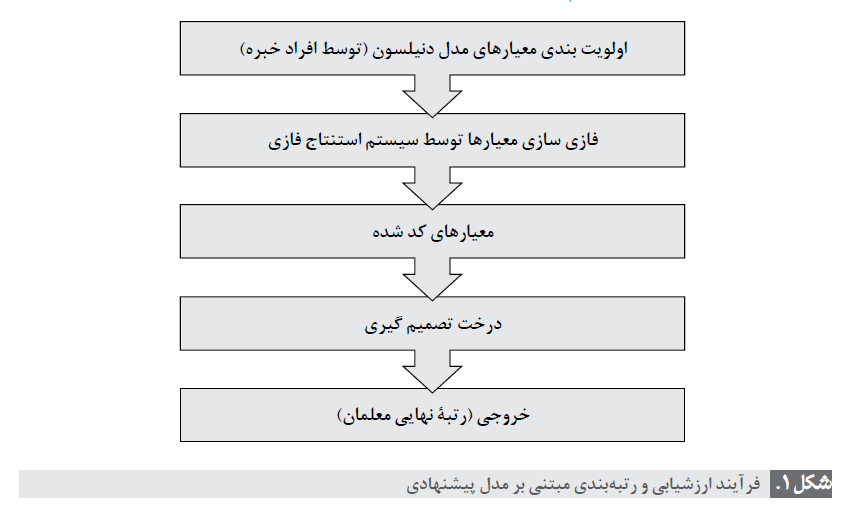
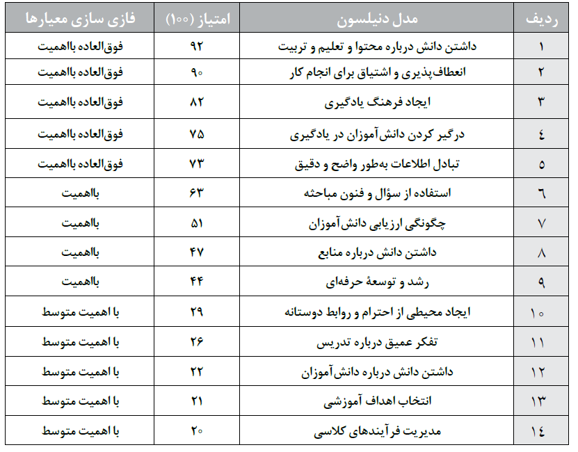
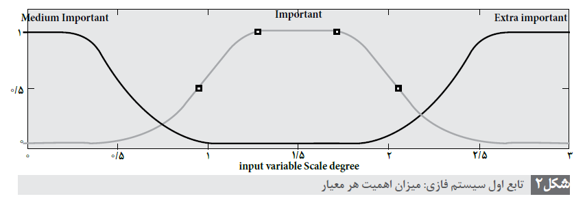
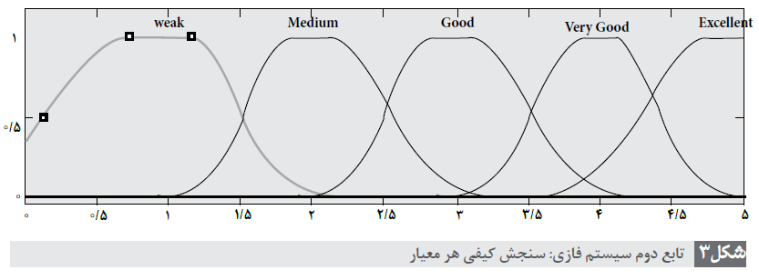

## ارزشیابی و رتبه بندی معلمان با استفاده از درخت تصمیم گیری

در این مثال از مدل ارزشیابی دنیلسون که توصیف کننده ویژگی ها و رفتارهای معلمان است استفاده شده که مقادیر معیار ها با اعداد ثابت سنجیده شده.

و از منطق فازی و درخت تصمیم گیری به عنوان پارادایم های هوش مصنوعی استفاده شده است.

در مدل پیشنهادی، امتیاز هر معیار از مدل دنیلسون (که پیش از این با اعداد ثابت سنجیده می شد) به صورت
فازی سنجیده می شود و دسته بندی معلمان با استفاده از درخت تصمیم انجام خواهد شد.

این مدل نرم افزاری، به دلیل استفاده از متغیرهای کیفی فازی، فرآیند ارزشیابی را برای ارزیاب بسیار آسان تر
از روش قبل و با دقت بسیار بالایی انجام می دهد.

در این پژوهش فرآیند ارزشیابی و رتبه بندی معلمان چند مدرسه از ناحیه 4 کرج، در بازه زمانی ابتدای مهر تا انتهای اسفند 93 توسط این سیستم ارزشیابی
مورد بررسی قرار گرفته است. درمجموع، این مدل می تواند به عنوان یک سیستم پشتیبان تصمیم گیری
و نرم افزاری دقیق، توسط مدیران در ارزشیابی و رتبه بندی معلمان مورد استفاده قرار گیرد.

### روش

با توجه به شواهد موجود، گا م های ذیل جهت رسیدن به هدف نهایی در نظر گرفته می شود (شکل 1)

با توجه به نتایج حاصل از پرسش نامه ها از بین 22 معیار آموزشی اولیه، 14 مورد آن اصلی
و مهم ارزیابی شده بود که این معیارها با توجه به همان نتایج اولویت بندی استادان مشخص گردید.
جدول 1 مرتب سازی این معیارها را، با توجه به حاصل جمع امتیازدهی استادان، نمایش می دهد. نحوه
امتیازدهی بر اساس نظر استادان در مورد اهمیت و اولویت بندی معیارها در تدریس دروس مختلف
می باشد و حداکثر امتیاز 10 و حداقل امتیاز 1، منظور گردیده است. حاصل جمع امتیازات داده شده
توسط همه استادان محاسبه شده و معیار با بیشترین امتیاز در صدر جدول 1 قرار گرفته است و دیگر
معیارها به ترتیب در سطرهای بعدی جدول منظور گردید.

#### فازی سازی معیار ها

#### استفاده از درخت تصمیم گیری برای دسته بندی معلمان

مجموعه آموزشی این مدل شامل 106 نمونه ارزیابی شده از معلمان هستند.

#### آزمایش درخت تصمیم
در اینجا درخت تصمیم را بر اساس دو نمونه آزمایش می کنیم:

