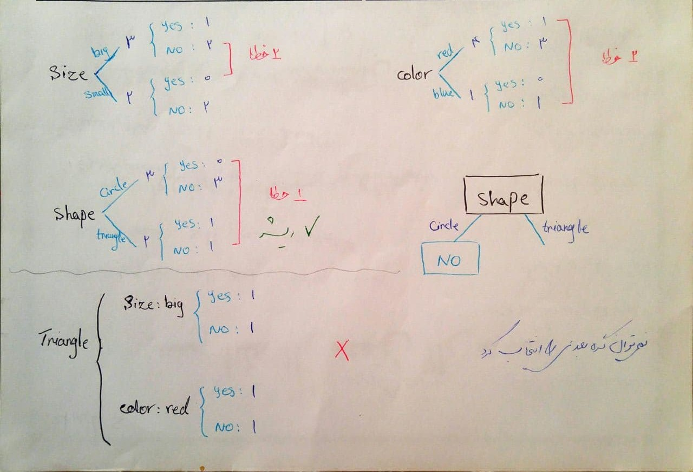
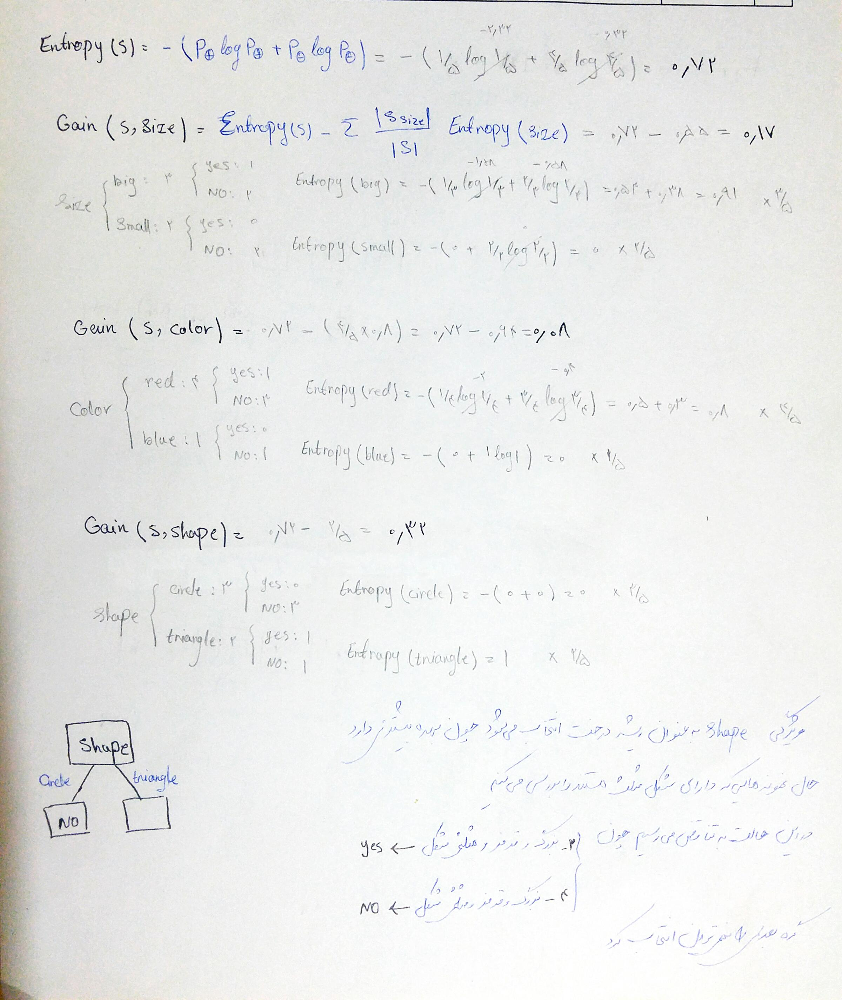

  
### درخت تصمیم:
  
در ساخت درخت تصمیم به روش خطایابی بررسی می کنیم هر ویژگی چند خطا خواهد داشت و ویژگی با تعداد خطاهای کمتر در ریشه درخت قرار میگیرد.
   
پس از مشخص شدن ریشه اگر در برگی به جواب قطعی نرسیدیم تعداد خطای مثال های باقیمانده را بررسی میکنیم.
   
در این مثال ویژگی "شکل" تعداد خطای کمتری تولید میکند و در ریشه قرار میگیرد و با حالت "دایره" (نمونه های 1 و 3 و 5 
) به جواب قطعی "نه" میرسیم.
   
در این صورت باید بررسی کنیم در حالت "مثلث" (نمونه های 2 و 4) وضعیت به چه شکل است. همانطور که در تصویر مشخص است با بررسی ویژگی های سایز و رنگ در وضعیتی که حالت ویژگی شکل "مثلث" است، نمی توان در مورد گره بعدی تصمیم گرفت.
    

  
  
  

  

### ID3:
 

  

### Candidate Elimination:
 

  S0=<0,0,0> 
 
  G0=<?,?,? >
 
  
  X1=<big,red,circle> -
 
  S1=<0,0,0>
 
  G1=<small,?,?> <?,blue,? > <?,?,triangle>
  

  X2=<big,red,triangle> +
 
  S2=<big,red,triangle>
 
  G2=<?,?,triangle>
 
  
  X3=<small,red,circle> -
 
  S3=<big,red,triangle>
 
  G3=<?,?,triangle>
 

  X4=<big,red,triangle> -
 
  S4=<big,red,triangle>
 
  G4=<?,?,triangle>
 
 
تناقض:
  

 X2=<big,red,triangle> +
 
 X4=<big,red,triangle> -
