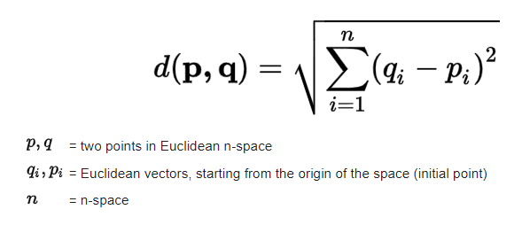
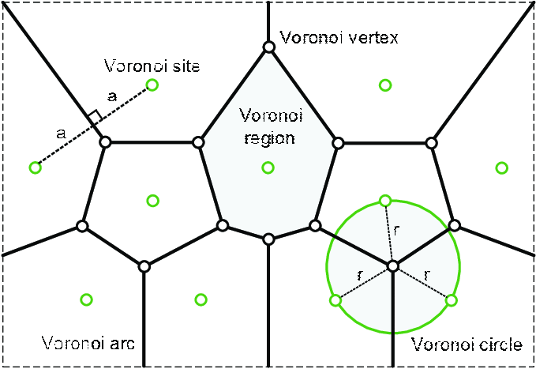

  ### نمودار ورونوی
   
در علم ریاضیات، نمودار ورنوی روشی برای تقسیم فضا به تعدادی ناحیه می‌باشد. در این دیاگرام به هر مجموعه‌ای از نقاط ناحیه‌ای اختصاص داده می‌شود. این نواحی سلول‌های ورونوی نامیده می‌شود. برای یک مجموعه از نقاط دیاگرام ورونوی سطح را به مناطقی تقسیم‌بندی می‌کند که برای هر نقطه از مجموعه نقاط یک منطقه تعریف می‌شود. این نمودار در هندسه کاربرد بسیاری دارد.
   
KNN(K-Nearest Neighbor) یکی از روش های Instance Based Learning )یادگیری مبتنی بر نمونه( است که معمولا در این مسائل (پیدا کردن نزدیک ترین همسایه) از مفاهیم فاصله اقلدیسی برای پیدا کردن k تا از نزدیک ترین همسایه ها به داده ی مورد نظر استفاده می شود(همانند فرمول زیر).
    
  
  
  
   
به جای محاسبه فاصله از این روش در این مسائل می توان از نمودار ورونی استفاده کرد.
   
نموداری که ناحیه ها را به نحوی تقسیم کرده است که در هر ناحیه از نظر فاصله به مرکز دسته(نقطه مد نظر در ناحیه) نزدیکترند را ورونوی میگویند.
   
همان طور که در شکل مشخص است فاصله نقاط از خط به یک اندازه است و نواحی(به هر ناحیه یک سلول ورونوی گفته می شود) به گونه ای مشخص شده اند که نقاطی که در هر ناحیه قرار میگیرند به نقطه ای که وسطشان و در همان ناحیه قرار دارد نزدیکتر هستندو آن هایی که بر روی خط قرار دارند از نقطه های ناحیه های مجاورشان به یک فاصله اند که با استفاده از عمود منصف این فاصله دقیق تعیین شده است.
    
  
  
  
   
مزیت استفاده از این روش این است که در یافتن نزدیک ترین همسایه 1nn سرعت محاسبات را افزایش میدهد اما محاسبه و تعیین نواحی و رسم نمودار ورونوی دشوار است به خصوص زمانی که فضای مسئله از حالت دو بعدی خارج شود و سه بعدی و n بعدی شود.

