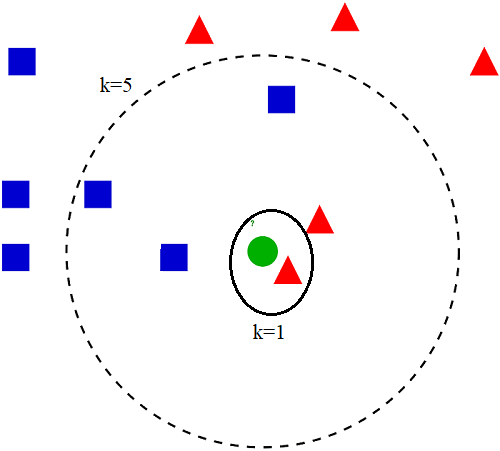

  
الگوریتم KNN روشی مبتنی بر نمونه است. در این روش نمونه به نزدیک ترین همسایگانش شباهت دارد. یعنی به نزدیک ترین همسایه نمونه توجه کرده و بر اساس آن تصمیم گیری میکند.
 
در این الگوریتم عدد k(تعداد همسایگان) فرد است تا در مقایسات یک برنده داشته باشیم و به تساوی نرسیم
در k=1 به نزدیک ترین همسایه و در k=5 به 5 همسایه نزدیکش توجه میکند.
 
k=1 معمولا مقبول نیست زیرا که تنها به نزدیک ترین همسایه توجه میکند که این داده میتواند نویز و اشتباه و یا داده پرت باشد و به نتیجه اشتباه منجر شود.
همچنین با افزایش k تا یک حد مطلوب به نتایج بهتری میرسیم چون با نمونه های بیشتری سر و کار داریم و حساسیت به نویز نیست کمتر میشود اما باید توجه داشته باشیم که k را خیلی زیاد در نظر نگیریم که مفهوم همسایگی به زیر سوال رود

همانطور که در تصویر مشخص است با k=1 به نزدیک ترین همسایه که مثلث قرمز است توجه کرده و نتیجه را متناسب با آن ارائه میدهد اما با افزایش k به 5 نمونه های بیشتری را در بر میگیرد و با توجه به آمار اشکال ممکن است جواب دقیقتری ارائه دهد(چون تعداد مربع های آبی بیشتر است) و دایره هم متناسب با آن مربع آبی تشخیص داده میشود
  

