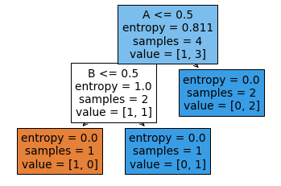

<div dir='rtl'>

### سوال 15

کد مربوط به *and* شماره 1
</div>

``` 
def anda(A,B):
    if A==0 and B==0:
        L=A and B
    if A==0 and B==1:
      L=A and B
    if A==1 and B==0:
      L=A and B
    if A==1 and B==1:
       L=A and B
    return L

print("Enter the value of boolean 0 or 1 for A:  ")
x=int(input ())
if x==0 or x==1:
	     A =x
else:
	print("please enter 0 ya 1 ")
	x=int(input ())
A=x
print("Enter the value of boolean 0 or 1 for B:  ")
y=int(input())
if y==0 or y==1:
   B=y
else:
	print("please enter 0 ya 1 ")
	y=int(input ())
B=y
print("label is : ")
print (anda(A,B))
```
---
<div dir='rtl'>

کد بعدی *And*
</div>

```
import pandas as pd
from sklearn import tree
from sklearn.tree import DecisionTreeClassifier
c=pd.read_csv('G:/Python/my project/a.txt')
x0= c.iloc[0:5,0:2]
x=x0
y0=c['label']
y=y0
clf=tree.DecisionTreeClassifier(criterion='entropy')
clf=clf.fit(x,y)
print (clf)
tree.plot_tree(clf,feature_names=x.columns,filled= True)

```
<div dir='rtl'>
کد شماره 2 OR , Xor,Nand,Nor
همانند And  است اما با دیتاست های مخصوص به خود که برخی از آنها   در همین پوشه ذخیره شده است.
تنها تفاوت در دیتاست هاست 

</div>

```
c=pd.read_csv('G:/Python/my project/?.txt')
```
<div dir='rtl'>
به جای این مورد مسیر ذخیره دیتاست بیان می شود.
</div>

<div dir='rtl'>

کد مربوط به *OR*
</div>

```
def ora(A,B):
    if A==0 and B==0:
        L=A or B
    if A==0 and B==1:
      L=A or B
        
    if A==1 and B==0:
      L=A or B
    if A==1 and B==1:
       L=A or B
    return L
    
print("Enter the value of boolean 0 or 1 for A:  ")
x=int(input ())
if x==0 or x==1:
	     A =x
else:
	print("please enter 0 ya 1 ")
	x=int(input ())
A=x
print("Enter the value of boolean 0 or 1 for B:  ")
y=int(input())
if y==0 or y==1:
   B=y
else:
	print("please enter 0 ya 1 ")
	y=int(input ())
B=y
print("label is or : ")
print (ora(A,B))
```

<div dir='rtl'>

کد مربوط به *xor*:

</div>

```
def xor(A,B):
    if A==0 and B==0:
        L=A ^ B
    if A==0 and B==1:
      L=A ^ B
    if A==1 and B==0:
      L=A ^ B
    if A==1 and B==1:
       L=A ^ B
    return L
x = input("Enter the value of boolean 0 or 1 for A: ")
x = int(x)
if x==0 or x==1:
	     A =x
else:
	print("please enter 0 ya 1 ")
	x=int(input ())
A=x

y= input("Enter the value of boolean 0 or 1 for B: ")
y= int(y)
if y==0 or y==1:
   B=y
else:
	print("please enter 0 ya 1 ")
	y=int(input ())
B=y

print("label is xor: ")
print (xor(A,B))
```

<div dir='rtl'>

*کد مربوط به NOR*

</div>

```
def nora(A,B):
    if A==0 and B==0:
        L=A or B
        L1=not L
    if A==0 and B==1:
      L=A or B
      L1=not L
    if A==1 and B==0:
      L=A or B
      L1=not L
    if A==1 and B==1:
       L=A or B
       L1=not L
    return L1

x = input("Enter the value of boolean 0 or 1 for A: ")
x = int(x)
if x==0 or x==1:
	     A =x
else:
	print("please enter 0 ya 1 ")
	x=int(input ())
A=x
y= input("Enter the value of boolean 0 or 1 for B: ")
y= int(y)
if y==0 or y==1:
   B=y
else:
	print("please enter 0 ya 1 ")
	y=int(input ())
B=y

print("label is Nor: ")
print (nora(A,B))
```
</div>

<div dir='rtl'>

کد مربوط به *nand*
</div>

```
def anda(A,B):
    if A==0 and B==0:
        L=A and B
        L1=not L
    if A==0 and B==1:
      L=A and B
      L1=not L
    if A==1 and B==0:
      L=A and B
      L1=not L
    if A==1 and B==1:
       L=A and B
       L1=not L
    return L1

print("Enter the value of boolean 0 or 1 for A:  ")
x=int(input ())
if x==0 or x==1:
	     A =x
else:
	print("please enter 0 ya 1 ")
	x=int(input ())
A=x
print("Enter the value of boolean 0 or 1 for B:  ")
y=int(input())
if y==0 or y==1:
   B=y
else:
	print("please enter 0 ya 1 ")
	y=int(input ())
B=y
print("label is : ")
print (anda(A,B))
```
<div dir='rtl'>
کد مربوط به not

</div>

```
def not(A):
    if A==0 
        L= not A 
    if A==1
        L= not A 
          return L

print("Enter the value of boolean 0 or 1 for A:  ")
x=int(input ())
if x==0 or x==1:
	     A =x
else:
	print("please enter 0 ya 1 ")
	x=int(input ())
A=x
print("label is : ")
print (not(A))

```

درخت مربوط به or

