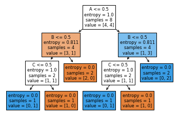

<div dir='rtl'>

#### سوال 16

</div>

* (A AND B) OR (B OR C) XOR (A NAND B)

<div dir='rtl'>
کد مربوطه
</div>

``` 
def tabe1(A,B,C):
    if A==0 and B==0 and C==0:
        L5= m1(A,B,C)
    if A==0 and B==0 and C==1:
         L5= m1(A,B,C)
    if A==0 and B==1 and C==0:
         L5= m1(A,B,C)
    if A==0 and B==1 and C==1:
         L5= m1(A,B,C)
    if A==1 and B==0 and C==0:
        L5= m1(A,B,C)
    if A==1 and B==0 and C==1:
         L5= m1(A,B,C)
    if A==1 and B==1 and C==0:
         L5= m1(A,B,C)
    if A==1 and B==1 and C==1:
         L5= m1(A,B,C)
    if A==0 and B==0 and C==0:
         L5= m1(A,B,C)
    if A==0 and B==0 and C==1:
        L5= m1(A,B,C)
    if A==0 and B==1 and C==0:
         L5= m1(A,B,C)
    if A==0 and B==1 and C==1:
         L5= m1(A,B,C)
    if A==1 and B==0 and C==0:
         L5= m1(A,B,C)
    if A==1 and B==0 and C==1:
        L5= m1(A,B,C)
    if A==1 and B==1 and C==0:
      L5= m1(A,B,C)
    if A==1 and B==1 and C==1:
       L5= m1(A,B,C)

    return L5

def m1(A,B,C):
    L1= A and B
    L2=B or C
    L3=not L1
    L4=L1 or L2
    L5=L4 ^ L3
    return L5
x = input("Enter the value of boolean 0 or 1 for A: ")
x = int(x)
if x==0 or x==1:
	     A =x
else:
	print("please enter 0 ya 1 ")
	x=int(input ())
A=x

y= input("Enter the value of boolean 0 or 1 for B: ")
y= int(y)
if y==0 or y==1:
   B=y
else:
	print("please enter 0 ya 1 ")
	y=int(input ())
B=y

z= input("Enter the value of boolean 0 or 1 for C: ")
z= int(z)
if z==0 or z==1:
   C=z
else:
	print("please enter 0 ya 1 ")
	z=int(input ())
C=z

print("label is : ")
print (tabe1(A,B,C))
```
* (A AND B OR C) OR (C NAND B)

<div dir ='rtl'>
کد مربوطه

</div>

```
def tabe2(A,B,C):
    if A==0 and B==0 and C==0:
        L5= m1(A,B,C)
    if A==0 and B==0 and C==1:
         L5= m1(A,B,C)
    if A==0 and B==1 and C==0:
         L5= m1(A,B,C)
    if A==0 and B==1 and C==1:
         L5= m1(A,B,C)
    if A==1 and B==0 and C==0:
        L5= m1(A,B,C)
    if A==1 and B==0 and C==1:
         L5= m1(A,B,C)
    if A==1 and B==1 and C==0:
         L5= m1(A,B,C)
    if A==1 and B==1 and C==1:
         L5= m1(A,B,C)
    if A==0 and B==0 and C==0:
         L5= m1(A,B,C)
    if A==0 and B==0 and C==1:
        L5= m1(A,B,C)
    if A==0 and B==1 and C==0:
         L5= m1(A,B,C)
    if A==0 and B==1 and C==1:
         L5= m1(A,B,C)
    if A==1 and B==0 and C==0:
         L5= m1(A,B,C)
    if A==1 and B==0 and C==1:
        L5= m1(A,B,C)
    if A==1 and B==1 and C==0:
      L5= m1(A,B,C)
    if A==1 and B==1 and C==1:
       L5= m1(A,B,C)

    return L5

def m1(A,B,C):
    L1= A and B or C
    L2=C or B
    L4=L1 or L2
    return L4
x = input("Enter the value of boolean 0 or 1 for A: ")
x = int(x)
if x==0 or x==1:
	     A =x
else:
	print("please enter 0 ya 1 ")
	x=int(input ())
A=x

y= input("Enter the value of boolean 0 or 1 for B: ")
y= int(y)
if y==0 or y==1:
   B=y
else:
	print("please enter 0 ya 1 ")
	y=int(input ())
B=y

z= input("Enter the value of boolean 0 or 1 for C: ")
z= int(z)
if z==0 or z==1:
   C=z
else:
	print("please enter 0 ya 1 ")
	z=int(input ())
C=z

print("label is : ")
print (tabe2(A,B,C))
```


* (A XOR B) AND (B OR C) AND (C AND D)

<div dir='rtl'>
کد مربوطه: 
</div>

```
def tabe3(A,B,C,D):
    if A==0 and B==0 and C==0 and D==0:
        L5= m1(A,B,C)
    if A==0 and B==0 and C==0 and D==1:
         L5= m1(A,B,C)
    if A==0 and B==0 and C==1 and D==0:
         L5= m1(A,B,C)
    if A==0 and B==0 and C==1 and D==1:
         L5= m1(A,B,C)
    if A==0 and B==1 and C==0 and D==0:
        L5= m1(A,B,C)
    if A==0 and B==1 and C==0 and D==1:
         L5= m1(A,B,C)
    if A==0 and B==1 and C==1 and D==0:
         L5= m1(A,B,C)
    if A==0 and B==1 and C==1 and D==1:
         L5= m1(A,B,C)
    if A==1 and B==0 and C==0 and D==0:
         L5= m1(A,B,C)
    if A==1 and B==0 and C==0 and D==1:
        L5= m1(A,B,C)
    if A==1 and B==0 and C==1 and D==0:
         L5= m1(A,B,C)
    if A==1 and B==0 and C==1 and D==1:
         L5= m1(A,B,C)
    if A==1 and B==1 and C==0 and D==0:
         L5= m1(A,B,C)
    if A==1 and B==1 and C==0 and D==1:
        L5= m1(A,B,C)
    if A==1 and B==1 and C==1 and D==0:
      L5= m1(A,B,C)
    if A==1 and B==1 and C==1 and D==1:
       L5= m1(A,B,C)

    return L5

def m1(A,B,C):
    L1= A ^ B 
    L2=C or B
    L3=C and D
    L4=L1 and L2 and L3
    return L4
x = input("Enter the value of boolean 0 or 1 for A: ")
x = int(x)
if x==0 or x==1:
	     A =x
else:
	print("please enter 0 ya 1 ")
	x=int(input ())
A=x

y= input("Enter the value of boolean 0 or 1 for B: ")
y= int(y)
if y==0 or y==1:
   B=y
else:
	print("please enter 0 ya 1 ")
	y=int(input ())
B=y

z= input("Enter the value of boolean 0 or 1 for C: ")
z= int(z)
if z==0 or z==1:
   C=z
else:
	print("please enter 0 ya 1 ")
	z=int(input ())
C=z

s= input("Enter the value of boolean 0 or 1 for D: ")
s= int(z)
if s==0 or s==1:
   D=s
else:
	print("please enter 0 ya 1 ")
	s=int(input ())
D=s

print("label is : ")
print (tabe3(A,B,C,D))
```
 <div dir='rtl'>
 

   کد دیگری  مربوط به اولین تابع توابع دیگر نیز به همین صورت است :اما با دیتاست متفاوت
</div>

```
import pandas as pd
from sklearn import tree
from sklearn.tree import DecisionTreeClassifier
c=pd.read_csv('G:/16/x.txt')
x0= c.iloc[0:9,0:3]
x=x0
y0=c['Label']
y=y0
clf=tree.DecisionTreeClassifier(criterion='entropy')
clf=clf.fit(x,y)
print (clf)
tree.plot_tree(clf,feature_names=x.columns,filled= True)
```


