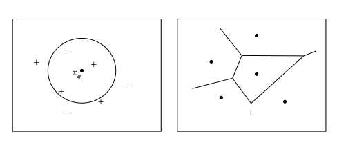

 ## سوال 20

نمودار voronoi روشی برای تقسیم فضا به تعدادی ناحیه است
 این نمودار به هر مجموعه از نقاط ناحیه ای اختصاص داده می شود.
 این نمودار در واقع نموداری است که ناحیه ها را به نحوی تقسیم می کند که از نظر فاصله به گرهی  یا نقطه ای که
 در مرکز بوده است نزدیک ترند .

نمودار voronoi در واقع ترفندی برای افزایش سرعت 1NN است

