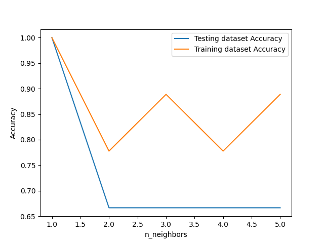

<div dir='rtl'>

### سوال 23

تفاوت های  k=1 ، k=5 را در یک داده ی فرضی با الگوریتم  knn بررسی کنید.

الگوریتم knn با استفاده ازکتابخانه های پایتون:

در این الگوریتم از دیتاست  play tenis استفاده شده است.


</div>

```# Import necessary modules
from sklearn.neighbors import KNeighborsClassifier
from sklearn.model_selection import train_test_split

import numpy as np
import matplotlib.pyplot as plt
import pandas as pd

#داده مربوط به play tenis
df = pd.read_csv('G:/QQQ/wheater.txt')
x0= df.iloc[:,0:4]

y0=df['playtennis']

#پیش پردازش داده
from sklearn import preprocessing
m1=preprocessing.LabelEncoder()
m1.fit(['Sunny','Rain','Overcast'])
X=x0
X.iloc[:,0]=m1.transform(x0.iloc[:,0])

m2=preprocessing.LabelEncoder()
m2.fit(['Hot','Mild', 'Cool'])
X.iloc[:,1]=m2.transform(x0.iloc[:,1])

m3=preprocessing.LabelEncoder()
m3.fit(['High','Normal'])
X.iloc[:,2]=m3.transform(x0.iloc[:,2])

m4=preprocessing.LabelEncoder()
m4.fit(['Weak','Strong'])
X.iloc[:,3]=m4.transform(x0.iloc[:,3])

m5=preprocessing.LabelEncoder()
m5.fit(['Yes','No'])
y=m5.transform(y0)


#جداسازی داده تست و آموزشی
X_train, X_test, y_train, y_test = train_test_split(
			X, y, test_size = 0.2, random_state=42)

neighbors = np.arange(1, 6)
train_accuracy = np.empty(len(neighbors))
test_accuracy = np.empty(len(neighbors))

# حلقه k
for i, k in enumerate(neighbors):
	knn = KNeighborsClassifier(n_neighbors=k)
	knn.fit(X_train, y_train)
	
	#محاسبه دقت داده های تست و آموزشی 
	train_accuracy[i] = knn.score(X_train, y_train)
	test_accuracy[i] = knn.score(X_test, y_test)
```
<div dir='rtl'>
 رسم نمودار برای بررسی دقت داده های آموزشی و تست بین k های  مختلف 
</div>

```
plt.plot(neighbors, test_accuracy, label = 'Testing dataset Accuracy')
plt.plot(neighbors, train_accuracy, label = 'Training dataset Accuracy')

plt.legend()
plt.xlabel('n_neighbors')
plt.ylabel('Accuracy')
plt.show()

```
<div dir='rtl'>

به طور کلی اگر مقدار k مقادیر 3و5و7 و... باشد بهتر است زیرا وقتی k=1 باشد امکان اشتباه بیشتر است زیرا ممکن است آن داده نویزباشد  اما وقتی  k= 3,5,.. است چون بین همسایه ها رای گیری می شود  می توان گفت به نوعی قابلیت اطمینان بیشتر خواهد بود .
البته این بسیار به خود دیتاست وابسته است
اما در این مثال و با این داده فرضی  1nn بهتر از 5NN است 
زیرا همانطور که مشاهده می شود دقت داده های تست و آزمایشی در 1NN با هم برابر است و هر چه مقدار k افزایش می یابد مقدار هر دو کاهش می یابد.
البته در اینجا اگر مقدار داده های تست و آزمایشی تغییر کند نتیجه تغییر خواهد کرد 
یعنی به جای  test_size = 0.2 مقدار 0.3 یا 0.4 را قرار دهیم نتایج متفاوتی به دست خواهید آمد 
</div>




