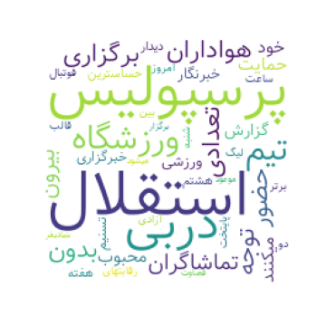
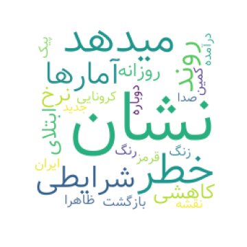

<div dir='rtl'>

### سوال 29

ابرکلمات هر خبر را با کمک دیتاستی که جمع آوری کرده اید ایجاد کنید و یک ابرکلمات برای تمام خبرها نیز
در نظر بگیرید

----
ابر کلمات هر خبر:
</div>

```
import wordcloud
import matplotlib.pyplot as plt
from wordcloud_fa import WordCloudFa
from IPython.core.display import Image
from PIL import Image
import os

a=1
wc = WordCloudFa(persian_normalize=True, include_numbers=False, height=200 , width=200 , background_color='white')
with open('news_data.txt' , 'r',encoding='utf-8', errors='ignore') as file:
  for i in file:
    text = file.readline()
    word_cloud = wc.generate(text)
    image = word_cloud.to_image()
    plt.figure(1,figsize=(5,5))
    plt.imshow(word_cloud)
    plt.axis('off')
    plt.savefig(str(a) +'.png')
    a=a+1
    plt.close()

```




<div dir='rtl'>

ابر کلمات کلیه اخبار:
</div>

```
import wordcloud
import matplotlib.pyplot as plt
from wordcloud_fa import WordCloudFa
from IPython.core.display import Image
from PIL import Image
import os

wc = WordCloudFa(persian_normalize=True, include_numbers=False, height=200 , width=200 , background_color='white')
with open('news_data.txt' , 'r',encoding='utf-8', errors='ignore') as file:

    text = file.read()
    word_cloud = wc.generate(text)
    image = word_cloud.to_image()
    plt.figure(1,figsize=(5,5))
    plt.imshow(word_cloud)
    plt.axis('off')
    plt.savefig('news.png')
    plt.close()
```