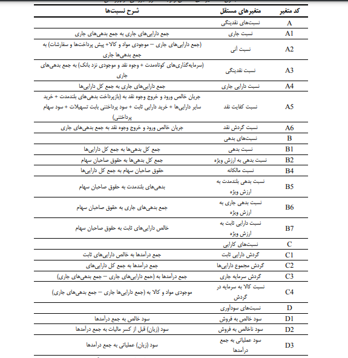
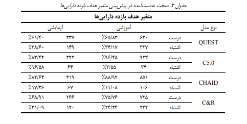

# یک نمونه واقعی از درخت تصمیم در دنیای واقعی

از درخت تصمیم میتوان برای پیش بینی امور مالی و بورس اوراق بهادر استفاده کرد. 

نسبتهای مالی همواره یکی از منابع قوی در ارزیابی عملکرد مالی شرکتهای بورس اوراق بهادار تهران است. یکی از روشهای پیش بینی عملکرد استفاده از الگوریتم های داده کاوی است. مدل درخت تصمیم به منظور ارزیابی عملکرد، پیاده سازی و مدل ها با معیارهای ارزیابی استفاده میشود. در یک مطالعه نمونه ای متشکل 21 نسبت در 534 شرکت پذیرفته شده در بورس اوراق بهادار تهران در فاصله بین سالهای 1390 تا 1393 به عنوان متغیرهای مستقل و دو نسبت بازده داراییها و بازده حقوق صاحبان سهام به عنوان متغیرهای وابسته انتخاب شده است. نتایج تحقیق حاکی از آن است که بین دو متغیر بازده دارایی ها و بازده حقوق صاحبان سهام، بازده حقوق صاحبان سهام از لحاظ ارزیابی های به دستآمده از صحت بالاتری برخوردار است و در بین چهار درخت تصمیم استفاده شده سی فایو از بهترین شاخصه های ارزیابی برخوردار بوده است.

اطلاعات مجموعه ای از نسبت های به دست آمده از صورت های مالی مربوط به شرکت های پذیرفته شده در بورس اوراق بهادار تهران است:

بر اساس ماتریس اغتشاش به دست آمده در هر مدل، دو شاخصه صحت و نرخ خطا به دست آمده است

