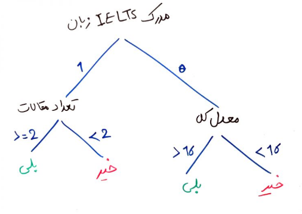

## الگوریتم c4.5

الگوریتم C4.5 یک دسته‌بندی (classifier) را در قالب یک درخت تصمیم تولید می‌کند که دارای ۲ نوع گره است. یک گره به‌صورت برگ که یک دسته را مشخص می‌کند و یک گره تصمیم که آزمون‌هایی روی یک صفت انجام می‌دهد تا یک شاخه یا زیر درخت به ازای هر خروجی آزمون تولید می‌کند.

الگوریتم C4.5 بهینه شده الگوریتم ID3 می باشد که از قانون هرس بعدی بهره می برد و می تواند صفاتی را که داده های نویزی و مقدار و همچنین صفات گسسته ندارند، استفاده نماید. در C4.5 فرض بر این است که کل داده های آموزشی در داخل حافظه باشند.
به جهت ساخت درخت تصمیم، فرض می کنیم که مجموعه داده های آموزشی که دارای برچسب کلاس مربوطه و بردار ویژگی ها هستند، در دسترس می باشند. معیارهای گوناگونی برای تقسیم بندی گره ها در درخت تصمیم وجود دارد که از عمومی ترین آنها، معیار ضریب بهره اطلاعات است که در C4.5 به کار می رد.

درخت تصمیم بر پایه آنالیز داده های ورودی و برای یافتن یک ویژگی بر مبنای تصمیم گیری برای هر نود استفاده می شود. ویژگی های گوناگونی از داده در هر نود بررسی می شود و یک ویژگی که اگر انتخاب شود، باعث خواهد شد که بی نظمی (آنتروپی) کاهش یابد، گزینش می شود. مبنای فعالیت نیز بر این اساس ایجاد شده است.

الگوریتم C4.5 می‌تواند مقادیر گسسته یا پیوسته را در ویژگی‌ها درک کند. در الگوریتم ID3 این نکته را گفتیم که الگوریتمِ ID3 اولیه نمی‌تواند تفاوتِ مقادیرِ عددیِ پیوسته را درک کند. برای مثال نمی‌تواند تفاوت بین معدل‌ها را درک کند. ولی الگوریتمِ C4.5 می‌تواند این کار را انجام دهد و مقادیرِ پیوسته را هم درک کرده و بر اساس آن درخت تصمیم را بسازد.

مثال زیر را درنظر بگیرید:

الگوریتمِ ID3 نمی‌تواند یک همچین درختی را با مقادیر پیوسته بسازد زیرا ساختِ این درخت نیازمندِ این است که الگوریتم بتواند تعدادِ مقالات و معدلِ کل را به صورت پیوسته و عددی همراه با یک حدِ آستانه‌ی مشخص (۲ برای تعداد مقالات و ۱۶ برای معدل) پیدا کند و بر اساس آن شاخه‌های زیر درخت‌های چپ و راست را بسازد. ولی این کار توسطِ الگوریتم C4.5 قابل انجام است. (منظور از مقادیر پیوسته مثلاً اعدادی است که پشت سرِ هم می‌آیند و منظور از مقادیر گسسته مثلاً مرد یا زن بودن است)

الگوریتمِ C4.5 قادر است تا مقادیری که موجود نیستند را هم تحمل کند.

جدول زیر را درنظر بگیرید:

|     |Total Average| Number of articles | IELTSE | sanavat tahsili | Acceptance of PhD |
|-----|-------------|--------------------|--------|-----------------|-------------------|
| 1   | 19.5        |                    | 1      | 3               | yes               |
| 2   | 16.5        | 0                  |        | 4               | no                |
| 3   | 15          | 0                  | 0      | 3               | no                |
| 4   | 17          | 2                  | 1      | 2.5             | yes               |
| 5   | 18.5        |                    | 0      | 2.5             | yes               |
| 6   | 15.5        | 1                  |        | 2.5             | no                |
| 7   | 19          | 3                  | 1      | 3               | yes               |

در جدول بالا مشاهده می‌کنید که تعدادی از داده‌ها وجود ندارند. به این داده‌ها، مقادیرِ ناموجود (missing values) نیز می‌گویند. مثلاً فرد شماره‌ی ۱، تعدادِ مقالات نامعلومی دارد، یعنی در این مجموعه داده نتوانسته‌ایم تعدادِ مقالاتِ فرد ۱ را به دست بیاوریم. الگوریتم C4.5 می‌تواند این مقادیر را تحمل کند و با وجود مقادیری که ناموجود است، درخت تصمیم خود را بسازد. در حالی که الگوریتمی مانند ID3 و بسیاری دیگر از الگوریتم‌های طبقه‌بندی نمی‌توانند با مقادیر ناموجود، مدلِ خود را بسازند.

سومین موردی که باعث بهینه شدن الگوریتم C4.5 نسبت به ID3 می‌شود، عملیاتِ هرس کردن (prunning) جهت جلوگیری از overfitting است. الگوریتم‌هایی مانند ID3 به خاطر اینکه سعی دارند تا حد امکان شاخه و برگ داشته باشند (تا به نتیجه مورد نظر برسند) با احتمال بالاتری دارای پیچیدگی در ساخت مدل می‌شوند (بحث bias و variance را مطالعه داشته باشید) و این پیچیدگی در بسیاری از موارد الگوریتم را دچار overfitting و خطای بالا می‌کند. اما با عملیات هرس کردن درخت که در الگوریتم C4.5 انجام می‌شود، می‌توان مدل را به یک نقطه بهینه رساند که زیاد پیچیده نباشد (و البته زیاد هم ساده نباشد) و overfitting یا underfitting رخ ندهد.

مورد چهارم که می‌تواند الگوریتم C4.5 را از بسیاری دیگر از الگوریتم‌ها متمایز کند بحثِ وزن‌دهی (weighting) به ویژگی‌ها است
جدول زیر را درنظر بگیرید:

|     |Total Average| Number of articles | IELTSE | sanavat tahsili | Acceptance of PhD |
|-----|-------------|--------------------|--------|-----------------|-------------------|
| 1   | 19.5        | 3                  | 1      | 3               | yes               |
| 2   | 16.5        | 0                  | 1      | 4               | no                |
| 3   | 15          | 0                  | 0      | 3               | no                |
| 4   | 17          | 2                  | 1      | 2.5             | yes               |
| 5   | 18.5        | 1                  | 0      | 2.5             | yes               |
| 6   | 15.5        | 1                  | 1      | 2.5             | no                |
| 7   | 19          | 3                  | 1      | 3               | yes               |

شما می‌خواهید یک طبقه‌بند بسازید تا از روی مدلِ ساخته شده پیش‌بینی کند که آیا یک شخص می‌تواند در مقطع دکتری قبول شود یا خیر؟

حال فرض کنید، شما به عنون رئیسِ دانشکده (با توجه به تجربه‌ی بالای خود) می‌خواهید وزنِ ویژگیِ تعداد مقالات را بیشتر کنید. یعنی به این نتیجه رسیده‌اید که این ویژگی می‌تواند اثر بیشتری در انتخاب یک شخص در مقطع دکتری داشته باشد. الگوریتم C4.5 این قابلیت را دارد که وزن‌های مختلف و غیر یکسانی را به برخی از ویژگی‌ها بدهد

