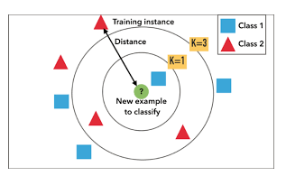

## تفاوت های k=1 و k=5 در knn

روش K نزدیک‌ترین همسایه نزدیک K Nearest Neighbors یا (KNN) یک روش یادگیری موردی ‌است و از جمله ساده‌ترین الگوریتم‌های یادگیری ماشین می‌باشد که به روش K همسایه نزدیک نیز معروف است. در این الگوریتم یک نمونه با رای اکثریت از همسایه‌هایش دسته‌بندی می‌شود و این نمونه در عمومی‌ترین کلاس مابین k همسایه نزدیک تعیین می‌شود. K یک مقدار مثبت صحیح و عموماً کوچک است. اگر k=1 باشد نمونه به سادگی در کلاس همسایگان نزدیکش تعیین می‌گردد. فرد بودن مقدار k مفید می‌باشد چون با این کار جلوی آراء برابر گرفته می‌شود.

روش k همسایه‌ نزدیک، برای بسیاری از روش‌ها کاربرد دارد، زیرا اثربخش، غیرپارامتریک و دارای پیاده‌سازی راحت می‌باشد. با این حال زمان دسته‌بندی‌اش طولانی است و یافتن مقدار k بهینه مشکل است. بهترین انتخاب از k، وابسته به داده‌ها می‌باشد به طور کلی مقدار بزرگ از k اثر نویز روی دسته‌بندی را کاهش می‌دهد، اما مرز مابین کلاس‌ها کمتر متمایز می‌شود.

شکل بالا مثالی از الگوریتم دسته‌بندی K نزدیک ترین همسایه، با استفاده از بردار ویژگی چندبعدی می‌باشد که مثلث‌ها کلاس اول و مربع‌ها کلاس دوم رانشان می‌دهند. دایره کوچک در داخل دوایر، نمونه تستی را نشان می‌دهد. حال اگر مقدار k=3 باشد (یعنی 3 همسایه‌ی نزدیک به نمونه) نمونه تستی متعلق به کلاس مثلث و اگر k=5 باشد نمونه متعلق به کلاس مربع می‌باشد.
