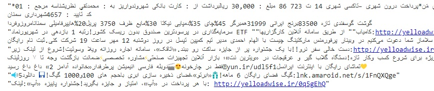
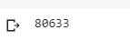
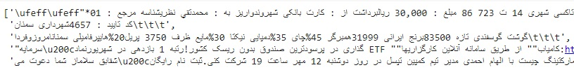
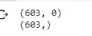

### با دیتاست جمع آوری شده از پیامک ها و دیتاست کلمات اسپم پیامک های فارسی به همراه الگوریتم بیز تصمیم گیری در مورد هر پیامک را داشته باشید

</div>

```  
import numpy as np
import matplotlib.pyplot as plt
import pandas as pd
import seaborn as sb
sb.set(style='dark')

```  
ده خط اول متن را نمایش میدهیم:

```  
!head -n 10 sms.txt

```  



طول دیتاست را نمایش میدهیم:

```

sms= open('sms.txt', 'r').read()
len(sms)

```


```
splited= sms.split('\n')
splited[:5]
```


```
print(splited[2])
```


برای برچسب زدن به فایل های spam و sms به این صورت عمل میکنیم:

ابتدا دیتاست را فراخوانی میکنیم:

```
spam = pd.read_csv('spam-word.txt', encoding='utf-8')
```

یک لیستی از متن ها و کلمه ها ایجاد میکنیم:

```
kalame = {}
text={}
```
یک تابعی از متن به طول کلمات درست میکنیم:
```
def kalamat(text):
  indx = len(kalame)
```

برای هر کلمه در متن برچسب گذاری را انجام میدهیم:

```
for word in text:
  
    kalame[word] = indx
    indx += 1

if __name__ == '__main__':
  for i in range(spam.shape[0]):
    text = spam.iloc[i,0].split()
    print('the length of kalamat is ', len(kalame))

  kalamat(text)
```
لیست تولید شده را به صورت یک فایل kalame.txt ذخیره میکنیم:

```
file = open("kalame.txt", "w")
file.write(str(kalame))
file.close()
```
همین کار را برای فایل sms هم انجام میدهیم:

```
import numpy as np
import pandas as pd
import ast
```
فایل sms  و kalame را فراخوانی میکنیم:

```
data = pd.read_csv('sms.txt', encoding='utf-8')
file = open('kalame.txt', 'r', encoding='utf-8')
A = file.read()
```

برچسب گذاری را برای فایل sms انجام میدهیم:

```
KLME = ast.literal_eval(A)

x = np.zeros((data.shape[0], len(KLME)))
y = np.zeros((data.shape[0]))

for i in range(data.shape[0]):
  sms = data.iloc[i,0].split()

for sms_word in sms:
  if sms_word.lower() in KLME:
    x[i, KLME[sms_word]] +=1
 ```   
   
   
    
 به صورت فایل x و y ذخیره میکنیم:
    
```
 np.save('x.npy', x)
 np.save('y.npy', y)
```
تابع نیوبیز را میسازیم:

```
import numpy as np

class naivebayes():
 def __init__(self, X, y):
  self.num_examples, self.num_features = X.shape
  self.num_classes = len(np.unique(y))
  self.eps = 1e-6
def fit(self, X, y):
 self.classes_mean = {}
 self.classes_variance = {}
 self.classes_prior = {}

 for c in range(self.num_classes):
   X_c = X[y==c]

   self.classes_mean[str(c)] = np.mean(X_c, axis=0)
   self.classes_variance[str(c)] = np.var(X_c, axis=0)
   self.classes_prior[str(c)] = X_c.shape[0]/self.num_examples
def predict(self, X):
 probs = np.zeros((self.num_examples, self.num_classes))

 for c in range(self.num_classes):
   prior = self.classes_prior[str(c)]
   probs_c = self.density_function(X, self.classes_mean[str(c)], self.classes_variance[str(c)])
   probs[:, c] = probs_c +np.log(prior)

   return np.argmax(probs, 1)
def density_function(self, X, mean, sigma):
  const = -self.num_features/2 * np.log(2*np.pi) - 0.5*np.sum(sigma+self.eps)
  probs = 0.5*np.sum(np.power(x-mean, 2)/(sigma+self.eps), 1)
  return const - probs
 ```
 
 دshape فایل های تولید شده X-train و y-train را نمایش میدهیم:
  ```
 if __name__ == '__main__':
 X-train = np.load('x.npy')
y-train = np.load('y.npy')
print(X-train.shape)
print(y-train.shape)
  ```
 
 
  مدل نیو بیز را روی اموزش میدهیم:
  
   ```
   NB = naivebayes(X-train, y-train)
NB.fit(X-train, y-train)
y_pred = NB.predict(X-train)
   ```
