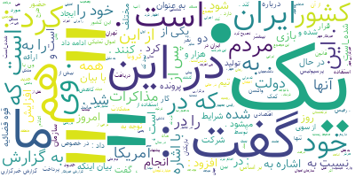

### ابرکلمات هر خبر را با کمک دیتاستی که جمع آوری کرده اید ایجاد کنید و یک ابرکلمات برای تمام خبرها نیزدر نظر بگیرید

</div>

```  
!pip3 install wordcloud-fa

from wordcloud_fa import WordCloudFa
wc = WordCloudFa()

with open('news.txt', 'r') as file:
    text = file.read()

    wc = WordCloudFa(width=1000, height=600)
    wc = WordCloudFa(background_color="blue")

word_cloud = wc.generate(text)

image = word_cloud.to_image()
image.show()

image.save('news.png')

``` 


### ابر کلمات برای هر خبر جدا


.jpg)

.jpg)

.jpg)

.jpg)

.jpg)

.jpg)

.jpg)

.jpg)

.jpg)

.jpg)

.jpg)

.jpg)

.jpg)

.jpg)

.jpg)

.jpg)

.jpg)

.jpg)

.jpg)

.jpg)

#### ابر کلمات برای دیتاست کلی 




