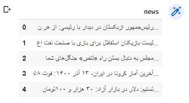

### سعی کنید دسته بندی هر خبر را به صورت خودکار بدست آورید

```
import numpy as np
import pandas as pd
from sklearn.feature_extraction.text import TfidfVectorizer
from sklearn.cluster import KMeans
```
فایل خبر را فراخوانی میکنیم و به صورت جدول نمایش میدهیم:

```
NEWS_DATA= pd.read_csv('news-data.txt', encoding='utf-16')
NEWS_DATA = NEWS_DATA.rename({'برگزاری جلسه هیئت دولت به ریاست مخبر/ آغاز بررسی لایحه بودجه سال ۱۴۰۱ کل کشوربه گزارش گروه سیاسی خبرگزاری فارس، جلسه بعدازظهر امروز هیئت و زیران به ریاست محمد مخبر معاون اول رئیس جمهور برگزار شد.معاون اول رئیس جمهور ضمن قدردانی از رأی اعتماد نمایندگان مجلس شورای اسلامی به یوسف نوری وزیر آموزش و پرورش، از زحمات و تلاش های کاظمی در دوران مسئولیت وی در این وزارتخانه تقدیر کرد.همچنین اعضای دولت بررسی لایحه بودجه سال ۱۴۰۱ کل کشور را در دستور کار خود قرار داده و درخصوص تبصره های آن، به بحث و تبادل نظر با یکدیگر پرداختند.گفتنی است، کار بررسی لایحه بودجه سال ۱۴۰۱ کل کشور در جلسه های آتی دولت ادامه خواهد یافت.': 'news'}, axis=1)  

NEWS_DATA.head()

```


کلاس بندی با kmeans را مطابق زیر انجام میدهیم:

```
doc = news['news'].values.astype("U")
vector = TfidfVectorizer(stop_words='english')
features = vector.fit_transform(doc)

#KMeans
k = 12  
model = KMeans(n_clusters=k, init='k-means++', max_iter=100, n_init=1)
model.fit(features)

news['type'] = model.labels_
news.head()

```


به صورت زیر دسته بندی هر خبر را نمایش میدهیم: 

```
clusters = news.groupby('type')
for cluster in clusters.groups:
  my = open('type'+ str(cluster) + '.txt', 'w')
  data = clusters.get_group(cluster)[['news']]
  my.write(data.to_csv(index_label='id'))
  my.close()


print("cluster centroids:\n")

order_centeroids = model.cluster_centers_.argsort()[:,::-1]
terms = vector.get_feature_names()
for i in range(k):
  print("cluster %d:" %i)
  for j in order_centeroids[i, :10]:
    print('%s' %terms[j])
  print('-----------------')
 

```

cluster centroids:

```
cluster 0:
سوریه
تجارت
امضا
توسعه
وزیر
سند
ایران
بازسازی
همکاری
سفر
```
```
cluster 1:
در
به
مذاکرات
از
ایران
آمریکا
این
که
را
با
```

```
cluster 2:
تیم
لیگ
فوتبال
ورزشگاه
دربی
به
جدول
برتر
تساوی
گهر
```

```
cluster 3:
در
به
پلیس
از
که
با
حادثه
فتا
این
های
```
```
cluster 4:
در
به
از
که
می
این
است
را
های
با
```
```
cluster 5:
در
به
کرونا
از
که
مسکن
واکسن
بیماری
با
است
```
```
cluster 6:
در
کمیسیون
مورا
کننده
نشست
برجام
مذاکرات
مذاکره
طرف
وین
```
```
cluster 7:
مسکن
نهضت
نام
ثبت
به
حج
زیارت
عتبات
ملی
زائران
```
```
cluster 8:
شیعی
سرآغازی
میان
صدر
چارچوب
توافق
هماهنگی
نشست
اتحاد
گروه
```
```
cluster 9:
آزمون
در
دانشجویان
به
دانشگاه
هزار
آموزشی
از
زنیت
است
```
```
cluster 10:
در
از
کشور
به
استان
بارش
این
های
یمن
غرب
```
```
cluster 11:
در
ایران
با
به
گازی
این
کشور
از
ترکمنستان
ازبکستان
```
