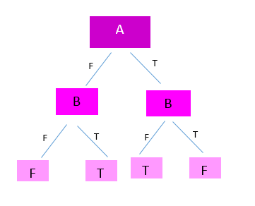
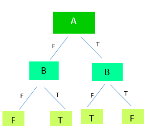
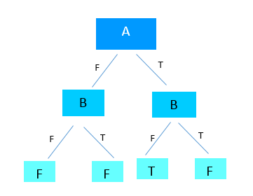
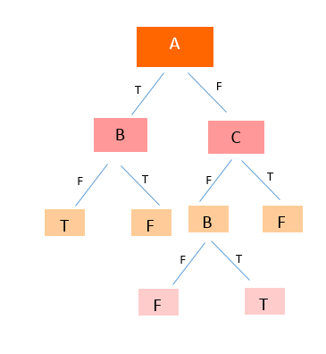
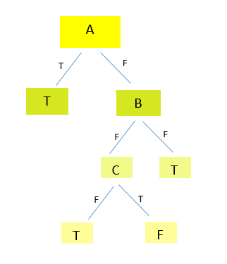
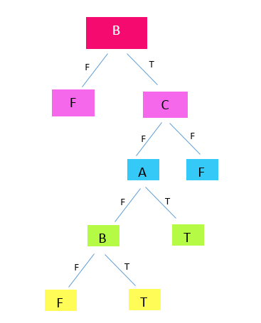

# درخت تصمیم مربوط به عبارت های زیر 

1- (A or B) xor (A and B)

2- (A xor B) and (A or B) or (A and B)

3- (A nand B) and (A xor B) or (A or B) and not(B)

4- (A and B) or (B and C) xor (A or B)

5- (A and B and C) or (C nand B) 

6- (A or B) and (B or C) and (C and D)

