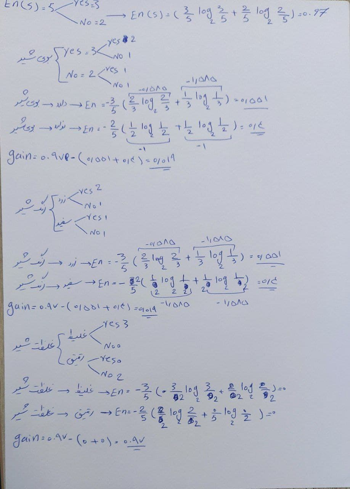
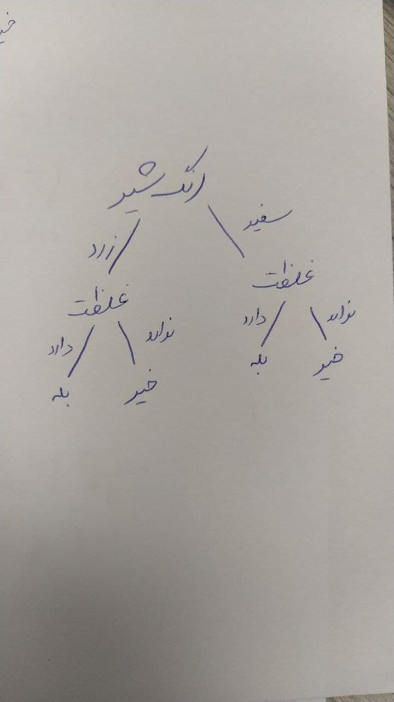

### مراحل انجام الگوریتم ID3 را به صورت خلاصه با یک مثال توضیح دهید.
روش ID3 یک روش ساخت درخت تصمیم گیری با استفاده از احتمال است.
این روش در ساخت درخت های غیر باینری بهتر عمل میکند.
در این روشی از مفهومی به نام Entropy استفاده می شود، که منظور همان بی نظمی است.
فرمول انتروپی:

-(p+.logp+ + p-.logp-)

که در این روش  لگاریتم ما بر مبنای 2 است.

الگوریتم id3 شناسایی شیر فاسد :

|مثال| بو | رنگ شیر | غلظت شیر | فاسد |
|------|------|------------------|-------------|-----|
|1| دارد | زرد| غلیظ |بله
|2| ندارد | سفید| رقیق|خیر
|3| دارد | زرد| غلیظ |بله
|4| ندارد |سفید | غلیظ |بله
|5| دارد | زرد| رقیق|خیر

  
   
  

  

