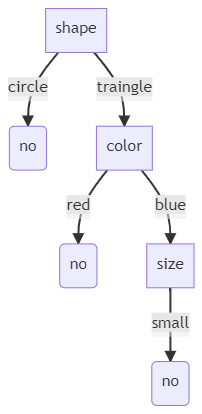
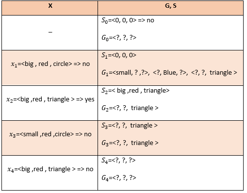

### با کمک سه روش درخت تصمیم ، ID3 ، CANDIDATE ELMINIATION داده ی زیر را حل کنید.

  
|     Example    |     Size     |     Color    |     Shape       |     Class/Label    |
|----------------|--------------|--------------|-----------------|--------------------|
|     1          |     big      |     red      |     circle      |     No             |
|     2          |     big      |     red      |     triangle    |     Yes            |
|     3          |     small    |     red      |     circle      |     No             |
|     4          |     big      |     red      |     triangle    |     No             |
|     5          |     small    |     blue     |     circle      |     No             |
  

  <h4>درخت تصمیم</h4>
  

در نتیجه فرضیه های ویژگی ها به شکل زیر ساخته میشوند تا ویژگی دارای کمترین خطا در ریشه قرار گیرد و درخت رسم شود.
  

   
<table>
<tr>
<td>
ویژگی 1
</td>
<td>
big => yes
</td>
<td>
small => no
</td>
<td>
big => no
</td>
<td>
small => yes
</td>
</tr/>
<tr>
<td>
size
</td>
<td>
1
</td>
<td>
2
</td>
<td>
2
</td>
<td>
0
</td>
</tr>
<tr>
<td>
-
</td>
<td colspan=2>
فرضیه 1 : 3
</td>
<td colspan=2>
فرضیه 2 : 2
</td>
</tr>
</table>

<table>
<tr>
<td>
ویژگی 2
</td>
<td>
red => yes
</td>
<td>
blue => no
</td>
<td>
red => no
</td>
<td>
blue => yes
</td>
</tr/>
<tr>
<td>
color
</td>
<td>
1
</td>
<td>
1
</td>
<td>
3
</td>
<td>
0
</td>
</tr>
<tr>
<td>
-
</td>
<td colspan=2>
فرضیه 1 : 2
</td>
<td colspan=2>
فرضیه 2 : 3
</td>
</tr>
</table>

<table>
<tr>
<td>
ویژگی 3
</td>
<td>
circle => yes
</td>
<td>
triangle => no
</td>
<td>
circle => no
</td>
<td>
triangle => yes
</td>
</tr/>
<tr>
<td>
Shape
</td>
<td>
0
</td>
<td>
1
</td>
<td>
3
</td>
<td>
1
</td>
</tr>
<tr>
<td>
-
</td>
<td colspan=2>
فرضیه 1 : 1
</td>
<td colspan=2>
فرضیه 2 : 4
</td>
</tr>
</table>

در نتیجه از میان ویژگی های فوق کمترین مقادیر خطا را از میان فرضیه ها انتخاب کرده و نتیجه همچون جدول زیر خواهد بود : 

|ویژگی | مقدار |
|-------|-------|
|size|2|
|color|2|
|shape|1|

از میان موارد فوق shape که کمترین مقدار خطا را دارد در ریشه درخت قرار میگرد.

<table>
<tr>
<td>
ویژگی ها
</td>
<td>
فرضیه 1
</td>
<td>
فرضیه 2
</td>
</tr/>
<tr>
<td>
color
</td>
<td>
 red
 
بله =>1 , خیر=>3
 
جمع : 4
</td>
<td>
blue
 
بله =>0 , خیر=>1
 
جمع : 1
</td>
</tr>
<tr>
<td>
size
</td>
<td>
big
 
بله =>1 , خیر=>2
 
جمع : 3
</td>
<td>
small
 
بله =>0 , خیر=>2
 
جمع : 2
</td>
</tr>
</table>

از میان ویژگی های فوق "color" انتخاب میشود و این مراحل آنقدر ادامه پیدا میکند تا درخت تکمیل گردد.
به دلیل تکراری بودن این مرحله از تکرار آن صرف نظر شده در نتیجه درخت همچون زیر خواهد بود 

<h4>CANDIDATE ELMINIATION</h4>

<h4>ID3</h4>

