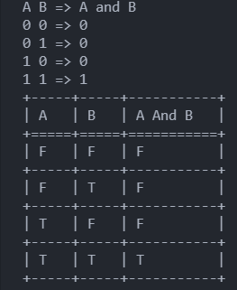
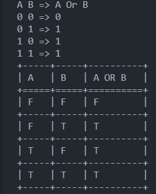
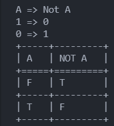
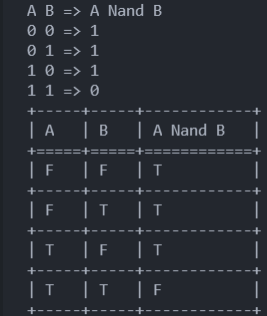
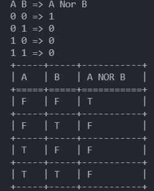
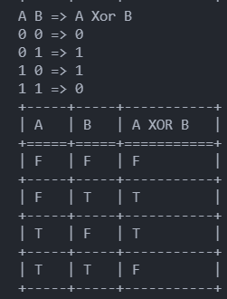

<div align="justify">
<h3> همانطور که در تعاریف درخت تصمیم گفته شده الگوریتم درخت تصمیم شامل IF THEN ELSE ها می باشد؛ با یک زبان برنامه نویسی (ترجیحا پایتون، جاوا، سی پلاس پلاس) در قالب یک تابع هر درخت تصمیم مربوط به AND و OR و NOT و NAND و NOR و XOR را رسم کنید.</h3>
</div>


- AND

```
def And (a, b):
    #  a AND b
    if a == 1 and b == 1:
        return 1
    else:
        return 0
    
          
print("A B => A and B")
print("0 0 =>", And(0,0))
print("0 1 =>", And(0,1))
print("1 0 =>", And(1,0))
print("1 1 =>", And(1,1))

mydata_and = [("F", "F", "F"), 
            ("F", "T", "F"), 
            ("T", "F", "F"), 
            ("T", "T", "T")]
# create header
head = ["A", "B", "A And B"]
# display table
print(tabulate(mydata_and, headers=head, tablefmt="grid"))

```
خروجی برنامه فوق به صورت زیر خواهد بود :
<div align="center">

</div>

- OR

```
def Or (a, b):     
    #  A OR B
    if a == 1 or b == 1:
        return 1
    else:
        return 0    
              
print("A B => A Or B")
print("0 0 =>", Or(0,0))
print("0 1 =>", Or(0,1))
print("1 0 =>", Or(1,0))
print("1 1 =>", Or(1,1))

mydata_OR = [("F", "F", "F"), 
            ("F", "T", "T"), 
            ("T", "F", "T"), 
            ("T", "T", "T")]

head = ["A", "B", "A OR B"]
print(tabulate(mydata_OR, headers=head, tablefmt="grid"))

```

خروجی برنامه فوق به صورت زیر خواهد بود :
<div align="center">

</div>

- NOT

```
def Not (a):     
    #  A Not B
    if a == 1 :
        return 0
    else:
        return 1    
              
print("A => Not A")
print("1 =>", Not(1))
print("0 =>", Not(0))
mydata_NOT = [("F", "T"), 
            ("T", "F")]

head = ["A", "NOT A"]
print(tabulate(mydata_NOT, headers=head, tablefmt="grid"))

```

خروجی برنامه فوق به صورت زیر خواهد بود :
<div align="center">

</div>

- NAND

```
def Nand (a, b):     
    #  A NAND B
    if a == 1 and b == 1:
        return 0
    else:
        return 1   
              
print("A B => A Nand B")
print("0 0 =>", Nand(0,0))
print("0 1 =>", Nand(0,1))
print("1 0 =>", Nand(1,0))
print("1 1 =>", Nand(1,1))

mydata_nand = [("F", "F", "T"), 
                ("F", "T", "T"), 
                ("T", "F", "T"), 
                ("T", "T", "F")]
head = ["A", "B", "A Nand B"]
print(tabulate(mydata_nand, headers=head, tablefmt="grid"))

```

خروجی برنامه فوق به صورت زیر خواهد بود :
<div align="center">

</div>

- NOR

```
def Nor (a, b):     
    #  A NOR B
    if a == 1 or b == 1:
        return 0
    else:
        return 1    
              
print("A B => A Nor B")
print("0 0 =>", Nor(0,0))
print("0 1 =>", Nor(0,1))
print("1 0 =>", Nor(1,0))
print("1 1 =>", Nor(1,1))

mydata_NOR = [("F", "F", "T"), 
            ("F", "T", "F"), 
            ("T", "F", "F"), 
            ("T", "T", "F")]

head = ["A", "B", "A NOR B"]
print(tabulate(mydata_NOR, headers=head, tablefmt="grid"))

```


خروجی برنامه فوق به صورت زیر خواهد بود :
<div align="center">

</div>

- XOR

```
def Xor (a, b):     
    #  A XoR B
    if a != b :
        return 1
    else:
        return 0    
              
print("A B => A Xor B")
print("0 0 =>", Xor(0,0))
print("0 1 =>", Xor(0,1))
print("1 0 =>", Xor(1,0))
print("1 1 =>", Xor(1,1))

mydata_XOR = [("F", "F", "F"), 
            ("F", "T", "T"), 
            ("T", "F", "T"), 
            ("T", "T", "F")]

head = ["A", "B", "A XOR B"]
print(tabulate(mydata_XOR, headers=head, tablefmt="grid"))

```

خروجی برنامه فوق به صورت زیر خواهد بود :
<div align="center">

</div>
<br/>

همچنین به جهت نمایش جداول از کتابخانه ی tabulate پایتون استفاده شده که برای استفاده از آن نیاز به نصب و فراخوانی آن میباشد که کد آن به شکل زیر است : 
<br/>

```
from tabulate import tabulate
```


