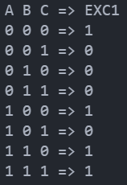
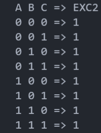
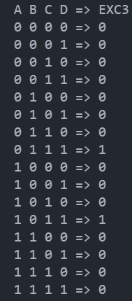

### برای سه عبارت زیر نیز مثل سوال یک کدهای مربوط به آنها را بنویسید.

- (A AND B) OR (B OR C) XOR (A NAND B)

```
def EXC1 (a, b, c):
    #  a AND b
    if a == 1 and b == 1:
        And = True
    else:
        And= False
        
    #  b OR c
    if b == 1 or c == 1:
        Or = True
    else:
        Or =  False
        
    #  First parenthesis OR second parenthesis
    if And == 1 or Or == 1:
        first_phrase = True
    else:
        first_phrase =  False
        
    #a Nand b  
    if a == 1 and b == 1:
        Nand = False
    else:
        Nand = True
        
    #first_phrase XOR Nand 
    if first_phrase != Nand:
        return 1
    else:
        return 0
        
print("A B C => EXC1")
print("0 0 0 =>", EXC1(0,0,0))
print("0 0 1 =>", EXC1(0,0,1))
print("0 1 0 =>", EXC1(0,1,0))
print("0 1 1 =>", EXC1(0,1,1))
print("1 0 0 =>", EXC1(1,0,0))
print("1 0 1 =>", EXC1(1,0,1))
print("1 1 0 =>", EXC1(1,1,0))
print("1 1 1 =>", EXC1(1,1,1))

```
خروجی برنامه فوق به شکل زیر خواهد بود :
<br/>
<br/>


- (A AND B OR C) OR (C NAND B)

```
def EXC2 (a, b, c):
    #  a AND b
    if a == 1 and b == 1:
        And = True
    else:
        And= False
        
    #  b OR c
    if b == 1 or c == 1:
        Or = True
    else:
        Or =  False
             
    #c Nand b  
    if c == 1 and b == 1:
        Nand = False
    else:
        Nand = True
        
   #  First parenthesis OR second parenthesis
    if Or == 1 or Nand == 1:
        return 1
    else:
        return  0
        
print("A B C => EXC2")
print("0 0 0 =>", EXC2(0,0,0))
print("0 0 1 =>", EXC2(0,0,1))
print("0 1 0 =>", EXC2(0,1,0))
print("0 1 1 =>", EXC2(0,1,1))
print("1 0 0 =>", EXC2(1,0,0))
print("1 0 1 =>", EXC2(1,0,1))
print("1 1 0 =>", EXC2(1,1,0))
print("1 1 1 =>", EXC2(1,1,1))

```
خروجی برنامه فوق به شکل زیر خواهد بود :
<br/>
<br/>



- (A XOR B) AND (B OR C) AND (C AND D)

```
def EXC3 (a, b, c, d):
    #A XOR B 
    if a != b:
        Xor = 1
    else:
        Xor=  0
        
    #  b OR c
    if b == 1 or c == 1:
        Or = True
    else:
        Or =  False
    
    #  Xor AND Or
    if Xor == 1 and Or == 1:
        First_And = True
    else:
        First_And = False
    
    #  C AND D
    if c == 1 and d == 1:
        second_And = True
    else:
        second_And = False
    
    #  First_And AND second_And
    if First_And == 1 and second_And == 1:
        return 1
    else:
        return 0
                   
print("A B C D => EXC3")
print("0 0 0 0 =>", EXC3(0,0,0,0))
print("0 0 0 1 =>", EXC3(0,0,0,1))
print("0 0 1 0 =>", EXC3(0,0,1,0))
print("0 0 1 1 =>", EXC3(0,0,1,1))
print("0 1 0 0 =>", EXC3(0,1,0,0))
print("0 1 0 1 =>", EXC3(0,1,0,1))
print("0 1 1 0 =>", EXC3(0,1,1,0))
print("0 1 1 1 =>", EXC3(0,1,1,1))
print("1 0 0 0 =>", EXC3(1,0,0,0))
print("1 0 0 1 =>", EXC3(1,0,0,1))
print("1 0 1 0 =>", EXC3(1,0,1,0))
print("1 0 1 1 =>", EXC3(1,0,1,1))
print("1 1 0 0 =>", EXC3(1,1,0,0))
print("1 1 0 1 =>", EXC3(1,1,0,1))
print("1 1 1 0 =>", EXC3(1,1,1,0))
print("1 1 1 1 =>", EXC3(1,1,1,1))

```

خروجی برنامه فوق به شکل زیر خواهد بود :
<br/>
<br/>



#### همچنین تمام این برنامه ها در فایل پایتون موجود در این پوشه نیز قرار دارد.
