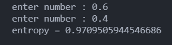

### فرمول آنتروپی در روش ID3 را بدون استفاده از توابع آماده ی زبان های برنامه نویسی خود برنامه نویسی کنید.

فرمول انتروپی به شرح زیر است:
<p align="left">
Entropy = :heavy_minus_sign:(P+logP+ :heavy_plus_sign: P-logP-)
</p>


برنامه فرمول فوق به شرح زیر است : 

```
import math

a = float(input('enter first number : '))
b = float(input('enter second number : '))

entropy = -(a * math.log2(a) + b * math.log2(b))
 
print ('entropy =', entropy)

```
<div align="justify">
در این برنامه با کمک کتابخانه ی math که در ابتدای برنامه Import شده است مقدار entropy محاسبه شده است .
مقدار p اول از  کاربر دریافت شده و در متغیر a قرار میگیرد و مقدار p دوم را دریافت و در متغیر b قرار میدهد در نهایت مطابق فرمول پیش رفته و با استفاده از تابع log2 کتابخانه ی math مقدار آنتروپی محاسبه شده است .

</div>
<br/>
<p>
خروجی برنامه فوق به شکل زیر میباشد :
</p>
<div align="center">

</div>

### این برنامه در فایل پایتون همین پوشه قرار داده شده است 


در ادامه برنامه ای ساده از محاسبه log2 قرار داده شده است که به صورت int مقدار وارد شده را محاسبه میکند .

```
def log2(n):
    i = 0
    while n > 1:
        n >>= 1
        i += 1
    return i
    
 ```
 برای مثال در صورت ورود عدد 14 خروجی 3 را به عنوان نتیجه خواهیم داشت 
