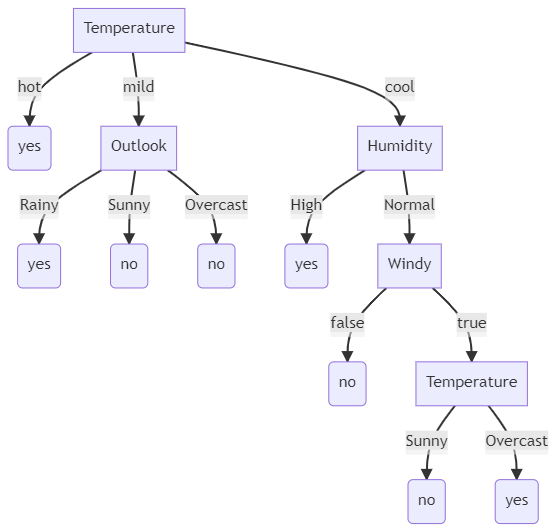

### الگوریتم c4.5 را مطالعه کنید و با ذکر یک مثال آنرا توضیح دهید.(مثال ها می تواند از جدول های تمرینات گذشته باشد.)

آقای راس کوینلند (پیشنهاد دهنده‌ی الگوریتمِ ID3)، بعد از اینکه به نقاط ضعفِ این الگوریتم پی‌برد، در مدتِ کوتاهی الگوریتمِ بعدی خود یعنی C4.5 را طراحی کرد. از نقاطِ ضعف الگوریتم ID3 که در C4.5 رفع شده است می‌توان به موارد زیر اشاره کرد:
 
 
1- الگوریتم C4.5 می‌تواند مقادیر گسسته یا پیوسته را در ویژگی‌ها درک کند : الگوریتمِ ID3 اولیه نمی‌تواند تفاوتِ مقادیرِ عددیِ پیوسته را درک کند

2- الگوریتمِ C4.5 قادر است تا مقادیری که موجود نیستند را هم تحمل کند.

3- سومین موردی که باعث بهینه شدن الگوریتم C4.5 نسبت به ID3 می‌شود، عملیاتِ هرس کردن (prunning) جهت جلوگیری از overfitting است.

4- مورد چهارم که می‌تواند الگوریتم C4.5 را از بسیاری دیگر از الگوریتم‌ها متمایز کند بحثِ وزن‌دهی (weighting) به ویژگی‌ها است

در تکمیل توضیحات این الگوریتم میتوان به تعریف زیر اشاره نمود : 

 

C4.5 يک معيار استاندارد در يادگيري ماشين است. انتخاب صفت در ID3 و C4.5 بر اساس حداقل کردن مقياس اطلاعات در يک گره است. هر مسير از ريشه به سمت يک گره، نمايان­گر يک قانون دسته بندي مي­باشد.
 

 

تئوري بر اين اساس است که تعداد آزمون­هايي که باعث مي­شود يک نمونه جديد در داخل پايگاه داده، دسته بندي شود، حداقل گردد. بخش انتخاب صفت در C4.5 بر اين اساس است که پيچيدگي درخت تصميم به شدت وابسته به مقدار اطلاعاتي است که با آن صفت در ارتباطند. با انتخاب آن صفت، اطلاعات بيشتر از هر صفت ديگري،  جدا و تقسيم مي­شوند. الگوريتم C4.5 دامنه دسته بندي را علاوه بر صفات قياسي در انواع صفات عددي نيز توسعه مي­دهد. الگوريتم اصولا صفتي را که حداکثر درجه جداسازي بين دسته ها را دارد انتخاب مي­کند و درخت تصميم را بر اساس آن مي­سازد.
 

  

    توليد درخت تصميم اوليه از روي مجموعه داده­اي، مهم­ترين بخش الگوريتم C4.5 مي­باشد. الگوريتم در نهايت يک دسته­بند را در قالب يک درخت تصميم توليد مي­کند که داراي 2 نوع گره است. يک گره بصورت برگ که يک دسته را مشخص مي­کند و يک گره تصميم که آزمون­هايي روي يک صفت انجام مي­دهد تا يک شاخه يا زير درخت به ازاي هر خروجي آزمون توليد مي­کند.

روش ساخت درخت مشابه­اي، بصورت بازگشتي به هر زير مجموعه از نمونه ها اعمال مي­شود. اين رويه  ادامه مي­يابد تا زير مجموعه ها شامل نمونه هايي باشند که به يک دسته تعلق داشته باشند.
  

 

 
 
 
 
 
 
### تصمیم گیری خرید خانه با استفاده از درخت تصمیم C4.5
 

|مثال| منطقه | مساحت خانه | اتاق خواب | قیمت | خرید|
|------|------|------------------|-------------|-------|-----|
|1| بالا شهر | بالای 120 متر| دارد |پایین|بله|
|2| پایین شهر | بالای 120 متر| دارد |بالا|خیر|
|3| بالا شهر | زیر 120 متر| ندارد |پایین|خیر|
|4| پایین شهر |بالای 120 متر | دارد |پایین|بله|
|5| بالا شهر | زیر 120 متر| دارد |بالا|خیر|
|6| پایین شهر |زیر 120 متر | دارد |بالا|خیر|
|7| بالا شهر | بالای 120 متر| دارد |بالا|بله|
|8| پایین شهر |زیر 120 متر | ندارد |پایین|بله|
|9| پایین شهر |بالا 120 متر | دارد |بالا|خیر|

  
 در نتیجه درخت تصمیم مثال فوق به شکل زیر خواهد بود 
 (به دلیل توضیح مثال در چند مثال قبل از توضیح مجدد آن پرهیز شده است )
 
 
 
 ### بازی تنیس 
 
 |     Play    |     Windy    |     Humidity    |     Temperature    |     Outlook     |     Day    |
|-------------|--------------|-----------------|--------------------|-----------------|------------|
|     Yes     |     False    |     High        |     Hot            |     Overcast    |     1      |
|     Yes     |     False    |     High        |     Mild           |     Rainy       |     2      |
|     NO      |     False    |     Normal      |     Cool           |     Rainy       |     3      |
|     No      |     False    |     High        |     Mild           |     Sunny       |     4      |
|     Yes     |     False    |     High        |     Mild           |     Overcast    |     5      |
|     No      |     True     |     Normal      |     Cool           |     Sunny       |     6      |
|     Yes     |     True     |     Normal      |     Hot            |     Sunny       |     7      |
|     Yes     |     False    |     High        |     Cool           |     Rainy       |     8      |
|     Yes     |     False    |     High        |     Cool           |     Sunny       |     9      |
|     Yes     |     True     |     Normal      |     Cool           |     Overcast    |     10     |
|     Yes     |     True     |     High        |     Hot            |     Sunny       |     11     |
|     Yes     |     True     |     High        |     Hot            |     Rainy       |     12     |

 
 
 درخت این جدول  که در مثال های قبل نیز وجود دارد به  صورت زیر خواهد بود
  
  

  

  
   

