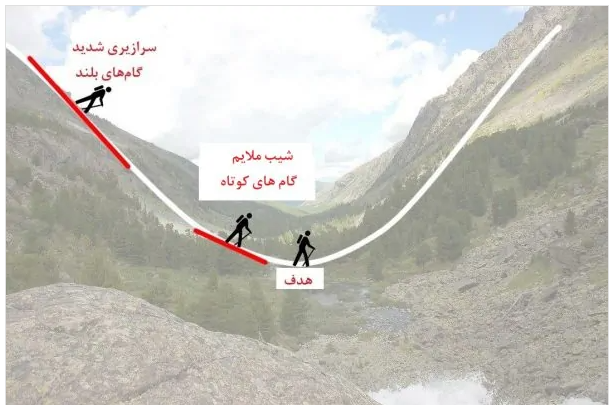
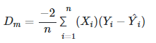
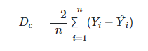
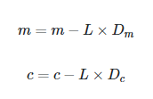

### مفاهیم زیر را به صورت خلاصه بررسی کنید.

- Ovefitting <br/>
<div dir="rtl" align="justify">
  
```
Ovefitting در عملکرد یادگیری بسیار خوب بوده، اما عملکرد آن بر روی مجموعه داده ای های دیگر (dataset) خوب نیست. 
```
  درواقع Over-fitting به این موضوع اشاره دارد که مدل ما بسیار خوب آموزش دیده است اما به خوبی تعمیم نیافته است. اجازه دهید با یک مثال واقعی پیش برویم.فرض کنید شما به یک کشور خارجی رفته اید و قصد دارید با تاکسی به جایی بروید و از بد روزگار راننده آن تاکسی شما را تلکه می کند و پول زیادی از شما می گیرد و در نهایت شما می گویید تمامی رانندگان تاکسی آن کشور دزد هستند. Over-generalization یا Over-fitting دقیقا همین چیزی است که در زندگی انسان ها در حال رخ دادن است و جالب است بدانید که ماشین نیز ممکن است در این دام بیفتد اگر به خوبی مراقب عملکردتان نباشید. بنابراین تعریف Over-fit را اینگونه می گوییم که بسیار خوب آموزش دیده است اما قدرت تعمیم پذیری یا Generalization ندارد.
  <br/>
  این اتفاق زمانی برایتان ممکن است بیفتد که مجموعه داده ای شما خیلی کوچک یا خیلی بزرگ و پیچیده باشد و همچنین شامل داده های نویزی نیز باشد ( البته کوچک بودن نیز به تنهایی می تواند مشکل ساز باشد حتی بدون داده های نویزی ). به همین خاطر می گوییم ماشین نمی تواند با داده های جدید درست نتیجه گیری کند.
</div>
Over-fitting = Good Learning + Not Generalized

زمانی که مدل را ساده تر می کنیم تا ریسک بیش برازش کمتر شود را Regularization یا تنظیم می گوییم.

- Local minimum
<div rtl="rtl" align="justify">
  
```
حداقل محلی یک تابع نقطه ای است که در آن مقدار تابع کوچکتر از نقاط نزدیک است، اما نسبت به تابع هدف بزرگتر است.
```
  برای مثال فرض کنید برای خرید ماسک به تعدادی داروخانه مراجعه میکنید از بین آنها ارزان ترین قیمت ماسک 5000 تومان است ولی  در داروخانه ای دیگر قیمت ماسک از 2000 تومان شروع میشود در این حالت از میان داروخانه ای از آنها گذر کرده اید ارزان ترین ماسک را خرید کرده اید ولی در مجموع ارزان ترین ماسک را نخریده اید به این حالت میتوان گفت مینیمم محلی زیرا در میان محله  ای که در آن ماسک را قیمت کرده اید بهینه ترین حالت را یافته اید ولی به داروخانه های قیمت مناسب تر سر نزده اید و بهینه ترین حالت را نیافته اید  

</div>


- Gradient descent

<div dir="rtl" align="justify">

```
الگوریتم گرادیان کاهشی، یک الگوریتم بهینه‌سازی تکراری مرتبه-اول هست که مینیموم محلی در یک تابع مشتق‌پذیر را پیدا می‌کند.
```
گرادیان کاهشی یک الگوریتم بهینه‌سازی تکرارپذیر است که به کمک آن می‌توان مقدار کمینه یک تابع مورد نظر را محاسبه کرد. در اینجا تابع مورد نظر، همان تابع زیان است.
  
  
  
  صور کنید که در کوهستان مشغول پیاده روی هستید و می‌خواهید از ستیغ کوه به دره برسید ولی به علت مه آلود بودن هوا متوجه نمی‌شوید که چه موقعی به دره رسیده‌اید. از شیب زمین و سرازیری کمک می‌گیرد. از سرازیری به پایین می‌آیید. در ابتدای راه گام‌های شما بلند است زیرا می‌دانید که هدف (دره) دور از شما قرار دارد و احتیاج به دقت در تشخیص موقعیت خود ندارید. ولی زمانی که شیب ملایم می‌شود می‌فهمید که به دره نزدیک شده‌اید و باید گام‌‌هایتان را کوتاه بردارید تا دره را پیدا کنید.

به این ترتیب در هر گام، موقعیت بعدیتان را براساس موقعیت فعلی تنظیم می‌کنید تا از مسیر خارج نشوید. به این شیوه مشخص است که گام بعدی شما به گام قبلی بستگی دارد. در این حالت کاهش طول گام‌ها را با کاهش شیب هماهنگ می‌کنید تا زمانی که دیگر شیبی وجود ندارد. در این هنگام به دره که هدفتان بود، رسیده‌اید.

این عملکرد همان چیزی است که در الگوریتم گرادیان کاهشی رخ می‌دهد. در ادامه، این الگوریتم را برای پیدا کردن پارامترهای m و c، قدم به قدم به کار می‌گیریم.

۱- مقدار دهی اولیه: فرض کنید m و c موقعیت شما را تعیین می‌کنند. به عنوان مقدارهای اولیه m=0 و c=0 در نظر گرفته می‌شود. در این میان L را نیز نرخ یادگیری می‌نامیم. مقدار L نشان می‌دهد که میزان تغییر m در هر مرحله چقدر است. امیدواریم تغییر در مقدار m در آخرین مراحل اجرای الگوریتم گرادیان کاهشی، ما را به هدف که کمینه‌سازی تابع زیان است، برساند.
  
   محاسبه مشتق: مشتق جزئی تابع زیان را برحسب m که ضریب X است، محاسبه می‌کنیم و آن را 
D
m
 می‌نامیم. در این حالت چون این مشتق برابر با 
−
X
i
 است، داریم:
  


2- محاسبه مشتق: مشتق جزئی تابع زیان را برحسب m که ضریب X است، محاسبه می‌کنیم و آن را 
D
m
 می‌نامیم. در این حالت چون این مشتق برابر با 
−
X
i
 است، داریم:
  
  
  
  به همین ترتیب مشتق جزئی تابع زیان را نسبت به c محاسبه می‌کنیم و آن را 
D
c
 می‌نامیم. به این ترتیب خواهیم داشت:

  3- به روز رسانی پارامترها:  براساس رابطه زیر مقدار پارامترها را در این مرحله به روز می‌کنیم.

  

  
  
  4- تکرار مراحل: با جایگزینی مقدار m و c‌ حاصل شده در هر مرحله، مقدار 
^
Y
 محاسبه می‌شود و مجدد مقدار مشتقات جزئی تابع زیان براساس محاسبات جدید به روز خواهد شد. این گام‌ها تا زمانی که مقدار تابع زیان بسیار کوچک شده باشد، ادامه پیدا می‌کند. در حالت ایده‌آل باید مقدار تابع زیان صفر شود که در این حالت، دقت ۱۰۰٪ در پیش‌بینی رخ خواهد داد و این وضعیت فقط زمانی پیش خواهد آمد که دقیقا مقدارهای 
X
 و 
Y
 روی یک خط راست قرار گرفته باشند.

حال به مسئله کوهنوردی شما بر می‌گردیم. فرض کنید m و c موقعیت شما را نشان می‌دهند. مشتق جزئی یعنی 
D
m
 نیز میزان شیب یا سرازیری را نشان می‌دهد. از طرف دیگر می‌توان L را سرعت حرکت شما در نظر گرفت. در این حالت مقدار جدید m در طرف چپ مرحله ۳ نشان‌دهنده موقعیت بعدی شما است و 
L
×
D
 نیز طول گام‌های شما را نشان می‌دهد. وقتی که شیب یعنی مقدار D بزرگ باشد، شما گام‌های بلندی بر می‌دارید زیرا می‌دانید که هدف در دور دست است. وقتی که شیب کم می‌شود، طول گام‌ها شما کوتاه می‌شود زیرا می‌دانید که در حال نزدیک شدن به دره هستید. در انتها نیز زمانی که شیب صفر است دیگر تغییر مکانی نخواهید داشت پس مقدار m و c انتهایی موقعیت شما را در دره نشان می‌دهند.
  
</div>

- Eager and lazy learning
