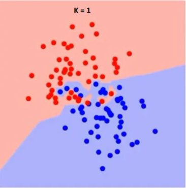
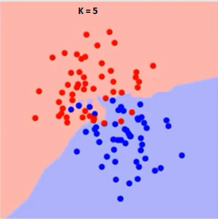
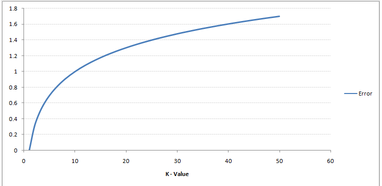
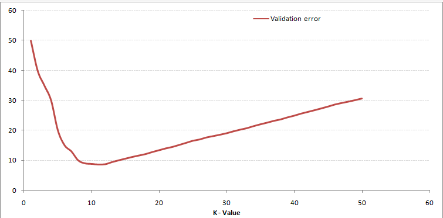

### تفاوت های k=1 ، k=5 را در یک داده ی فرضی با الگوریتم knn بررسی کنید.

  الگوریتم k-نزدیک‌ترین همسایگی برای مسائل طبقه‌بندی و رگرسیون قابل استفاده است. اگرچه، در اغلب مواقع از آن برای مسائل طبقه‌بندی استفاده می‌شود. برای ارزیابی هر روشی به طور کلی به سه جنبه مهم آن توجه می‌شود:

1- سهولت تفسیر خروجی‌ها
 
2- زمان محاسبه
 
3-قدرت پیش‌بینی
  
به تصاویر زیر توجه کنید :
   

 
همان‌طور که از تصاویر مشهود است، با افزایش مقدار k، مرزهای کلاس‌ها روان‌تر می‌شود. با افزایش k به سمت بی‌نهایت، بسته به اکثریت مطلق نمونه‌ها در نهایت یک کلاس آبی یا قرمز وجود خواهد داشت. نرخ خطاهای آموزش (training) و ارزیابی (evaluation) دو عاملی هستند که برای تعیین مقدار k مناسب به آن‌ها نیاز داریم. نمودار خطی در شکل ۴ بر اساس مقدار خطای آموزش برای k‌های گوناگون ترسیم شده است.
 
 

   
     
چنان‌که مشاهده می‌کنید، نرخ خطا هنگامی‌که k = ۱ است، برای نمونه‌های آموزش صفر باقی می‌ماند. این امر بدین دلیل است که نزدیک‌ترین نقطه به هر داده آموزش، خود آن داده است. بنابراین نتایج پیش‌بینی با k = ۱ صحیح است. اگر k = ۱ باشد نمودار خطای ارزیابی نیز روند مشابهی دارد. نمودار خطای ارزیابی با مقادیر گوناگون k در شکل ۵ نمایش داده شده است.

 

   
در تصویر فوق نرخ خطا را در K های مختلف بررسی کرده ایم : 
هنگامی که k = ۱ است مرزها دچار بیش برازش (overfit) شده‌اند. بنابراین نرخ خطا کاهش پیدا کرده و در واقع به حداقل میزان خود می‌رسد و با افزایش k مقدار خطا نیز افزایش پیدا می‌کند. برای انتخاب مقدار بهینه k می‌توان داده‌های آموزش و ارزیابی را از مجموعه داده اولیه جدا کرد. سپس با رسم نمودار مربوط به خطای ارزیابی مقدار بهینه K را انتخاب کرد. این مقدار از k باید برای همه پیش‌بینی‌ها مورد استفاده قرار بگیرد و در‌ واقع برای همه مراحل پیش‌بینی باید از یک k مشخص استفاده شود.
  
  

