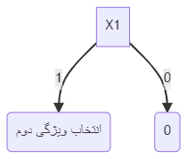
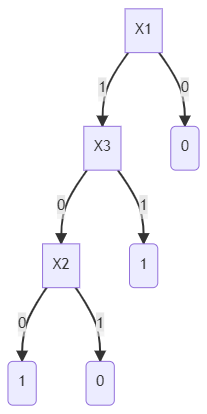
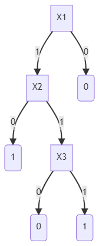

###  دیتاست زیر شامل 3 ورودی و یک y می باشد؛ این دیتاست تنها دارای مقدار باینری 0 و 1 است.

  
|     Y    |     X3    |     X2    |     X1    |        |
|----------|-----------|-----------|-----------|--------|
|     0    |     1     |     0     |     0     |    1   |
|     0    |     0     |     1     |     0     |    2   |
|     0    |     0     |     1     |     1     |    3   |
|     1    |     1     |     0     |     0     |    4   |
|     1    |     1     |     1     |     1     |    5   |
|     1    |     0     |     0     |     1     |    6   |
|     1    |     0     |     1     |     1     |    7   |  
  
  - اگر داده ی x1=0 , x2=0, x3=1 بیاید در کدام کلاس قرار می گیرد.
  - ما می دانیم که X1 ، X2 ، X3 متغیرهای تصادفی مستقل هستند. آیا درخت تصمیم برای داده های بالا مناسب تر می باشد.

  
  مطابق ردیف های موجود در جدول، ردیف های 4 و 7 دارای نویز میباشد به این معنی که با ورودی های مشابه ردیف های 1 و 3 شاهد نتایج متفاوتی بودیم .
  
  در نتیجه این ردیف ها را نادیده گرفته و جدول را یه شکل زیر استفاده خواهیم کرد : 
  
|     Y    |     X3    |     X2    |     X1    |        |
|----------|-----------|-----------|-----------|--------|
|     0    |     1     |     0     |     0     |    1   |
|     0    |     0     |     1     |     0     |    2   |
|     0    |     0     |     1     |     1     |    3   |
|     1    |     1     |     1     |     1     |    4   |
|     1    |     0     |     0     |     1     |    5   |
  
  

<table>
<tr>
<td>
ویژگی 1
</td>
<td>
0 => 0
</td>
<td>
1 => 1
</td>
<td>
0 => 1
</td>
<td>
1 => 0
</td>
</tr/>
<tr>
<td>
X1
</td>
<td>
2
</td>
<td>
2
</td>
<td>
0
</td>
<td>
1
</td>
</tr>
<tr>
<td>
-
</td>
<td colspan=2>
فرضیه 1 : 4
</td>
<td colspan=2>
فرضیه 2 : 1
</td>
</tr>
<tr>
<td colspan=5 align="justify">
توضیحات : فرضیه دوم به عنوان فرضیه دارای خطای کمتر انتخاب میشود  
</td>
</tr>
</table>
 
  
  
<table>
<tr>
<td>
ویژگی 2
</td>
<td>
0 => 0
</td>
<td>
1 => 1
</td>
<td>
0 => 1
</td>
<td>
1 => 0
</td>
</tr/>
<tr>
<td>
X2
</td>
<td>
1
</td>
<td>
1
</td>
<td>
1
</td>
<td>
2
</td>
</tr>
<tr>
<td>
-
</td>
<td colspan=2>
فرضیه 1 : 2
</td>
<td colspan=2>
فرضیه 2 : 3
</td>
</tr>
<tr>
<td colspan=5 align="justify">
توضیحات : فرضیه اول به عنوان فرضیه دارای خطای کمتر انتخاب میشود  
</td>
</tr>
</table>
 
  
  
<table>
<tr>
<td>
ویژگی 3
</td>
<td>
0 => 0
</td>
<td>
1 => 1
</td>
<td>
0 => 1
</td>
<td>
1 => 0
</td>
</tr/>
<tr>
<td>
X3
</td>
<td>
2
</td>
<td>
1
</td>
<td>
1
</td>
<td>
1
</td>
</tr>
<tr>
<td>
-
</td>
<td colspan=2>
فرضیه 1 : 3
</td>
<td colspan=2>
فرضیه 2 : 2
</td>
</tr>
<tr>
<td colspan=5 align="justify">
توضیحات : فرضیه دوم به عنوان فرضیه دارای خطای کمتر انتخاب میشود  
</td>
</tr>
</table>

در نهایت مقدار ویژگی ها به صورت زیر خواهد بود 

|ویژگی | مقدار |
|-------|-------|
|X1|1|
|X2|2|
|X3|2|

در نتیجه ویژگی 1 که "X1" میباشد به عنوان ریشه انتخاب میشود

شکل درخت تا کنون به شکل زیر میباشد:

به جهت یافتن ویژگی دوم مجدد مراحل فوق را تکرار میکنیم:

 
<table>
<tr>
<td>
ویژگی 2
</td>
<td>
0 => 0
</td>
<td>
1 => 1
</td>
<td>
0 => 1
</td>
<td>
1 => 0
</td>
</tr/>
<tr>
<td>
X2
</td>
<td>
0
</td>
<td>
1
</td>
<td>
1
</td>
<td>
1
</td>
</tr>
<tr>
<td>
-
</td>
<td colspan=2>
فرضیه 1 : 1
</td>
<td colspan=2>
فرضیه 2 : 2
</td>
</tr>
<tr>
<td colspan=5 align="justify">
توضیحات : فرضیه اول به عنوان فرضیه دارای خطای کمتر انتخاب میشود  
</td>
</tr>
</table>
 
  
  
<table>
<tr>
<td>
ویژگی 3
</td>
<td>
0 => 0
</td>
<td>
1 => 1
</td>
<td>
0 => 1
</td>
<td>
1 => 0
</td>
</tr/>
<tr>
<td>
X3
</td>
<td>
1
</td>
<td>
1
</td>
<td>
1
</td>
<td>
0
</td>
</tr>
<tr>
<td>
-
</td>
<td colspan=2>
فرضیه 1 : 2
</td>
<td colspan=2>
فرضیه 2 : 1
</td>
</tr>
<tr>
<td colspan=5 align="justify">
توضیحات : فرضیه دوم به عنوان فرضیه دارای خطای کمتر انتخاب میشود  
</td>
</tr>
</table>

در نهایت مقدار ویژگی ها به صورت زیر خواهد بود 

|ویژگی | مقدار |
|-------|-------|
|X2|1|
|X3|1|

به دلیل مساوی بودن مفدار دو فرضیه دو حالت  از درخت را میتوان رسم نمود
  

 

:ballot_box_with_check:
پاسخ بخش اول : 
بنابر این در دو جدول رسم شده در فوق اگر x1=0 ،x2=0 ،x3=1 باشد در حالت اول ما دو خروجی 0 و 1 را داریم که به دلیل مشاهده نویز دومین سطر مشابه را حذف کرده و در نتیجه خروجی 
مشابه سطر یک بوده و برابر با 0 میباشد. (y=0)

:ballot_box_with_check:
پاسخ بخش دوم : 
درخت تصمیم برای داده هایی که مستقل و گسسته هستند مناسب بوده و عملکرد خوبی دارد.

