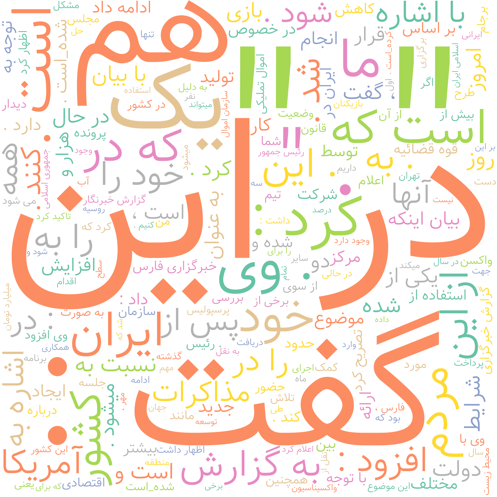

### ابرکلمات هر خبر را با کمک دیتاستی که جمع آوری کرده اید ایجاد کنید و یک ابرکلمات برای تمام خبرها نیز در نظر بگیرید.
<div dir="rtl" align="justify">
<p>
در این قسمت لازم به نصب کتابخانه ای تحت عنوان wordcloud-fa است که به دلیل استفاده ازدیتاست حاوی لغات فارسی لازم است از آن استفاده شود و با دستور زیر این امکان مهیا خواهد بود
  </p>
  </div>
  
  ```
  pip install wordcloud-fa
  ```
  
  
  <div dir="rtl">
<p>
در خطوط زیر کتابخانه های مورد نظر import  شده اند این کتابخانه ها به ترتیب برای 

<br/>
  <li>نمایش تصویر</li>
  <li> ایجاد ابر کلمات برای لغات فارسی</li>
  <li> و در نهایت نیز استفاده از کتابخانه کولب به منظور ذخیره تصویر ایجاد شده به عنوان خروجی</li>
  <br/>
میباشند
</p>
</div>

```
import matplotlib.pyplot as plt
from wordcloud_fa import WordCloudFa
from google.colab import files
```

<p dir="rtl" align="justify">
 در خطوط زیر نیز با فراخوانی تابع WordCloudFa و تنظیم میزان عرض و ارتفاع تصویر بر روی 2000 و رنگ پس زمینه تصویر و بازه رنگی کلمات ، اقدام به فراخوانی فایل دیتاست مورد نظر شده است البته این دیتاست از منوی کناری colab در بخش فایل قرار داده شده است در ادامه نیزبا ایجاد محیط ابری بر روی کلمات وارد شده ابر کلمات ایجاد شده است حال لازم است تا این تصویر نمایش داده شود در نتیجه با استفاده از کتابخانه matplotlib و تابع show تصویر نمایش داده شده است 
  
 </p>
 
 
 ```
 word_cloud = WordCloudFa(height= 2000 , width=2000, background_color='white', colormap='Set2')
with open('./news_data.txt' , 'r',encoding='utf-16',) as file:
  news_content = file.read()

cloud = word_cloud.generate(news_content)
plt.imshow(word_cloud)
plt.axis('off')
plt.show()
```
<div dir="rtl" align="justify">
<p>
در این بخش با تبدیل خروجی به تصویر و در نهایت استفاده از تایع save تصویر مورد نظر در بخش files واقع در منوی سمت چپ با عنوان output ذخیره میشود 
  </p>
  </div>
  
  ```
image = word_cloud.to_image()
image.save('output.png')
  ```
  
  خروجی تصویر به شکل زیر خواهد بود :
  <br/>
  <br/>
  
