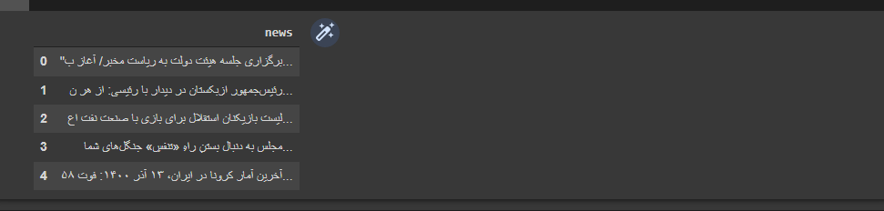
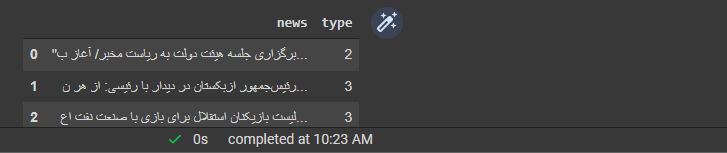
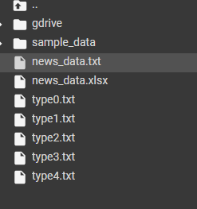

### سعی کنید دسته بندی هر خبر را به صورت خودکار بدست آورید.


<div dir="rtl" align="justify">
  قبل از انجام هر کاری در خط اول دیتاست news را به عنوان head قرار میدهیم 
  <br/>
  به جهت بارگذاری فایل دیتاست مورد نظر در برنامه لازم است تا آن را در گوگل درایو خود آپلود نموده و در محیط colab از آن استفاده نماییم برای این منظور به روش زیر عمل خواهیم کرد :  
 
  </div>
  
  ```
from google.colab import drive
drive.mount('/content/gdrive')
```
<div dir="rtl" align="justify">
در خط اول کتابخانه مورد نظر به منظور بارگذاری فایل دیتاست از گوگل درایو  import کرده ایم 
  و در خط دوم نیز محتوای موجود درگوگل درایو را mount کرده ایم 
  با انجام این کار گوگل برای حفظ امنیت popup باز کرده و اجازه ی دسترسی میخواهد با تایید دسترسی ، میتوان به محتویات آپلود شده در گوگل درایو اکانت خود دسترسی داشته باشیم .
  <br/>
  <br/>
در ادامه به جهت فراخوانی دیتاست مورد نظر ابتدا لازم است با انتخاب فایل مورد نظر بارگذاری آن صورت گیرد .
  برای این منظور به شکل زیر عمل میکنیم: 
  </div>
  <br/>
  <br/> 
  
  ```
import pandas as pd
news = pd.read_csv('./gdrive/MyDrive/news_data.txt', encoding='utf-8')
news.head()
  ```
  <div dir="rtl" align="justify">
  در ابتدا لازم است تا کتابخانه ی pandas فراخوانی شود تا امکان بارگذاری فایل مورد نظر مهیا بشد در ادامه با قرار دادن فایل مورد نظر در متغیری با نام news و استفاده از تابع read_csv فایل مورد نظر را قرار داده ایم و encoding ان را نیز بر روی utf-8 قرار داده ایم با این کار امکان مشاهده متون فارسی فراهم خواهد شد .
  همچنین به جهت نمایش دیتاهای موجود در فایل news با استفاده از تابع head خروجی همچون تصویر زیر را خواهیم داشت .
  </div>
  <br/>
    <div align="center">
  
  </div>
    <div dir="rtl" align="justify">
در ادامه با استفاده از کتابخانه ای با نام sklearn برداری از کلمات را ایجاد کرده ایم به عبارت دیگر کلمات را از متون موجود جداسازی کرده ایم
  
  
  </div>
  <br/>
  
  ```
ffrom sklearn.feature_extraction.text import TfidfVectorizer
from sklearn.cluster import KMeans

document = news['news'].values.astype("U")
```

<div align="justify" dir="rtl">
  پس از عملیات فوق و ایجاد vectore ها ، stopword  ها که کمکی در یافتن دسته بندی نمیکنند را جدا میکنیم و با استفاده از کتابخانه ی KMeans مقداری را برای k در نظر میگیریم که این مقدار در این مثال 5 است  و میتواند تغییر کند و مقداری دیگر را برای آن در نظر داشت در نهایت با نمایش مجدد news خواهیم دید خروجی به شکل زیر میشود  
  </div>
  <br/>
  
  ```
vector = TfidfVectorizer(stop_words='english')
features = vector.fit_transform(doc)

k = 5
model = KMeans(n_clusters=k, init='k-means++', max_iter=100, n_init=1)
model.fit(features)

news['type'] = model.labels_
news.head()
```


   <div align="center">
  
  </div>
  
  
  <div align="justify" dir="rtl">
  با استفاده از برنامه زیر میتوان فایل برای تمام دسته بندی ها ایجاد نموده و موارد هر دسته بندی را در فایل خود ذخیره نماییم این فایل ها را میتوان در منوی سمت چپ colab مشاهده نمود که تصویر ان در ادامه قرار داده شده است
  </div>
  <br/>
  
  ```
  clusters = news.groupby('type')
for cluster in clusters.groups:
  my = open('type'+ str(cluster) + '.txt', 'w')
  data = clusters.get_group(cluster)[['news']]
  my.write(data.to_csv(index_label='id'))
  my.close()
  ```
  
<div align="center">
  
  </div>
  <br/>
  <div align="justify" dir="rtl">
در برنامه زیر به خوشه بندی های ایجاد شده با نام های آن قرار داده شده است  و خروجی آ ن نیز در تصویر اخر قابل مشاهده است 
  </div>
  <br/>
  
  ```
  print("cluster :\n")

order_centeroids = model.cluster_centers_.argsort()[:,::-1]
terms = vector.get_feature_names()
for i in range(k):
  print("cluster %d:" %i)
  for j in order_centeroids[i, :10]:
    print('%s' %terms[j])
  print('-----------------')
  ```
  
  <div align="center">
  
  </div>
