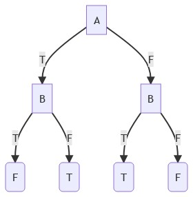
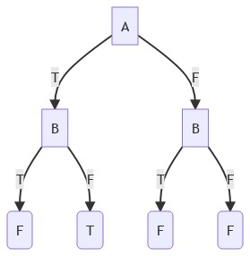
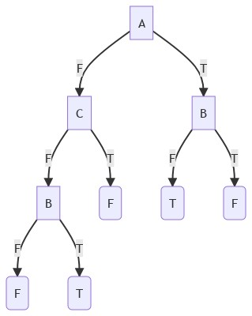
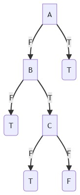
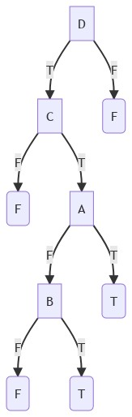

### درخت تصمیم مربوط به عبارت های زیر را رسم کنید.
<br/>

```
(A OR B) XOR (A AND B)
```


```
(A XOR B) AND ( (A OR B) OR (A AND B) )
```


```
(A NAND B) AND ( (A XOR B) OR (A OR B) ) AND NOT(B)
```


```
(A AND B) OR (B AND C) XOR (A OR B)
```


```
(A AND B AND C) OR (C NAND B)
```


```
(A OR B) AND (B OR C) AND (C AND D) 
```


