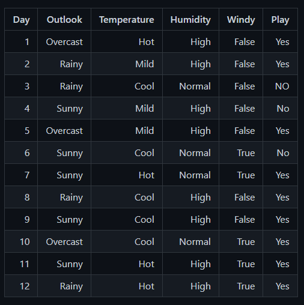
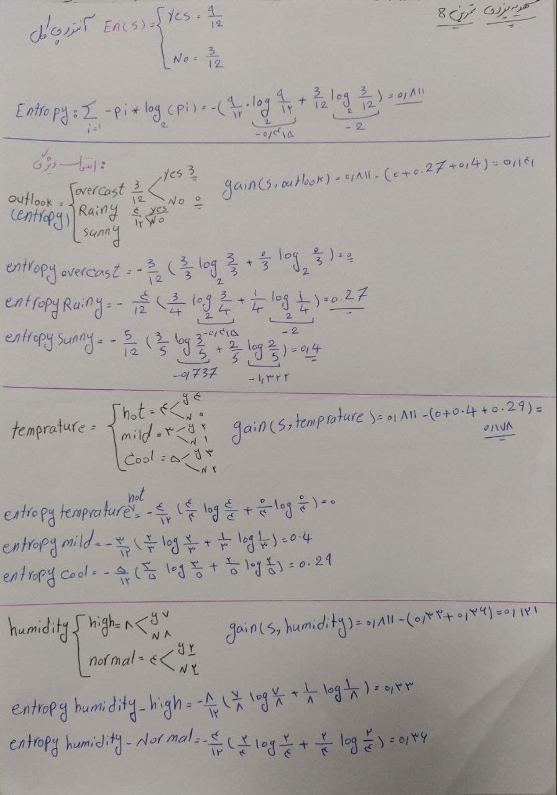
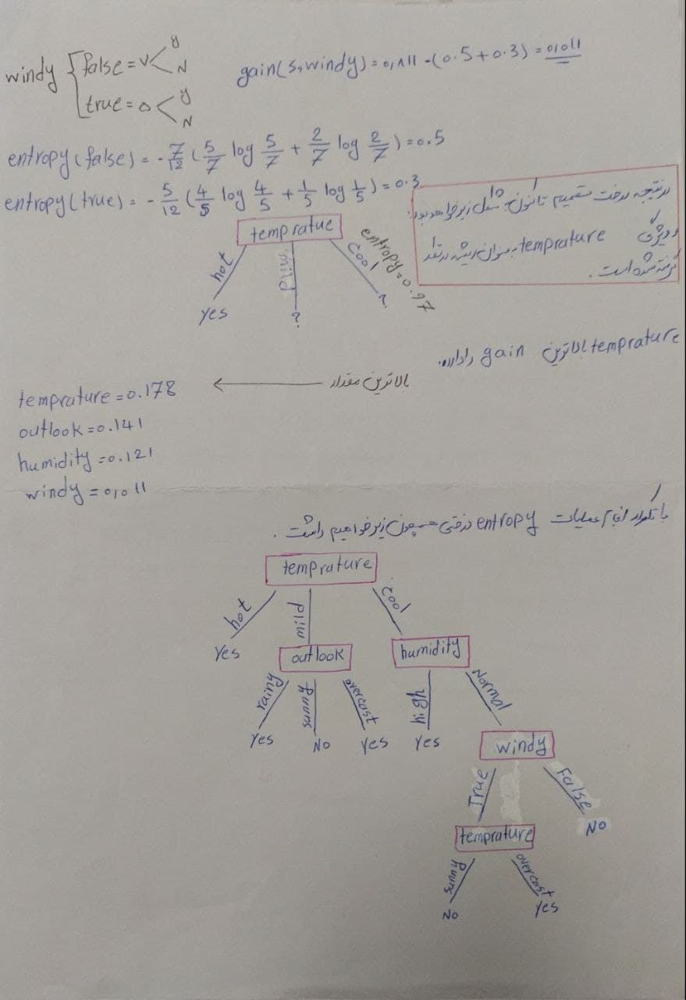

### با روش ID3 درخت تصمیم جدول زیر را رسم کنید.

  

الگوریتم id3 یکی از الگوریتم های ساخت درخت تصمیم است که در این الگوریتم با دو مفهوم Entropy و gain مواجه هستیم که در ادامه به توضیح آن ها خواهیم پرداخت 

:arrow_backward: Entropy همان گونه که از نام آن مشخص است برای یافتن بی نظمی های سیستم از آن استفاده میشود و نشان دهنده ی کم بودن اطلاعات است

:arrow_backward: Gain که در واقع همان Information Gain است، از Entropy در هر مقدار از ویژگی‌ها کمک گرفته و به میزانِ اطلاعاتی که می‌توان از یک ویژگی (بُعد) به دست آورد، گفته می شود. یعنی یک ویژگیِ خاص چقدر می‌تواند اطلاعاتِ بیشتری به ما بدهد. 

 

الگوریتم ID3 وظیفه پیدا کردنِ ویژگی‌هایی دارای اطلاعات زیادتر (Gain بیشتر) را دارد و آن‌ها را در سطوحِ بالاتری از درخت قرار می‌دهد.

  در نتیجه این روش به بهبود درخت تصمیم کمک میکند در شکل زیر فرمول آنتروپی قابل مشاهده است وهمانطور که مشخص است لگاریتم با مبانی 2 مشخص شده است  

  

در ادامه به حل تمرین خواهیم پرداخت 

  

  

