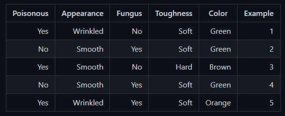

### با توجه به داده های زیر این جدول را با کمک الگوریتم find-s حل کنید.


<p align="center">
  
</p>


 مرحله اول =  در ابتدا تمام ویژگی ها را 0 قرار میدهیم :
 
 
 ```
  h0 = (ø, ø, ø, ø, ø)
 ```

 
 مرحله دوم =  ویژگی های x را در x1 قرار داده و عینا در h قرار میدهیم :

 ```
X1 = (green, soft, no, wrinkled) – yes

h1 = (green, soft, no, wrinkled)
 ```
 
 
مرحله سوم : به دلیل منفی بودن تاثیری در مقدار h نخواهیم داشت 
 
 ```
X2 = (green, soft, yes, smoth) – no
 
h2 = (green, soft, no, wrinkled)
 ```
 
 
مرحله چهارم : به دلیل تغییر ویژگی های color , toughness , appearance مقدار h انها ? میشود 
 
```
 X3 = (brown, hard, no, smoth) – yes
 
 h3 = (?, ?, no, ?)
 ````
 
 
مرحله پنجم : به دلیل منفی بودن تاثیری در مقدار h نخواهیم داشت 

```
X4 = (green, soft, yes, smoth) – no
 
h4 = (?, ?, no, ?)
```
 

مرحله ششم : به دلیل تغییر ویژگی Fungus مقدار h به ? تغییر میکند 
 
 
 ```
X5 = (green, soft, yes, wrinkled) – yes
 
h5 = (?, ?, ?, ?)
```

با اتمام نتیجه متوجه خواهیم شد مقدار  h به صورت زیر خواهد  بود : 
 
 ```
 فرضیه حداکثری نهایی :
 
 h = (?, ?, ?, ?)
 ```
