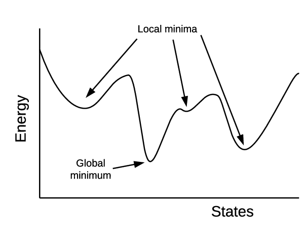

### Ovefitting
یا بیش برازش هنگامی رخ می دهد که مدل ما بیش از حد به داده های آموزشی منطبق شده باشد، مانند این است که زیادی به مثال های آموزشی بها می دهیم. در این صورت مدل ما برای داده های آموزش بسیار درست خواهد بود اما در دنیای واقعی خطا خواهد داشت.

### Local minimum
نقطه ای است که نسبت به نقاط اطرافش کمتر است اما کمترین نقطه نمی باشد. در مسائل هوش مصنوعی دوست داریم درگیر مینیمم محلی نشویم.

### Gradient descent
گرادیان کاهشی یک الگوریتم بهینه‌سازی برای پیدا کردن کمینه یک تابع است. در این الگوریتم کار با یک نقطه تصادفی روی تابع آغاز می‌شود و روی جهت منفی از گرادیان تابع حرکت می‌کند تا به کمینه محلی/سراسری برسد.

### Eager and lazy learning
2 دسته بندی برای الگوریتم‌های طبقه‌بندی (Classification) از منظر روش یادگیری روی داده‌های آموزشی هستند.
  
یادگیری کوشا به این صورت عمل می‌کند که با استفاده از داده‌های آموزشی مدل طبقه‌بندی را می‌سازد، سپس این مدل، برای ارزیابی داده‌های آزمایشی مورد استفاده قرار می‌گیرد. اگر نتایج ارزیابی رضایت‌بخش باشد، از مدل بدست‌آمده جهت پیش‌بینی طبقه‌بندی داده‌های ناشناخته ورودی استفاده می‌شود.
  
یادگیری تنبل هیچ مدلی را قبل از گرفتن داده‌های ناشناخته از ورودی نمی‌سازد و منتظر داده‌های طبقه‌بندی نشده می‌ماند و پس از دریافت شروع به ساخت مدل پیش‌بینی می‌کند.به دلیل اینکه به ازای هر پیش‌بینی داده ورودی باید کل مدل از اول ساخته شود، بنابراین می‌توان گفت یاگیری تنبل زمان زیادی صرف می‌کند.
