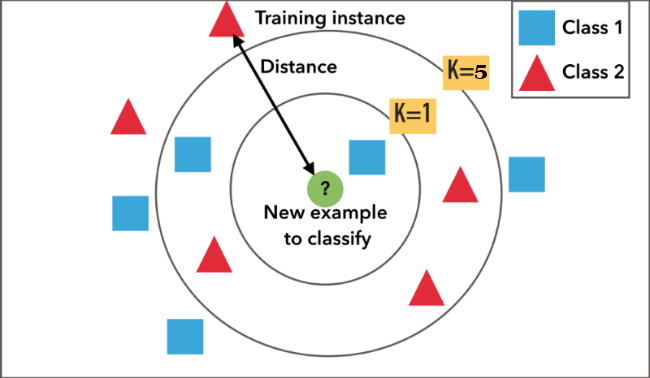

### الگوریتم knn 

 یک روش دسته بندی بر اساس نمونه است که متناسب با نردیک ترین همسایه های خود تصمیم میگیرد. موقعیت یک نقطه جدید را بدست می اوریم و بر اساس k نقطه نزدیک آن تصمیم میگیریم. بدیهی است برای تصمیم گیری درست باید k فرد باشد.
 
فرض کنیم k  برابر 1 باشد، در این صورت تنها یک همسایه نزدیک خود را میبیند، که ممکن است این داده نویز باشد، در نتیجه، خروجی مطلوب خاصل نمی شود.
<b>
اگر k برابر 5 باشد، مشخص است که نمونه های بیشتری را در بر میگیرد و نتیجه دقیق تری ارائه می دهد.

