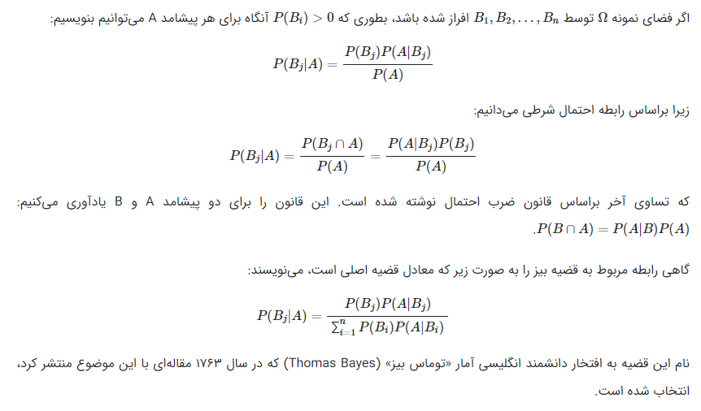

### قضیه بیز (Bayesian Theorem)

پیدایش رسمی احتمال از قرن هفدهم به عنوان متدی برای محاسبه شانس در بازیهای قمار بوده است. اگر چه ایده های احتمال شانس و تصادفی بودن از تاریخ باستان در رابطه با افسونگری و بخت آزمایی و بازیهای شانسی و حتی در تقسیم کار بین راهبان در مراسم مذهبی وجود داشته است و به علاوه شواهدی از بکارگیری این ایده ها در مسایل حقوق٫ بیمه٫ پزشکی و نجوم نیز یافت میشود٫ اما بسیار عجیب است که حتی یونانیان اثری از خود در رابطه با استفاده از تقارنی که در هندسه بکار می برده اند در زمینه احتمال یا اصولی که حاکم بر مسایل شانس باشد بجا نگذاشته اند. ارسطو پیشامدها را به سه دسته تقسیم می نمود: ۱) پیشامدهای قطعی که لزومآ اتفاق می افتادند. ۲) پیشامدهای احتمالی که در بیشتر موارد اتفاق می افتادند. ۳) پیشامدهای غیر قابل پیش بینی و غیر قابل شناسایی که فقط با شانس محض رخ میدهند. اما ارسطو به تعبیرهای مختلف احتمال اعتقاد نداشته و فقط احتمال شخصی که مربوط به درجه اعتقاد افراد نسبت به وقوع پیشامدهاست را معتبر می دانسته است. پاسکال و فرما اولی کسانی هستند که در اوایل قرن هفدهم مسایل مربوط به بازیهای شانسی را مورد مطالعه قرار دادند و این دو نفر به عنوان بنیانگزاران تیوری ریاضی احتمال لقب گرفته اند. دانشمندانی از قبیل هی گنز کارهای آنها را ادامه داده و ویت و هلی این مسایل را در آمارهای اجتماعی بکار گرفتند. این علم جدید نخستین نقطه اوج خود را در اثر مشهوری از ژاکوب برنولی بدست آورد. در این اثر علاوه بر تعریف کلاسیک احتمال ریاضی٫ اساس خاصی از قانون اعداد بزرگ و کاربردهای احتمال در آمارهای اجتماعی نیز مطرح شده است. در قرن هجدهم متفکران بزرگی چون دی مور٫ دانیل برنولی٫ آلمبرت٫ اویلر٫ لاگرانژ٫ بیز٫ لاپلاس و گاوس قسمتی از وقت خود را به این علم جدید اختصاص دادند. بیز در سال ۱۷۶۳ قانون معروف بیز را ارایه می دهد و لاپلاس در نوشته ای تمام موضوع علم احتمال را جمع آوری می کند. 

###مزیت ها و معایب تحلیل بیزی

تحلیل بیزی ابزار تحلیلی قدرتمند برای مدلسازی آماری، تفسیر نتایج و پیش بینی داده هاست. از این رویکرد،

می توان زمانی استفاده کرد که روش های استاندارد مبتنی بر فراوانی(کلاسیک) در دسترس نیستند و یا

روش های کلاسیک موجود موفقیت چندانی ندارند. بهرحال قبل از استفاده از روش های بیزی باید از مزیت ها

و معایب آن آگاهی داشته باشید. احتمالا جامعیت رویکرد بیزی مهم ترین مزیت روش شناسی آن نسبت به

رویکرد کلاسیک است. استنباط های رویکرد بیزی بر اساس قاعده ساده بیز هستند که برای همه مدل های

پارامتریک بکار می رود. همین مساله منجر به جامعیت و نیز سهولت کاربرد و تفسیر آن می شود. بهرحال

رویکرد کلاسیک وابسته به روش های برآورد مختلف است که برای مسائل و مدل های آماری خاص طراحی

شده اند. اغلب روش های استنباطی که برای طبقه خاصی از مسائل طراحی شده نمی تواند برای مدلهای

دیگر نیز بکار رود.

در تحلیل بیزی می توانیم از اطلاعات قبلی که ممکن است بر اساس شواهد آزمایشی و یا باور شخصی

بدست آیند استفاده کنیم تا نتایج دقیق تری بدست آوریم. برای مثال، وارد کردن اطلاعات قبلی می تواند

اثرات منفی اندازه کم نمونه را کاهش دهد. مهم تر از آن این است که اطلاعات پیشین می تواند از چارچوب

نظری و مفهومی بدست آید.

با بکارگیری همه اطلاعات توزیع پسین برای پارامترهای مدل، استنباط آماری در این رویکرد نسبت به رویکرد

کلاسیک جامع تر و انعطاف پذیرتر است.

استنباط بیزی  به دلیل استفاده  از توزیع پسین در مرحله برآورد و پیش بینی، دقت بالایی دارد که توزیع پسین

یا به روش تحلیلی یا به روش عددی محاسبه می شود. این در حالی است که در بسیاری از روش های برآورد

کلاسیک برای مثال حداکثر درست نمایی بر اساس فرض نرمال بودن مجانبی استنباط انجام می گیرد.

استنباط بیزی یک تفسیر شهودی و  واضح تری از نتایج بر اساس احتمالات فراهم می کند. برای مثال فاصله

های منطقی به صورت فاصله هایی که پارامترها یک احتمال معین را می گیرند تفسیر می شوند در حالی که

فاصله اطمینان در رویکرد کلاسیک تفسیر واضح و آن چنان مستقیمی ندارد و یا حداقل به اندازه رویکرد بیزی

سرراست نیست.

مدل های بیزی اصل درست نمایی(Berger and Wolpert 1988))  را برآورده می کنند. بر اساس این اصل

اطلاعات در یک نمونه به صورت کامل توسط تابع درست نمایی نمایش داده می شود. لازم تحقق این قاعده

این است که اگر تابع درست نمایی در یک مدل متناسب با تابع درست نمایی مدل دیگر است این دو مدل باید

نتایج مشابهی داشته باشند. برخی از محققان ذکر کرده اند که روش های رویکرد کلاسیک ممکن است  اصل

درست نمایی  را نقض کنند. به عنوان نکته آخر می توان گفت که دقت برآورد در تحلیل بیزی به اندازه نمونه

محدود نیست.

با وجود مزیت های مفهومی و روش شناسی رویکرد بیزی کاربرد آن در عمل هنوز مورد بحث و مناقشه است.

دو دلیل اصلی می توان برای آن ذکر کرد: 1- امکان تصریح اطلاعات پیشین به صورت ذهنی 2- چالش های

محاسباتی در استفاده از روش های بیزی. مشکل اول زمینه ساز این  امکان می شود که افراد متفاوت توزیع

های پیشین متفاوتی تصریح کنند. به همین دلیل طرفداران رویکرد کلاسیک معتقدند که روش های بیزی فاقد

منطق و واقع بینی بوده و نباید استفاده شوند. به منظور مباحث بیشتر در خصوص مزایا و معایب رویکرد بیزی

به مقاله زیر مراجعه کنید:

Thompson (2012), Bernardo and Smith (2000), and Berger and Wolpert (1988).

### منابع
[1](http://eghtesadilam.blogfa.com/post/89)
[2](https://blog.faradars.org/bayesian-theorem/)
[3](http://www.gorohe-amar88.blogfa.com/post/43)
