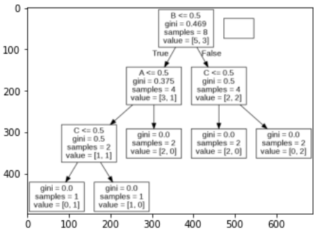
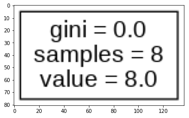
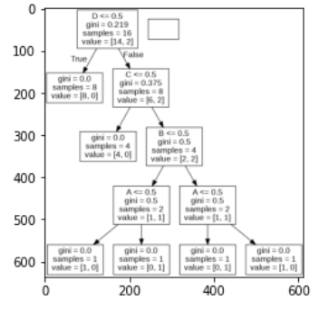

## part 1(EX1)
کد برای رسم جدول1
```
def ex1(a, b, c):
  if a == True:
    if b == True:
      if c == True:
          return True 
      elif c == False:
          return False 
    elif b == False: 
      return False
  elif a == False:
    if b == False:
      if c == True:
          return False
      elif c == False: 
          return True
    elif b == True:
      if c == True:
          return True 
      elif c == False:
          return False
print("A", "B", "C", "ex1")      
print("0", "0", "0", ex1(0,0,0))
print("0", "0", "1", ex1(0,0,1))
print("0", "1", "0", ex1(0,1,0))
print("0", "1", "1", ex1(0,1,1))
print("1", "0", "0", ex1(1,0,0))
print("1", "0", "1", ex1(1,0,1))
print("1", "1", "0", ex1(1,1,0))
print("1", "1", "1", ex1(1,1,1))
```
خروجی کد(جدول1)
```
A B C ex1
0 0 0 True
0 0 1 False
0 1 0 False
0 1 1 True
1 0 0 False
1 0 1 False
1 1 0 False
1 1 1 True
```
کد برای رسم درخت1
```
import pandas
from sklearn import tree
import pydotplus
from sklearn.tree import DecisionTreeClassifier
import matplotlib.pyplot as plt
import matplotlib.image as pltimg
df = pandas.read_csv("/content/ex1")
print(df)
features = ['A', 'B','C']
X = df[features]
y = df['ex']
print(df)
dtree = DecisionTreeClassifier()
dtree = dtree.fit(X, y)
data = tree.export_graphviz(dtree, out_file=None, feature_names=features)
graph = pydotplus.graph_from_dot_data(data)
graph.write_png('ex1.png')

img=pltimg.imread('ex1.png')
imgplot = plt.imshow(img)
plt.show()
```
خروجی درخت1
```
   A  B  C  ex
0  0  0  0   1
1  0  0  1   0
2  0  1  0   0
3  0  1  1   1
4  1  0  0   0
5  1  0  1   0
6  1  1  0   0
7  1  1  1   1 
```


  
 ## part 2(EX2)
 
 کد برای رسم جدول2
 
 ```
 def ex2(a, b, c):
  if a == True:
          return True 
  elif a == False:
          return True
print("A", "B", "C", "ex2")      
print("0", "0", "0", ex2(0,0,0))
print("0", "0", "1", ex2(0,0,1))
print("0", "1", "0", ex2(0,1,0))
print("0", "1", "1", ex2(0,1,1))
print("1", "0", "0", ex2(1,0,0))
print("1", "0", "1", ex2(1,0,1))
print("1", "1", "0", ex2(1,1,0))
print("1", "1", "1", ex2(1,1,1))
```
خروجی جدول 2

```
A B C ex2
0 0 0 True
0 0 1 True
0 1 0 True
0 1 1 True
1 0 0 True
1 0 1 True
1 1 0 True
1 1 1 True
```
کد برای رسم درخت 2

```
import pandas
from sklearn import tree
import pydotplus
from sklearn.tree import DecisionTreeClassifier
import matplotlib.pyplot as plt
import matplotlib.image as pltimg
df = pandas.read_csv("/content/ex2")
print(df)
features = ['A', 'B','C']
X = df[features]
y = df['ex2']
print(df)
dtree = DecisionTreeClassifier()
dtree = dtree.fit(X, y)
data = tree.export_graphviz(dtree, out_file=None, feature_names=features)
graph = pydotplus.graph_from_dot_data(data)
graph.write_png('ex2.jpeg')

img=pltimg.imread('ex2.jpeg')
imgplot = plt.imshow(img)
plt.show()
```
خروجی درخت 2
```
   A  B  C  ex2
0  0  0  0    1
1  0  0  1    1
2  0  1  0    1
3  0  1  1    1
4  1  0  0    1
5  1  0  1    1
6  1  1  0    1
7  1  1  1    1
```

## part 3(EX3)
کد برای جدول3
```
def ex3(a, b, c, d):
    if a == True:
        if b == True:
              return True 
        elif b == False:
              if c == False:
                  return False 
              elif c == True: 
                  if d == False:
                        return False
                  elif d == True:
                        return True
    elif a == False:
        if b == False:
              return False 
        elif b == True:
              if c == False:
                  return False 
              elif c == True:
                  if d == False:
                        return False
                  elif d == True:
                        return True
print("A", "B", "C", "D", "ex3")      
print("0", "0", "0", "0", ex3(0,0,0,0))
print("0", "0", "0", "1", ex3(0,0,0,1))
print("0", "0", "1", "0", ex3(0,0,1,0))
print("0", "0", "1", "1", ex3(0,0,1,1))
print("0", "1", "0", "0", ex3(0,1,0,0))
print("0", "1", "0", "1", ex3(0,1,0,1))
print("0", "1", "1", "0", ex3(0,1,1,0))
print("0", "1", "1", "1", ex3(0,1,1,1))
print("1", "0", "0", "0", ex3(1,0,0,0))
print("1", "0", "0", "1", ex3(1,0,0,1))
print("1", "0", "1", "0", ex3(1,0,1,0))
print("1", "0", "1", "1", ex3(1,0,1,1))
print("1", "1", "0", "0", ex3(1,1,0,0))
print("1", "1", "0", "1", ex3(1,1,0,1))
print("1", "1", "1", "0", ex3(1,1,1,0))
print("1", "1", "1", "1", ex3(1,1,1,1))
```
خروجی جدول3
```
A B C D ex3
0 0 0 0 False
0 0 0 1 False
0 0 1 0 False
0 0 1 1 False
0 1 0 0 False
0 1 0 1 False
0 1 1 0 False
0 1 1 1 True
1 0 0 0 False
1 0 0 1 False
1 0 1 0 False
1 0 1 1 True
1 1 0 0 True
1 1 0 1 True
1 1 1 0 True
1 1 1 1 True
```
کد برای رسم درخت3
```
import pandas
from sklearn import tree
import pydotplus
from sklearn.tree import DecisionTreeClassifier
import matplotlib.pyplot as plt
import matplotlib.image as pltimg
df = pandas.read_csv("/content/ex3")
print(df)
features = ['A', 'B','C','D']
X = df[features]
y = df['ex3']
print(df)
dtree = DecisionTreeClassifier()
dtree = dtree.fit(X, y)
data = tree.export_graphviz(dtree, out_file=None, feature_names=features)
graph = pydotplus.graph_from_dot_data(data)
graph.write_png('ex3.jpeg')

img=pltimg.imread('ex3.jpeg')
imgplot = plt.imshow(img)
plt.show()
```
خروجی درخت3
```
    A  B  C  D  ex3
0   0  0  0  0    0
1   0  0  0  1    0
2   0  0  1  0    0
3   0  0  1  1    0
4   0  1  0  0    0
5   0  1  0  1    0
6   0  1  1  0    0
7   0  1  1  1    1
8   1  0  0  0    0
9   1  0  0  1    0
10  1  0  1  0    0
11  1  0  1  1    1
12  1  1  0  0    0
13  1  1  0  1    0
14  1  1  1  0    0
15  1  1  1  1    0
 ```   

 
 
 
 
 
 
 
 
 
 
 
