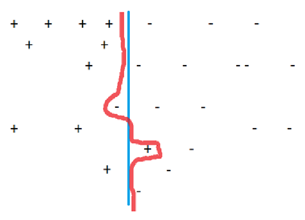
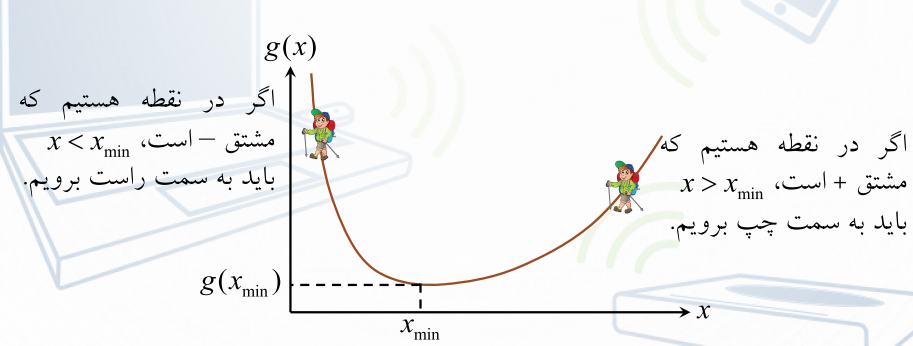

  مفاهیم زیر را به صورت خلاصه بررسی کنید.
  
   ### Overfitting  

 یعنی در ساخت فرضیه بیش از حد به مثال های آموزشی بها بدهیم. نتیجه این می شود که فرضیه ساخته شده برای مثال های آموزشی بسیار عالی جواب می دهد ولی احتمالا برای مثال های آزمایشی به دقت آن تا حدودی پایین می آید. مثلا در شکل زیر فرضیه قرمز رنگ روی مثال های آموزشی  Overfitting شده است ولی فرضیه آبی رنگ بهتر است.

 

  ### Local minimum 

یک مفهموم کلی است که در بسیاری از مباحث کاربرد دارد و به معنی یک نقطه مینیمم است که در تابع یا حل مساله وجود دارد ولی مینیمم مطلق نیست و مقادیر کمتر از آن نیز وجود دارند و ترجمه به مینیمم محلی شده است یعنی در یک ناحیه خاص مینیمم است ولی در کل نه. شکل زیر این مفهوم را به روشنی نشان می دهد.

 

 ### Gradient descent 

روش گرادیان کاهشی تقریبا رایج ترین روش برای پیدا کردن مینیمم یک تابع یا یک مینیمم برای یک مساله است به این ترتیب که می گوید در هر نقطه ای از تابع شیب را به دست می آوریم و در جهت خلاف شیب حرکت می کنیم تا به نقطه ای برسیم که شیب صفر است و آن نقطه می شود مینیمم. دلیل جهت حرکت هم واضح است چون در سمت راست نقطه مینیمم، شیب مثبت است خلاف آن می شود حرکت به سمت چپ یعنی به سمت مینیمم و در سمت چپ نقطه مینیمم، شیب منفی است و حرکت در خلاف آن یعنی حرکت به سمت مینیمم.

 

 ### Eager and lazy learning 

 روش های یادگیری به 2 دسته تقسیم میشوند:  Eager   و Lazy 
در روش های Eager  وقتی مثالی به آن ها داده میشود سعی میکنند سریعاً از روی مثال ها فرضیه بدست آورند و زمانی که نمونه جدید وارد میشود بر اساس فرضیه بدست آمده نتیجه آن را مشخص میکنند. برای مثال درخت تصمیم یک روش Eager  است.

روش های lazy روش هایی هستند که تا زمانی که از آن ها سوالی پرسیده نشود کاری انجام نمیدهند یعنی با مثال ها تقریبا کاری ندارند و اقدامی انجام نمیدهند و فقط زمانیکه سوال پرسیده می شود وارد محاسبات شده و سعی میکنند از روی مثال ها جواب را پیدا کنند و از قبل فرضیه ای برای این کار ندارند که بر اساس آن پیش روند knn یک روش lazy می باشد.

  
  
  
  
  
  

