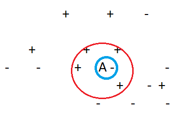

 
  
  تفاوت های k=1 ، k=5 را در یک داده ی فرضی با الگوریتم knn بررسی کنید.
  
  در k=1 فقط نزدیک ترین همسایه برای نقطه مورد سوال ملاک تصمیم گیری قرار می گیرد و همان را به عنوان برچسب نقطه مورد نظر میگیرد.
  
  ولی در مورد k=5 الگوریتم 5تا از نزدیک ترین نقاط را معیار تصمیم گیربی قرار می دهد مانند آنچه در شکل زیر می بینیم.
  
  
  
  طبیعی است که k=1 روش مناسبی نیست و احتمال خطا را بالا می برد و با رای گیری بین 3تا یا 5 تا از همسایه ها از همسایه ها جواب بهتری به دست می آید.
 

