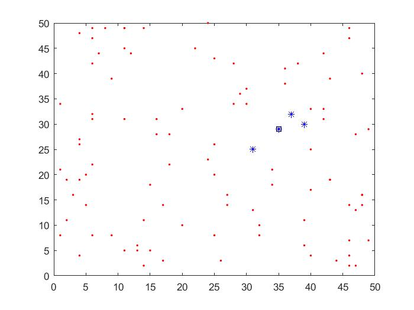

با کمک توابع رندوم در یک زبان برنامه نویسی روی یک صفحه ی مختصات دوبعدی 100 نقطه با x و yهای رندوم در بازه ی 1 تا 50 بدست آورید و برنامه ای بنویسید که k=3 را نسبت به 43 یا چهل و سومین نقطه ی تولید شده ی شما دارد.


ابتدا در قسمت اول کد 50 نقطه را رسم کرده و نقطه 43 را با مربع معلوم کردیم.

```
clc
clear
close all
%%
N=zeros(3,2),
A=randi([1 50],[100 2]);   %create A=100*2 matrix from 1 to 50 
plot(A(:,1),A(:,2), 'r.')  %plot 50 points
hold on
plot(A(43,1),A(43,2), 'ks') %plot poit-43 with square
hold on 
```


در مرحله دوم سه تا نقطه همسایه نقطه ی 43 را با * مشخص کردیم و نیز مختصات و فاصله آن ها را نمایش دادیم.

```
%%
B=[A(43,1),A(43,2)];
[n,distance]=knnsearch(A,B,'k',4 ,'Distance','euclidean'); %find 3 neighbours
 
for i=1:4   %plot & display neighbours
    hold on 
    plot(A(n(1,i),1),A(n(1,i),2),'b*');
     disp(A(n(1,i),:))
      disp(distance(i))
      disp('%%%%%%%%%%%%%%%%%%%%%%%%%%%')
end
```

 
کد کامل به صورت زیر است:

```
clc
clear
close all
%%
N=zeros(3,2),
A=randi([1 50],[100 2]);   %create A=100*2 matrix from 1 to 50 
plot(A(:,1),A(:,2), 'r.')  %plot 50 points
hold on
plot(A(43,1),A(43,2), 'ks') %plot poit-43 with square
hold on 
 
%%
B=[A(43,1),A(43,2)];
[n,distance]=knnsearch(A,B,'k',4 ,'Distance','euclidean'); %find 3 neighbours
 
for i=1:4   %plot & display neighbours
    hold on 
    plot(A(n(1,i),1),A(n(1,i),2),'b*');
     disp(A(n(1,i),:))
      disp(distance(i))
      disp('%%%%%%%%%%%%%%%%%%%%%%%%%%%')
end
```

