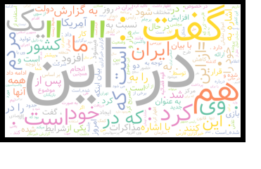

<div dir="rtl">
  
 ابتدا wordcloud فارسی را نصب می کنیم.  

!pip install wordcloud-fa

  در ادامه برای کل خبر ها یک کلمات ابری درست می کنیم.

 </div>
 
 ```
genearate word cloud for all news

import wordcloud_fa
import matplotlib.pyplot as plt
import PIL

word_cloud = WordCloudFa(height= 1080 , width=1920, background_color='white', colormap='Set2')
with open('news_data.txt' , 'r') as file:
  news_content = file.read()

cloud = word_cloud.generate(news_content)
plt.imshow(word_cloud)
plt.axis('off')
plt.show()

```
  

  
  <div dir="rtl">

  اگر بخواهیم برای تک تک پیامک ها داشته باشیم همین کد را در یک حلقه for برده و برای تک تک پیامک ها یک کلمات ابری درست می کنیم:
  
 
</div>

```
  import wordcloud_fa
import matplotlib.pyplot as plt
import PIL

word_cloud = WordCloudFa(height= 1080 , width=1920, background_color='white', colormap='Set2')
with open('news.txt' , 'r') as file:
  all_news_content = file.read()

news_array = all_news_content.split("-------------------");
i = 1;
for single_news in news_array:
  cloud = word_cloud.generate(single_news)
  plt.imshow(word_cloud)
  plt.axis('off')
  plt.title(i);
  plt.show()
  i+=1;
```  
  
  
