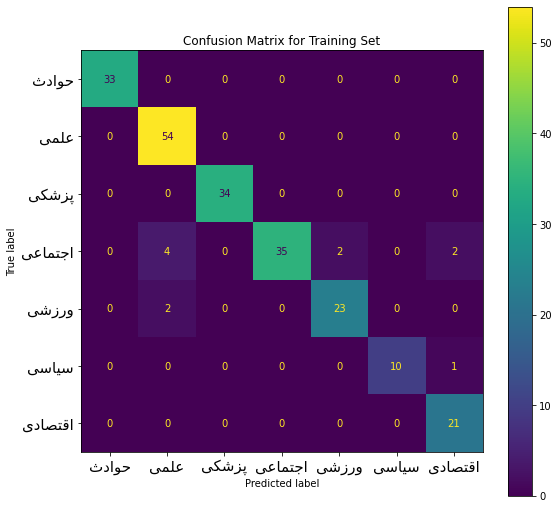
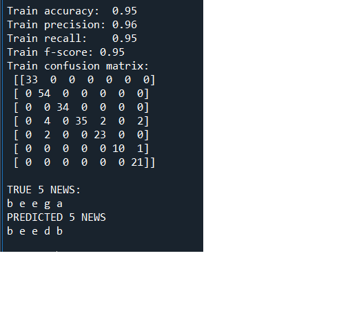

<div dir="rtl">
  
  سعی کنید دسته بندی هر خبر را به صورت خودکار بدست آورید.
   </div>
   
  ```
  
  import pandas as pd
from sklearn.feature_extraction.text import CountVectorizer, TfidfVectorizer
from sklearn.feature_extraction.text import TfidfTransformer
from sklearn.naive_bayes import MultinomialNB
from sklearn.metrics import accuracy_score, precision_score, recall_score, f1_score
from sklearn.metrics import confusion_matrix
from sklearn.metrics import ConfusionMatrixDisplay
from parsivar import Normalizer
import matplotlib.pyplot as plt
import arabic_reshaper
from bidi.algorithm import get_display

cats = ["a","b","c","d","e","f","g"] #name of categories

df_train = pd.DataFrame(columns=["text", "category"])
df_test = pd.DataFrame(columns=["text","category"])
ytest = [1,4,4,6,0]

normalizer = Normalizer()
for i in range(1,8):
   with open("{}.txt".format(i),"r",encoding="utf-8") as f:
       news = f.readlines()
       # print("len news :"+str(len(news)))
       for n in news:
           normalized = normalizer.normalize(n)
           df_train.loc[len(df_train)] = [normalized, cats[i-1]]
               
with open("test_news.txt","r",encoding="utf-8") as f:
   testnews = f.readlines()
   i=0
   for n in testnews:
       normalized = normalizer.normalize(n)
       df_test.loc[len(df_test)] = [normalized,cats[ytest[i]]]
       i+=1


with open('stopwords.txt',  encoding = 'utf-8') as f:
   stopwords = f.readlines()
stopwords = [w.strip() for w in stopwords]

x_train = df_train['text']
y_train = df_train['category']

x_test = df_test['text']
y_test = df_test['category']

count_vect = CountVectorizer(max_features=500, stop_words=stopwords)
x_train_counts = count_vect.fit_transform(x_train)
tfidf_transformer = TfidfTransformer()
x_train_tfidf = tfidf_transformer.fit_transform(x_train_counts)

nbclf = MultinomialNB().fit(x_train_tfidf, y_train)

ypred_train = nbclf.predict(count_vect.transform(x_train))
ypred_test = nbclf.predict(count_vect.transform(x_test))


print("\n\n-------------------------------------------------------------------\n\n")
print("Train accuracy:  {:.2f}".format(accuracy_score(y_train, ypred_train)))
print("Train precision: {:.2f}".format(precision_score(y_train, ypred_train, average='macro')))
print("Train recall:    {:.2f}".format(recall_score(y_train, ypred_train, average='macro')))
print("Train f-score: {:.2f}".format(f1_score(y_train, ypred_train, average='macro')))
print("Train confusion matrix:\n" , confusion_matrix(y_train, ypred_train))


print("\nTRUE 5 NEWS:")
for i in ytest:
   print(cats[i],end=" ")
print("\nPREDICTED 5 NEWS")
for i in ypred_test:
   print(i,end=" ")


conf_matrix_labels = ["حوادث","علمی","پزشکی","اجتماعی","ورزشی","سیاسی","اقتصادی"]
for i in range(len(conf_matrix_labels)):
   conf_matrix_labels[i]=get_display( arabic_reshaper.reshape(conf_matrix_labels[i]))

cm = confusion_matrix(y_train,ypred_train)
cmd = ConfusionMatrixDisplay(cm, display_labels=conf_matrix_labels)
fig, ax = plt.subplots(figsize=(9,9))
cmd.plot(ax=ax)
cmd.ax_.set_title("Confusion Matrix for Training Set")
cmd.ax_.tick_params(axis='both', which='major', labelsize=15)

  ```
  
  
  
  
 
