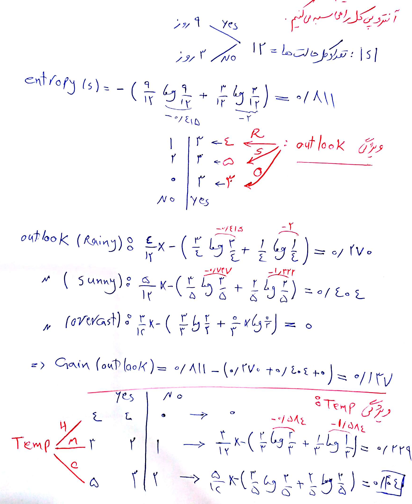
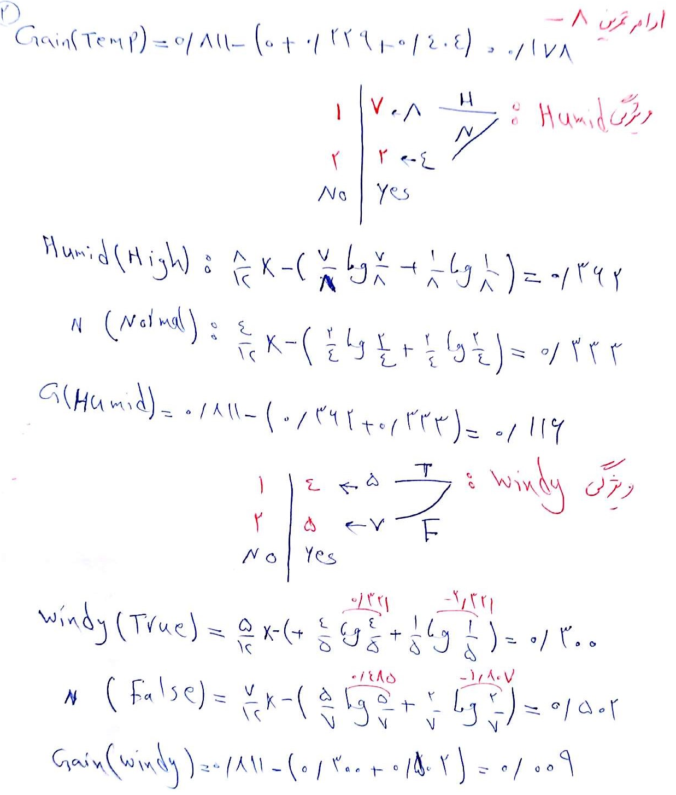
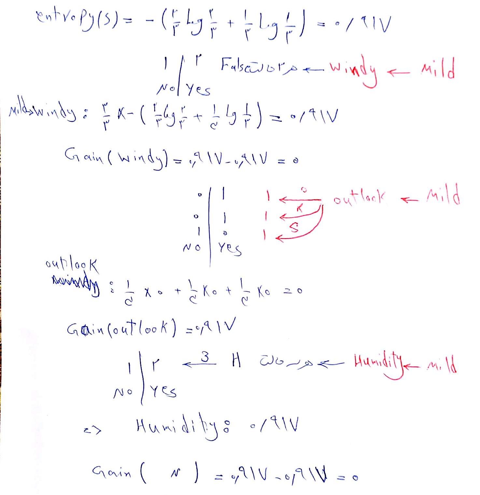
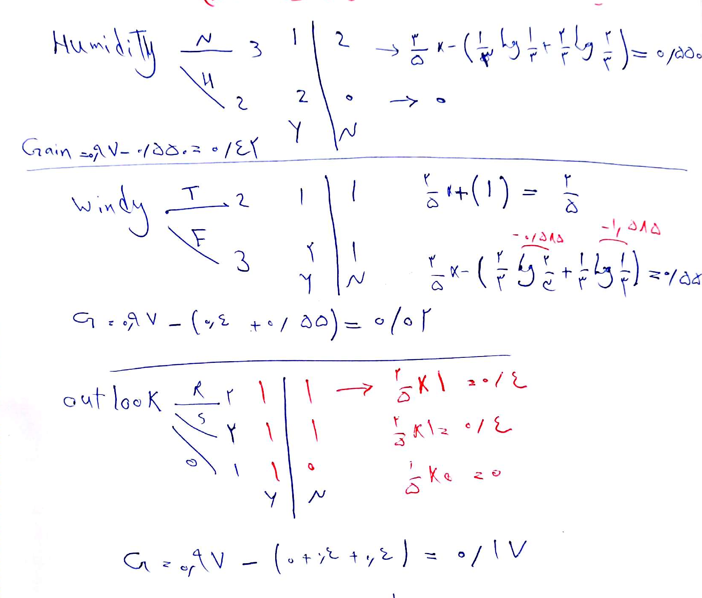

با روش ID3 درخت تصمیم جدول زیر را رسم کنید.

|     Play    |     Windy    |     Humidity    |     Temperature    |     Outlook     |     Day    |
|-------------|--------------|-----------------|--------------------|-----------------|------------|
|     Yes     |     False    |     High        |     Hot            |     Overcast    |     1      |
|     Yes     |     False    |     High        |     Mild           |     Rainy       |     2      |
|     NO      |     False    |     Normal      |     Cool           |     Rainy       |     3      |
|     No      |     False    |     High        |     Mild           |     Sunny       |     4      |
|     Yes     |     False    |     High        |     Mild           |     Overcast    |     5      |
|     No      |     True     |     Normal      |     Cool           |     Sunny       |     6      |
|     Yes     |     True     |     Normal      |     Hot            |     Sunny       |     7      |
|     Yes     |     False    |     High        |     Cool           |     Rainy       |     8      |
|     Yes     |     False    |     High        |     Cool           |     Sunny       |     9      |
|     Yes     |     True     |     Normal      |     Cool           |     Overcast    |     10     |
|     Yes     |     True     |     High        |     Hot            |     Sunny       |     11     |
|     Yes     |     True     |     High        |     Hot            |     Rainy       |     12     |

  
  
 جواب:می دانیم که گین(بهره) برای ویژگی A از رابطه زیر به دست می آید. 
  
  Gain(S,A)=entropy(S) – Σ  (|Sv|)/(|S|)  entropy(Sv)

  
  حال اینجا 4 تا ویژگی داریم که برای هر کدام گین را به دست می آوریم و ویژگی با بیشترین گین را در ریشه درخت قرار می دهیم.
  
قبل از هر چیزی آنتروپی کل را محاسبه می کنیم یعنی entropy(S)  در رابطه بالا و بعد گین ها را محاسبه می کنیم. 
  
  
  
  
  بالاترین گین مربوط به Temp است پس Temp را در ریشه درخت قرار می دهیم.
  
  برای ادامه به سراغ شاخه های Temp می رویم. 
  
  شاخه H آن با 4 تا Yes و 0 تا No قطعیت دارد و درخت از این طرف ادامه ندارد. اما از دو شاخه دیگر یعنی M و C باید بررسی شود.
  
  ابتدا گین را وقتی روی شاخه Mild هستیم بررسی می کنیم.
  
  Mild کلا در 3روز اتفاق افتاده است. برای این 3 روز ابتدا آنتروپی کل و بعد گین 3 تا ویژگی دیگر را محاسبه می کنیم.
  
  
  
  با توجه به محاسبات انجام شده Outlook بالاترین گین را دارد و در گره بعدی می نشیند.
  
  از طرفی چون در هر سه تا شاخه Outlook تکلیف مشخص است پس درخت اینجا تمام می شود.
  
  حالا میرویم سراغ آخرین شاخه از Temp یعنی Cool 
  
  Cool کلا 5 روز اتفاق افتاده که برای این 5 روز مقدار گین 3تا ویژگی دیگر را محاسبه می کنیم شاخه 
  
  ابتدا محاسبه آنتروپی کل این 5 روز:
  
  entropy(Cool) = - (3/5 log3/5 + 2/5 log2/5)= 0.97
  
  حال روی این شاخه گین 3 ویژگی دیگر را داریم:
  
  
  
  پس اینجا یعنی روی شاخه Cool باید Humidity انتخاب شود.
  
  در ادامه Humidity از شاخه High  قطعیت داردولی از شاخه  Normal  ادامه پیدا می کند. پس برای دو ویژگی باقی مانده یعنی Wind و Outlook باید گین را یافت که فقط کافی است 3 روز بررسی شوند. از بین این دو ویژگی Outlook با قطعیت تکلیف را مشخص می کند و اصلا نیازی به محاسبه گین نیست. 
  
  در نهایت جواب مساله به صورت درخت زیر است.
  
  
  
  
  
  
  
  
  
  
  
  
  
  
  

