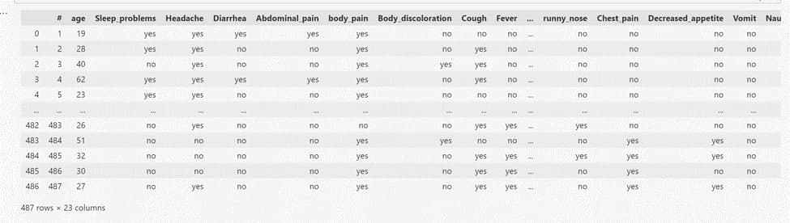
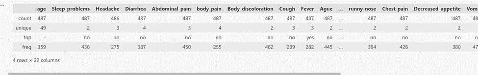
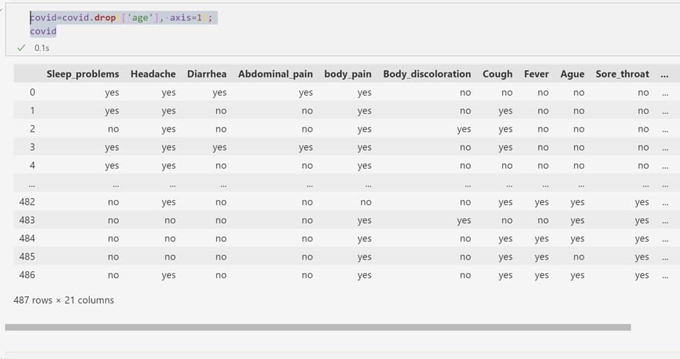
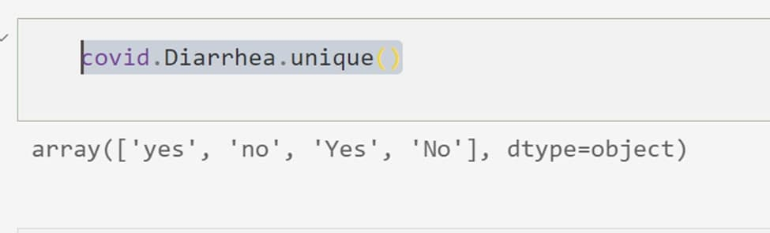
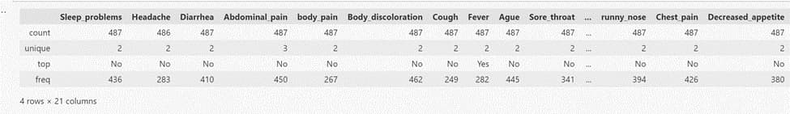
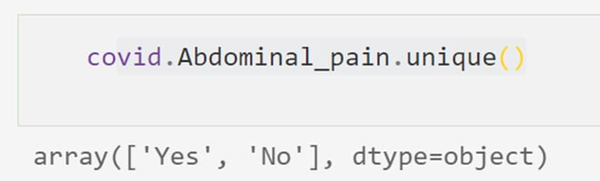
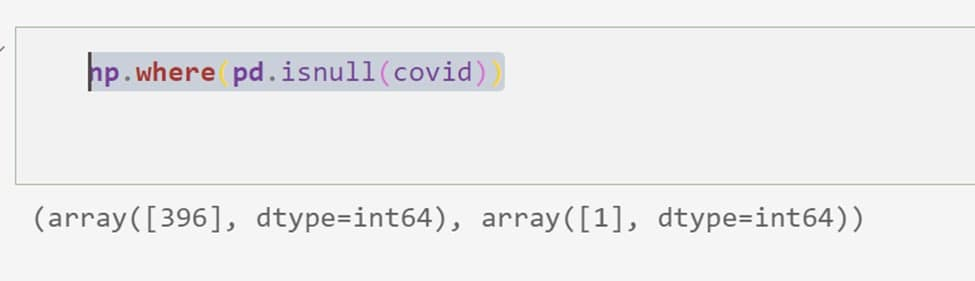

## تحلیل و بررسی دیتاست کووید

دیتاست کویید 487 مورد ابتلا به کرونا دارد و 23 ستون

ابتدا کتابخانه های مورد نیاز را  بارگذاری می کنیم:

```

import pandas as pd
import numpy as np
from sklearn.model_selection import train_test_split
import matplotlib.pyplot as plt
import seaborn as sns

```

سپس دیتا را فراخوانی میکنیم:

```
covid = pd.read_excel('covid.xlsx');
covid

```
 

همانطور که ملاحظه میکنیم تعداد ستون ها برابر 23 و تعداد موارد 487 است.

اما ستون # یک ستون اضافه هست و فقط اندیس را نشان میدهد که باید آن را حدف کنیم که این کار را با دستور زیر انجام میدهیم:

```

covid=covid.drop(['#'], axis=1);
covid

```


سپس با  دستور زیر اطلاعات کلی از جدول را بدست می آوریم:

```

covid.describe()

 ```
 
  

اطلاعاتی که از این جدول و توصیف ها بدست می آید :

1. تعداد داده های ما 487 مورد است. بنابراین مقدار count  همه سطر ها باید 487 باشد در حالی که در ستون headache  486 مورد است .(یک موردmissing value  داریم)
2. بیشترین تعداد تکرار در ستون سن برابر – است که نشان  دهنده این است که 359 مورد سن نداریم.
3.بقیه ستون ها باید دو حالت بله یا خیر داشته باشند در صورتی که تعداد مقدار unique  آنها اکثرا 3 و 4 مقدار است.


**حذف سن**

 با توجه به اینکه تعداد داده هایی که سن ندارند برابر 359 است و اکثر داده ها بدون سن هستند، میتوان ستون سن را حذف کرد.
 
 
 ```
 
covid=covid.drop(['age'], axis=1);
covid

```

 

حال باید مقدار یونیک یکی از ستون ها را مقایسه کنیم که چرا 3 یا 4 تا هستند.

```

covid.Diarrhea.unique()

```


 
 همانطور که ملاحظه میکنید مثلا در ستون Diarrhea چهار حالت وجود دارد (با حروف کوچک و بزرگ)

حال باید اینها را نرمال کنیم. در نتیجه باید عبارت ها شبیه هم شوند
بنابراین استفاده از دستورreplace  این کار را انجام میدهیم.

```

covid=covid.replace({'yes':'Yes', 'no':'No'});
covid.describe()

```

با این دستور جاهایی کهyes  وجود دارد بهYes  و جاهایی کهNo  وجود دارد به No  تبدیل می شود.


 

قابل مشاهده است که مقدار unique اکثر ستون ها برابر 2 شد به غیر از ستون Abdominal_pain
این ستون را بررسی میکنیم:
 
 
 
همانطور که مشخص است یک اعتبارes  وجود دارد که به احتمال زیادyes  بوده و به اشتباه نوشته شده است.
با دستور replace آن را تصحیح میکنیم:

```

covid=covid.replace({'es':'Yes'});

```
 
حال دوباره مقدار unique جدول را بررسی میکنیم:


 
 و مقدار یونیک آن برابر 2 شده است.

حال باید چک کنیم داده  missing Valueوجود دارد و یا خیر:
 
 


در سطر 397 (آرایه ها از صفر شروع می شوند) و ستون 2 یک عبارت وجود ندارد.
آن سطر را حذف می کنیم:


 
حال سطر های تکراری را هم حذف میکنیم:


 
تعداد سطرهایی که تکراری نبودند برابر 205 است
برای کار با جدول و پردازش بهتر ابتدا آنها را به 0و1 تبدیل می کنیم:

```

covid=covid.replace({'Yes':1, 'No':0});
covid

```
 
 


دوباره دستور describe را اجرا میکنیم:

```

covid.describe()

```
 

نمودار هیستوگرام هر کدام از ستون ها را رسم میکنیم:
 

ارتباط ستون ها نسبت به هم را با کورولیشن رسم می کنیم:

```

plt.figure(figsize=(15,12))
cor = covid.corr()
sns.heatmap(cor, annot=True, cmap=plt.cm.Reds)
plt.show()

```
 

با توجه به هیستوگرام ستون های urticaria,Vomit,Body-discoloration ,Abdominal_pain,Sneezing کمترین مقدار yes  دارند. اکثرا بیماران این علائم را ندارند. بنابراین میتوان گقت تاثیر این عوامل کمتر می باشد.
چون تاثیر کمتری دارند آن ها را از جدول حذف میکنیم.

حال باید عوامل کشف نشده و داده های که کرونا ندارند را خودمان ایجاد کنیم:


```

columns={}
for col in covid.columns:
    columns[col]=[1,0];
columns

from itertools import product
All_var=pd.DataFrame([row for row in product(*columns.values())],columns=columns.keys())

All_var


```
 

تعداد کل حالت هایی که با این 16 ستون می توان ایجاد کرد برابر65536 است.

حال باید مواردی که جزء داده های قبلی ما هستند (205 مورد) را از این جدول حذف کنیم.
ابتدا دو جدول وصل کرده (کل احتمالات و جدول کرونایی ها) سپس موارد مشابه را حذف می کنیم:

```

df4 = pd.concat([covid,All_var])
no_covid=df4.drop_duplicates(keep=False)
no_covid

```
 

حال برای بهتر کردن و بهینه کردن داده های که خودمان ایجاد میکنیم شرطی مبنی بر این که افرادی که کرونا ندارند حداکثر 7 ویژگی و حداقل 3 ویژگی داشته باشند:

```

no_covid=no_covid[(no_covid.sum(axis=1)<8)  & (no_covid.sum(axis=1)>3)];
no_covid

```


سپس از بین این دسته مقداری به عنوان نمونه به صورت تصادفی انتخاب می کنیم:

```

no_covid=no_covid.sample(n=250)
no_covid

```
 

حال باید برای جدول ها label بگذاریم:

```

no_covid['class']=0;
covid['class']=1;
no_covid

```

داده هایی کرونا ندارند لیبل 0 و داده هایی که کرونا دارند برابر 1 قرار می دهیم.
سپس هر دو جدول را بهم وصل کرده و به عنوان دیتاست معرفی می کنیم:

```

dataset =pd.concat([no_covid,covid],ignore_index=True)

```
 

این جدول شامل 455 داده است:
250 داده فیک که کرونا ندارد و 205 داده واقعی که کرونا دارند.
دادها به دو دسته X و Y تقسیم میکنیم.X  کل داده ها بدون لیبل وY   فقط لیبل

داده ها به 2 دسته داده تست و آزمایشی تقسیم می کنیم:

```

X_train, X_test, y_train, y_test = train_test_split(X, y, test_size = 0.30, random_state = 4)

```

30 درصد برای تست
70 درصد برای آموزش


حالا داده ها را برای الگوریتم های Find-S و Candidate Elimination به دو حالتyes  وno  تبدیل میکنیم:

**Find-S Algorithm:**

```

h = ['0', '0', '0', '0', '0', '0','0','0','0','0','0','0','0','0','0','0','0']

for index, row in dataset_nominal.iterrows():
    if row[-1] == 'Yes':
        j = 0
        
        for col in row:
            if col != 'Yes':
                if col != h[j] and h[j] == '0':
                    h[j] = col
                elif col != h[j] and h[j] != '0':
                    h[j] = '?'
                    
            j = j + 1
 
    
print('Maximally Specific Hypothesis: ', h)

```


**Candidate Elimination Algorithm:**

```

import numpy as np
import pandas as pd

def learn(concepts, target):
    
    specific_h = concepts[0].copy()
    
    general_h = [["?" for i in range(len(specific_h))] for i in range(len(specific_h))]
    
    # The learning iterations
    for i, h in enumerate(concepts):
        
        # Checking if the hypothesis has a positive target
        if target[i] == "Yes":
            for x in range(len(specific_h)):
                
                # Change values in S & G only if values change
                if h[x] != specific_h[x]:
                    specific_h[x] = '?'
                    general_h[x][x] = '?'
                    
        # Checking if the hypothesis has a positive target
        if target[i] == "No":
            for x in range(len(specific_h)):
                
                # For negative hyposthesis change values only  in G
                if h[x] != specific_h[x]:
                    general_h[x][x] = specific_h[x]
                else:
                    general_h[x][x] = '?'
    
    # find indices where we have empty rows, meaning those that are unchanged
    indices = [i for i,val in enumerate(general_h) if val == ['?', '?', '?', '?', '?', '?']]
    for i in indices:
        # remove those rows from general_h
        general_h.remove(['?', '?', '?', '?', '?', '?'])
        
    # Return final values
    return specific_h, general_h
sample=dataset_nominal.sample(n=20);
concepts =np.array(sample.iloc[:,:-1]);
target=np.array(sample.iloc[:,-1]);
s_final, g_final = learn(concepts, target)
print("Final S:", s_final, sep="\n")
print("Final G:", g_final, sep="\n")

```


**Naïve Bayes Algorithm:**

```

from sklearn.naive_bayes import GaussianNB
gnb = GaussianNB()
y_pred = gnb.fit(X_train, y_train).predict(X_test)
y_pred
gnb.score(X_test, y_test)

```


**KNN Algorithm:**

```

from sklearn.neighbors import KNeighborsClassifier
neigh = KNeighborsClassifier(n_neighbors=3)
neigh.fit(X_train, y_train)

y_pred=neigh.predict(X_test)
y_pred
neigh.score(X_test, y_test)

```


**Decision Tree Algorithm with Entropy (ID3):**

```

from sklearn.tree import DecisionTreeClassifier
clf = DecisionTreeClassifier(random_state=0,criterion='entropy')
clf.fit(X_train, y_train)

y_pred=clf.predict(X_test)
y_pred
clf.score(X_test, y_test)

```


**Decision Tree Algorithm:**

```

from sklearn.tree import DecisionTreeClassifier
clf = DecisionTreeClassifier(random_state=0)
clf.fit(X_train, y_train)

y_pred=clf.predict(X_test)
y_pred
clf.score(X_test, y_test)

```


**Random Decision Tree Algorithm:**

```

from sklearn.tree import DecisionTreeClassifier
clf = DecisionTreeClassifier(random_state=0,splitter='random')
clf.fit(X_train, y_train)

y_pred=clf.predict(X_test)
y_pred
clf.score(X_test, y_test)

```


**K-means Algorithm:**

```

from sklearn.cluster import KMeans
kmeans = KMeans(n_clusters=2, random_state=0).fit(X)
kmeans.labels_

```


**Random Forest:**

```

from sklearn. Ensemble import RandomForestClassifier
clf = RandomForestClassifier(max_depth=2, random_state=0)
clf.fit(X_train, y_train)
y_pred=clf.predict(X_test)
y_pred
clf.score(X_test, y_test)

```


ذخیره دیتاست بصورت اکسل:

```

dataset.to_excel("covid5.xlsx",index=False)

```


