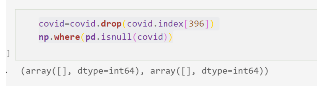
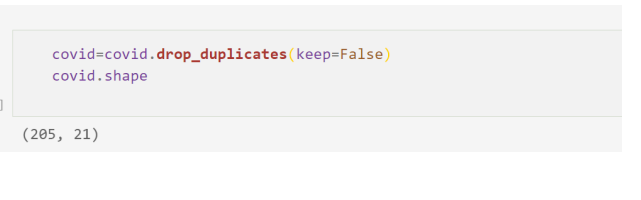
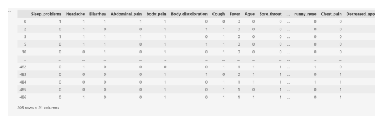
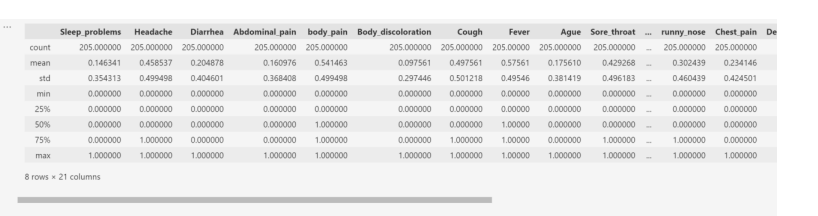
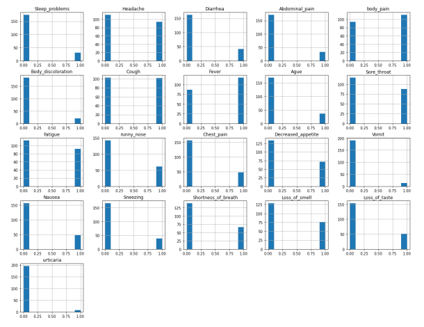
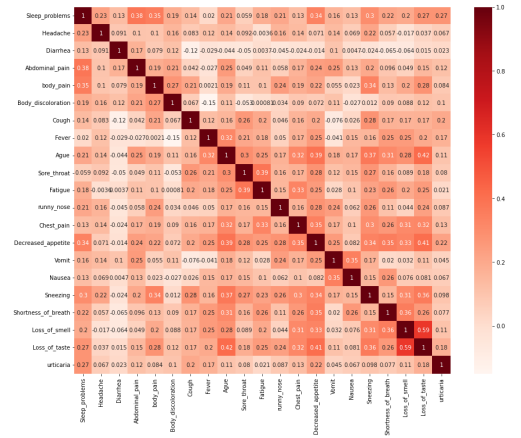
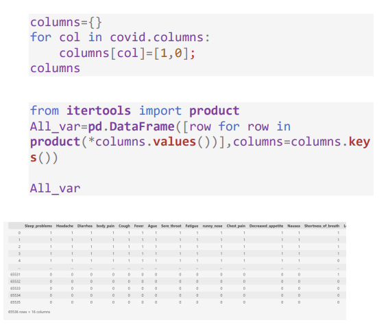
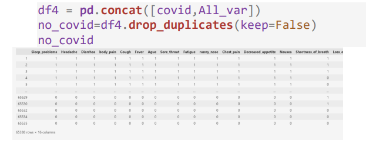
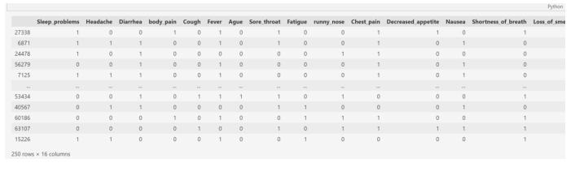
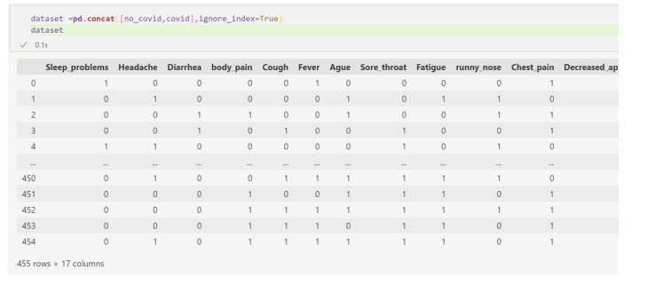

 
تحلیل و بررسی دیتاست کویید
 
دیتا ست کویید 487 مورد ابتال به کرونا دارد و 23 ستون

 

اولش میایم کتابخونه ی موزد نیازمونو بارگزاری میکنیم

import pandas as pd
 
import numpy as np
 
from sklearn.model_selection

import train_test_split
 
import matplotlib.pyplot as plt
 
import seaborn as sns
 

بعدش دیتا رو فراخونی میکنیم

covid = pd.read_excel('covid.xlsx');

covid

همانطور که مالحظه میکنیم تعداد ستون ها برابر 23 و تعداد موارد 487 است.
اما ستون # یک ستون اضافه هست و فقط اندیس را نشان میدهد که باید آن را حدف 
کنیم با دستور

covid=covid.drop(['#'], axis=1);

covid

سپس با دستور زیر اطاعات کلی از جدول را بدست می آوریم

اطالعاتی که از این جدول و توصیف ها بدست می آید :

1.تعداد داده های ما 487 مورد است. بنابراین مقدار count همه سطر ها باید 487
باشد در حالی که در ستون headache 486 مورد است .) یک مورد missing
 value داریم(

2.بیشترین تعداد تکرار در ستون سن برابر – است که نشان دهنده این است که 359
مورد سن نداریم.

3.بقیه ست ون ها باید دو حالت بله یا خیر داشته باشند در صورتی که تعداد مقدار 
 unique آنها اکثرا 3 و 4 مقدار است.

حذف سن

با توجه به اینکه تعداد داده هایی که سن ندارند برابر 359 است و اکثر داده ها بدون 
سن هستند . بنابراین میتوان ستون سن را حذف کرد

covid=covid.drop(['age'], axis=1);

covid

حال باید مقدار یونیک یکی از ستون ها را مقایسه کنیم که چرا چهار یا 3 تا هستند.

covid.Diarrhea.unique()

همانطور که مالحظه میکنید مثال در ستون Diarrhea چهار حالت وجود دارد ) با 
حروف کوچک و بزرک(

حال ما باید اینها را نرمال کنیم. در نتیجه باید عبارت ها شبیه هم بشن
بنابراین استفاده از دستور replaceاین کار را انجام میدهیم.

covid=covid.replace({'yes':'Yes', 'no':'No'});

covid.describe()

با این دستور جاهایی که yesوجود دارد به Yes و جاهایی که No وجود دارد به 
 No تبدیل می شود. 

همانطور که مشاهده میکنین مقدا یونیک اکثر ستون ها برابر دو شد به جر ستون 
Abdominal_pain
این ستون را بررسی میکنیم

همانطور که مشاهده میکنیم یک اعتبار es وجود دارد که به احتمال زیاد yes بوده 
است و به اشتباه نوشته شده است.

با دستور ریپلیس آن را تصحیح میکنیم

covid=covid.replace({'es':'Yes'});

حال دوباره مقدار یونیک جدول را بررسی میکنیم

و مقدار یونیک آن برابر 2 شده است

حال باید چک کنیم ببینم داده Value missing داریم

در سطر 397 ( آرایه ها از صفر شروع می شوند( و ستون 2 یک عبارت وجود ندارد

آن سطر را حذف می کنیم

حال باید سطر های تکراری را حذف نمود 

تعداد سطرهایی که تکراری نبودند برابر 205 است

برای کار با جدول و پردازش بهتر ابندا آنها به صفر و یک تبدیل می کنیم

covid=covid.replace({'Yes':1, 'No':0});

covid

دوباره دستور دیسکراب را میزنیم

covid.describe()

نمودار هیستوگرا هر کدام از ستون ها را رسم میکنیم

ارتباط ستون ها نسبت به هم را با کورولیشن رسم می کنیم

plt.figure(figsize=(15,12))

cor = covid.corr()

sns.heatmap(cor, annot=True, cmap=plt.cm.Reds)

plt.show()

ا توجه به هیستوگرام ستون های -Body,Vomit,urticaria
discoloration ,Abdominal_pain,Sneezing

کمترین مقدار yes دارند. اکثرا بیماران این عوامل را ندارند. بنابراین میتوان 
گقت تاثیر این عوامل کمتر می باشد 
چون تاثیر کمتری دارند آن ها را از جدول حذف کرده

حال باید عوامل کشف نشده و داده های که کرونا ندارند را خودمان ایجاد کنیم

تعداد کل حالت هایی که با این 16 ستون می توان ایجاد کرد برابر 65536
است

حال باید مواردی که جرو داده های قبلی ما هستند )205 مورد ( را از این 
جدول حذف کرد

ابتدا دو جدول وصل کرده ) کل احتماالت و جدول کرونایی ها( سپس موارد 
مشابه را حذف می کنیم

حال برای بهتر کردن و بهینه کردن داده های که خودمان ایجاد میکنیم شرط 
میزاریم که افزادی که کرونا ندارند حداکثر 7 ویژگی را دارا باشند و حداقل 3 ویژگی 
داشته باشند 

no_covid=no_covid[(no_covid.sum(axis=1)<8) &

(no_covid.sum(axis=1)>3)];

no_covid

سپس از بین این دسته مقداری به عنوان نمونه به صورت تصادفی انتخاب می 
کنیم

no_covid=no_covid.sample(n=250)

no_covid

حال باید برای جدول ها لیبل بگذاریم

no_covid['class']=0;

covid['class']=1;

no_covid

داده هایی کرونا ندارند لیبل 0
و داده هایی که کرونا دارند برابر 1 قرار می دهیم

سپس هر دو جدول را بهم وصل کرده و به عنوان دیتاست معرفی می کنیم 

dataset

=pd.concat([no_covid,covid],ignore_index=True)

این جدول شامل 455 داده است

0 داده فیک که کرونا ندارد

5 داده واقعی که کرونا دارند 

دادها به دو دسته Xو Y تقسیم میکنیم

Xکل داده ها بدون لیبل

 Y فقط لیبل

داده ها به داده تست و آزمایش تقسیم می کنیم

X_train, X_test, y_train, y_test =

train_test_split(X, y, test_size = 0.30,

random_state = 4)

0 درصد برای تست 

0 درصد برای آموزش

حاال داده ها به حالت yesو no تبدیل میکنیم برای الکوریتم findsو کاندید

الگوریتم فایند اس

h = ['0', '0', '0', '0', '0',

'0','0','0','0','0','0','0','0','0','0','0','0'

]

for index, row in dataset_nominal.iterrows():

if row[-1] == 'Yes':

j = 0

for col in row:

if col != 'Yes':

if col != h[j] and h[j] == '0':

h[j] = col

elif col != h[j] and h[j] !=

'0':

h[j] = '?'

j = j + 1

print('Maximally Specific Hypothesis: ', h)

الگوریتم کاندید 

import numpy as np

import pandas as pd

def learn(concepts, target):

specific_h = concepts[0].copy()

general_h = [["?" for i in

range(len(specific_h))] for i in

range(len(specific_h))]

# The learning iterations

for i, h in enumerate(concepts):

# Checking if the hypothesis has a 

positive target

if target[i] == "Yes":

for x in range(len(specific_h)):

# Change values in S & G only
 
if values change

if h[x] != specific_h[x]:

specific_h[x] = '?'

general_h[x][x] = '?'

# Checking if the hypothesis has a 

positive target

if target[i] == "No":

for x in range(len(specific_h)):

# For negative hyposthesis 

change values only in G

if h[x] != specific_h[x]:

general_h[x][x] =

specific_h[x]

else:

general_h[x][x] = '?'

# find indices where we have empty rows, 

meaning those that are unchanged

indices = [i for i,val in

enumerate(general_h) if val == ['?', '?', '?',

'?', '?', '?']]

for i in indices:

# remove those rows from general_h

general_h.remove(['?', '?', '?', '?',

'?', '?'])

# Return final values

return specific_h, general_h

sample=dataset_nominal.sample(n=20);

concepts =np.array(sample.iloc[:,:-1]);

target=np.array(sample.iloc[:,-1]);

s_final, g_final = learn(concepts, target)

print("Final S:", s_final, sep="\n")

print("Final G:", g_final, sep="\n")

الگوریتم نایوبیز

from sklearn.naive_bayes import GaussianNB

gnb = GaussianNB()

y_pred = gnb.fit(X_train,

y_train).predict(X_test)

y_pred

gnb.score(X_test, y_test)

الگوریتم knn

from sklearn.neighbors import

KNeighborsClassifier

neigh = KNeighborsClassifier(n_neighbors=3)

neigh.fit(X_train, y_train)

y_pred=neigh.predict(X_test)

y_pred

neigh.score(X_test, y_test)

الگوریتم درخت تصمیم با روش آنتروپی

from sklearn.tree import DecisionTreeClassifier

clf =

DecisionTreeClassifier(random_state=0,criterion

='entropy')

clf.fit(X_train, y_train)

y_pred=clf.predict(X_test)

y_pred

clf.score(X_test, y_test)

الگوریتم درخت تصمیم

from sklearn.tree import DecisionTreeClassifier

clf = DecisionTreeClassifier(random_state=0)

clf.fit(X_train, y_train)

y_pred=clf.predict(X_test)

y_pred

clf.score(X_test, y_test)

الگوریتم درخت تصمیم بصورت رندوم

from sklearn.tree import DecisionTreeClassifier

clf =

DecisionTreeClassifier(random_state=0,splitter=

'random')

clf.fit(X_train, y_train)

y_pred=clf.predict(X_test)

y_pred

clf.score(X_test, y_test)

k-means الگوریتم

from sklearn.cluster import KMeans

kmeans = KMeans(n_clusters=2,

random_state=0).fit(X)

kmeans.labels

دخیره دیتاست بصورت اکسل

dataset.to_excel("covid5.xlsx",index=False)

