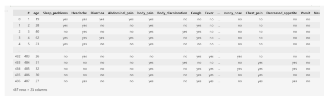
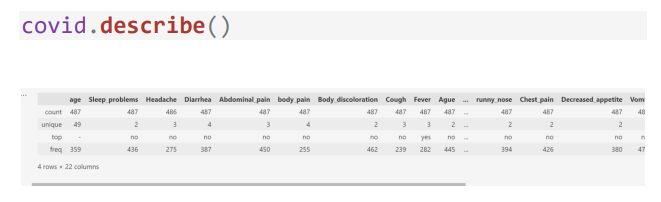
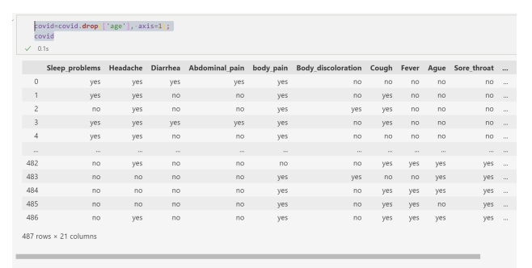
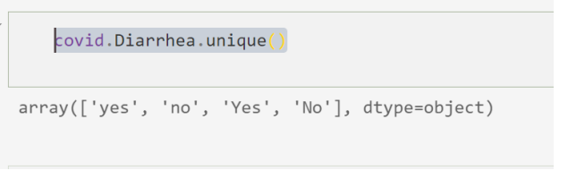
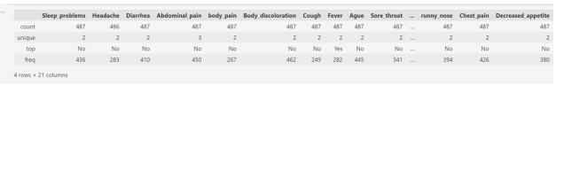
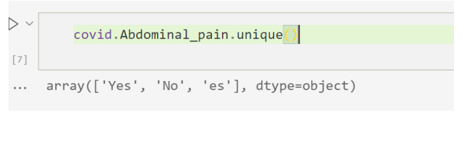
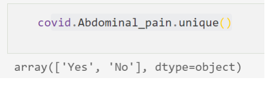
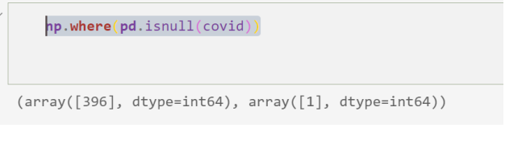

 
تحلیل و بررسی دیتاست کویید
 
دیتا ست کویید 487 مورد ابتال به کرونا دارد و 23 ستون

 

اولش میایم کتابخونه ی موزد نیازمونو بارگزاری میکنیم

import pandas as pd
 
import numpy as np
 
from sklearn.model_selection

import train_test_split
 
import matplotlib.pyplot as plt
 
import seaborn as sns
 

بعدش دیتا رو فراخونی میکنیم

covid = pd.read_excel('covid.xlsx');

covid

همانطور که مالحظه میکنیم تعداد ستون ها برابر 23 و تعداد موارد 487 است.
اما ستون # یک ستون اضافه هست و فقط اندیس را نشان میدهد که باید آن را حدف 
کنیم با دستور

covid=covid.drop(['#'], axis=1);

covid

سپس با دستور زیر اطاعات کلی از جدول را بدست می آوریم

اطالعاتی که از این جدول و توصیف ها بدست می آید :

1.تعداد داده های ما 487 مورد است. بنابراین مقدار count همه سطر ها باید 487
باشد در حالی که در ستون headache 486 مورد است .) یک مورد missing
 value داریم(

2.بیشترین تعداد تکرار در ستون سن برابر – است که نشان دهنده این است که 359
مورد سن نداریم.

3.بقیه ست ون ها باید دو حالت بله یا خیر داشته باشند در صورتی که تعداد مقدار 
 unique آنها اکثرا 3 و 4 مقدار است.

حذف سن

با توجه به اینکه تعداد داده هایی که سن ندارند برابر 359 است و اکثر داده ها بدون 
سن هستند . بنابراین میتوان ستون سن را حذف کرد

covid=covid.drop(['age'], axis=1);

covid

حال باید مقدار یونیک یکی از ستون ها را مقایسه کنیم که چرا چهار یا 3 تا هستند.

covid.Diarrhea.unique()

همانطور که مالحظه میکنید مثال در ستون Diarrhea چهار حالت وجود دارد ) با 
حروف کوچک و بزرک(

حال ما باید اینها را نرمال کنیم. در نتیجه باید عبارت ها شبیه هم بشن
بنابراین استفاده از دستور replaceاین کار را انجام میدهیم.

covid=covid.replace({'yes':'Yes', 'no':'No'});

covid.describe()

با این دستور جاهایی که yesوجود دارد به Yes و جاهایی که No وجود دارد به 
 No تبدیل می شود. 

همانطور که مشاهده میکنین مقدا یونیک اکثر ستون ها برابر دو شد به جر ستون 
Abdominal_pain
این ستون را بررسی میکنیم

همانطور که مشاهده میکنیم یک اعتبار es وجود دارد که به احتمال زیاد yes بوده 
است و به اشتباه نوشته شده است.

با دستور ریپلیس آن را تصحیح میکنیم

covid=covid.replace({'es':'Yes'});

حال دوباره مقدار یونیک جدول را بررسی میکنیم

و مقدار یونیک آن برابر 2 شده است

حال باید چک کنیم ببینم داده Value missing داریم

