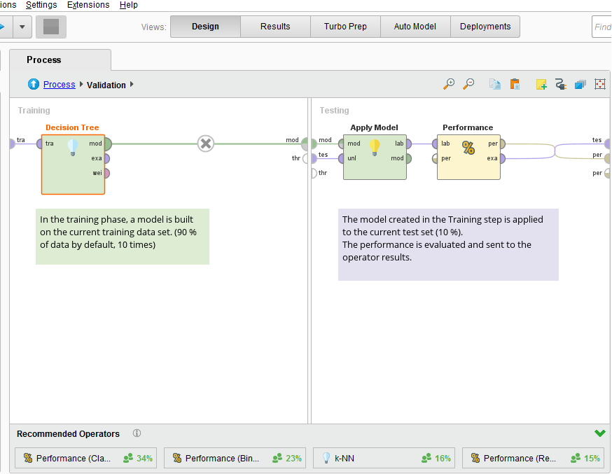
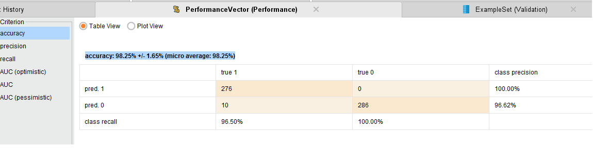
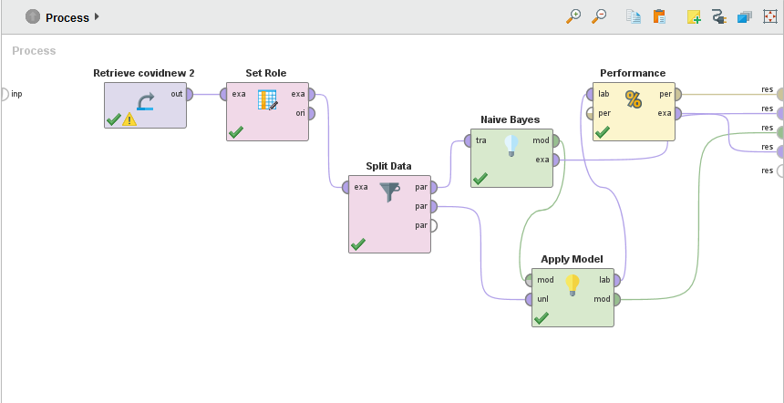
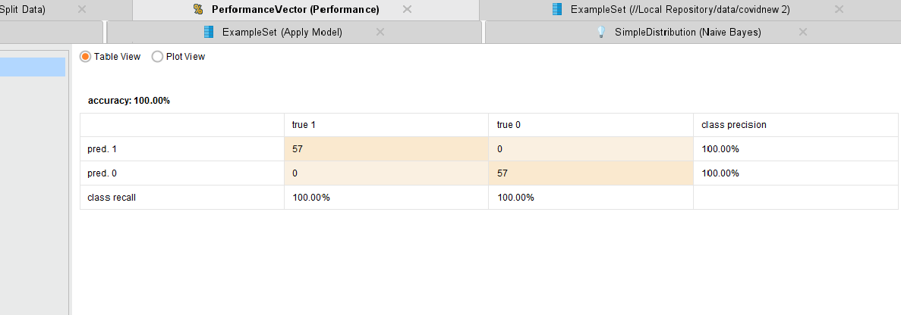
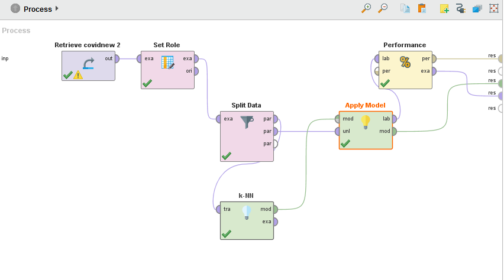
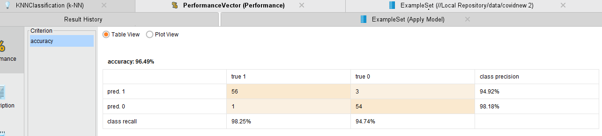
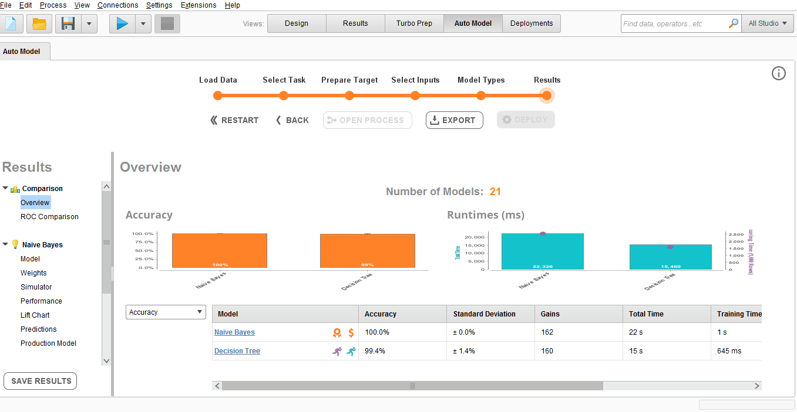
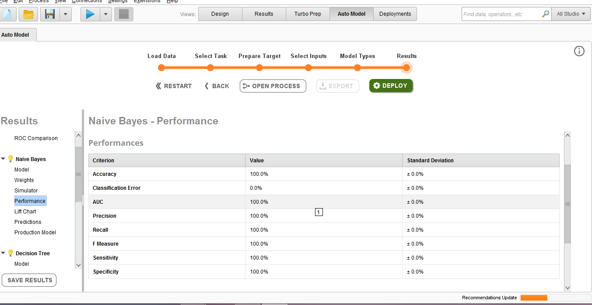
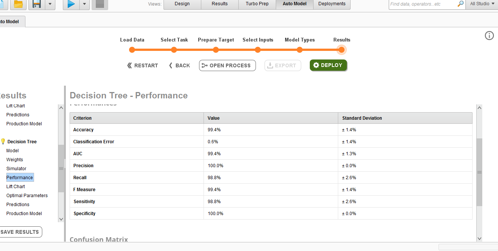

## **rapidminer**

الگوریتم های naive bayes , knn , decision tree را در نرم افزار rapid miner پیاده سازی کرده و به نتایج زیر دست یافتیم 

دقت الگوریتم decision tree 98.25% است که مشابه مقدار محاسبه شده در پایتون می باشد
 
 دقت روش بیز نیز 100% است و مساوی مقدار محاسبه شده درپایتون می باشد
 
 دقت روش knn نیز تقریبا مشابه مقدار به دست امده با پایتون است
 96%

این نشان می دهد دقت ما با در هر دو روش بسیار به هم نزدیک و مساوی است.

تصاویر زیر برخی از عملیات اتجام شده در رپیدماینر را نشان می دهد.

* **مدل پیاده سازی درخت تصمیم در Rapidminer**

------

* **مدل پیاده سازی Naive bayes در Rapidminer**

---

* **مدل پیاده سازی KNN در Rapidminer**

| نام الگوریتم  | دقت الگوریتم با زبان پایتون |دقت الگوریتم با رپید ماینر|
| ------------- | ------------- |-----------------|
|درخت تصمیم | 98.26%  |99.4 %|
| بیز ساده  | 100%  |100%
| KNN| 96-97% | 96.49%|     

* **پیاده سازی با auto model**
نتایج به شرح زیر است: 

