

  
  با توجه به دیتاست covid که در پوشه ی data موجود است عملیات زیر را روی این دیتاست انجام دهید:
  - نرمالیزه کردن
  - مرتب سازی داده
  - حذف داده های یکسان و تکراری
  - بدست آوردن 5 ویژگی که کمترین اهمیت را دارند
  -  اجرای الگوریتم های find-s و ce و بیز و knn و کلاسترینگ و درخت تصمیم یکبار به صورت تصادفی و یک بار با الگوریتم id3
  - داده های زیر همگی به عنوان true برچسب گذاری خواهند شد و ترکیبات داده ای دیگر به عنوان false تمام ترکیبات داده ای که قابل کشف می باشد را بدست آورید.
  - الگوریتم های اجرا شده را با rappid minner نیست اجرا کنید و نتیجه ی خود را با آن مقایسه کنید
  - دیتاست در سایت kaggle ثبت شده است در صورتی که کد خود را در بخش notebook های kaggle ثبت کنید نمره ی اضافه دریافت خواهید کرد.
  
  
 
  لینک kaggle
  : 
   
  https://www.kaggle.com/amirshnll/covid-patient-datasets
  

 لینک kaggle نوشته شده توسط من
  : 
   
  https://www.kaggle.com/baharhh/final-covid-hashemi

ابتدا کتابخانه های مورد نیاز برای این پروزه را ایمپورت میکنیم:

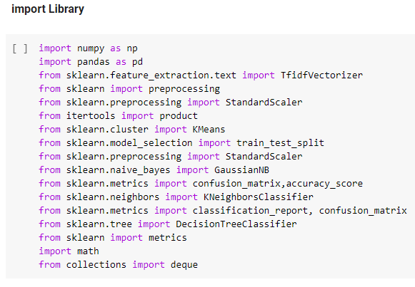

سپس فایل دیتاست را با استفاده از دستور pd.read_csv بارگذاری میکنیم:

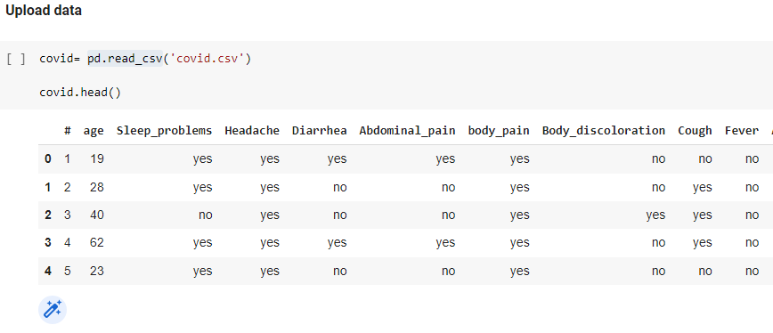

در این دیتاست بعضی از داده ها بی اهمیت هستند بنابراین باید حذف شوند برای حذف این داده ها از دستور drop استفاده میکنیم:

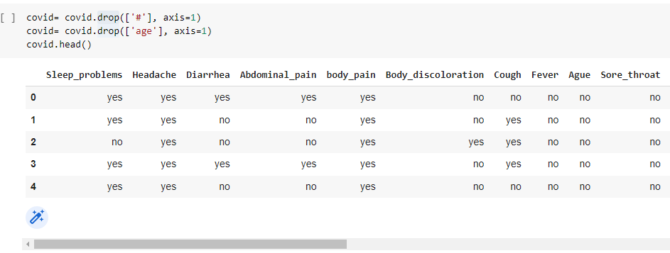

در محله بعد برای اینکه دید درستی از دیتاست داده باشیم با استفاده از دستور describe دیتاست را نمایش می دهیم:

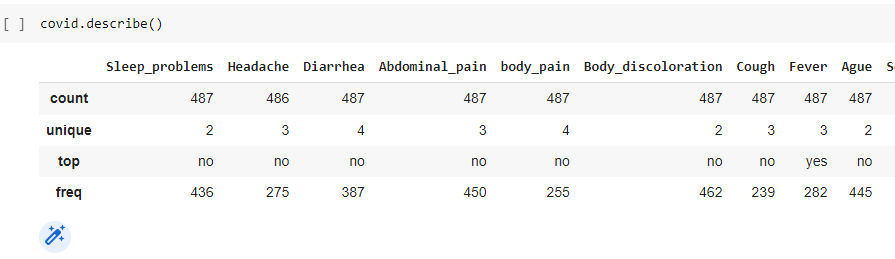

طبق جدول فوق بعضی از داده ها unique 3 و 4 هستند در صورتی که تمام داده ها باید unique 2 باشند بنابراین با استفاده از عملیات زیر تمام unique ها را 2 میکنیم:

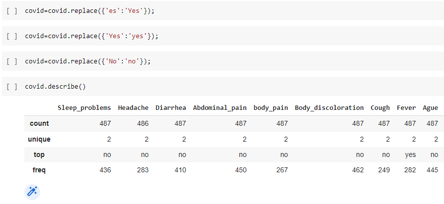

در این مرحله تمام yes  و  no ها را تبدیل به 0 و 1 میکنیم :

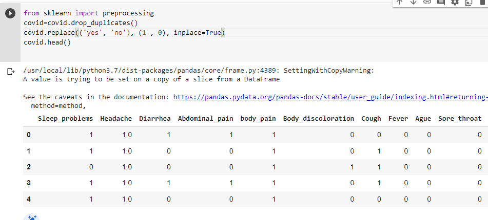

در این قسمت بین ویژگی ها پنج تا از بی اهمیت ترین ویژگی ها را پیدا میکنیم:

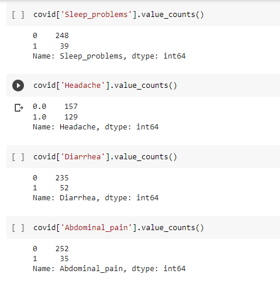

مشاهده کردیم که 'urticaria','Vomit','Body_discoloration','Abdominal_pain' ویژگی ها کم اهمیت ترین ویژگی ها هستند بنابراین باید حذف شوند. پس از دیتاست با استفاده از دستور زیر حذف میکنیم.:

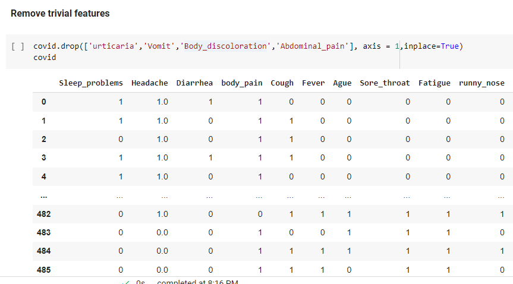

داده هایی که مشابه هستند را حذف میکنیم:

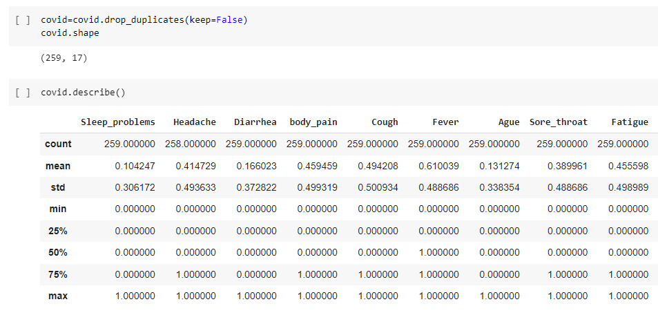

در بین داده ها موارد null دیده میشود و باید حذف شوند این کار را با استفاده از دستور زیر انجام میدهیم:

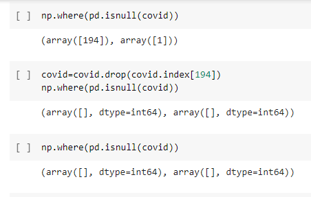

نرمال سازی را انجام میدهیم:

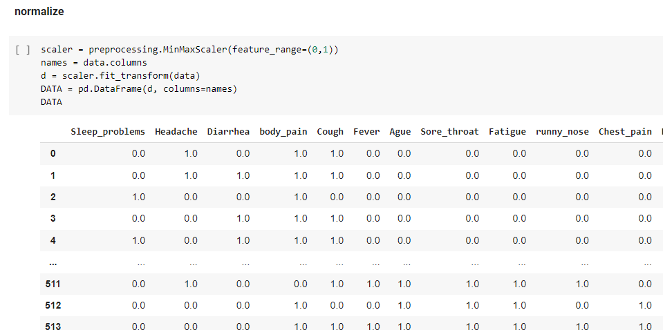

الگوریتم find-s را با استفاد از دستورات زیر بدست می اوریم:

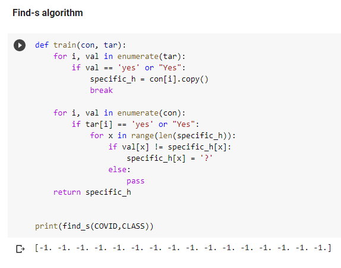

الگوریتم کاندید را مطابق دستور زیر مینویسیم و خروجی Specific و General را بدست می اوریم:

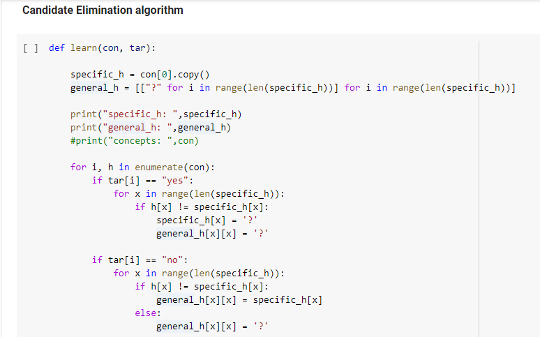

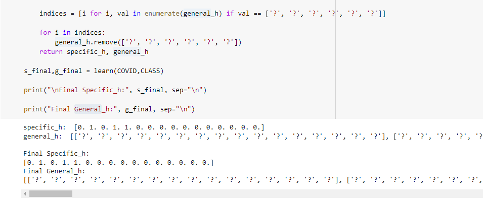

داده ها را به داده های ترین و تست تقسیم میکنیم:

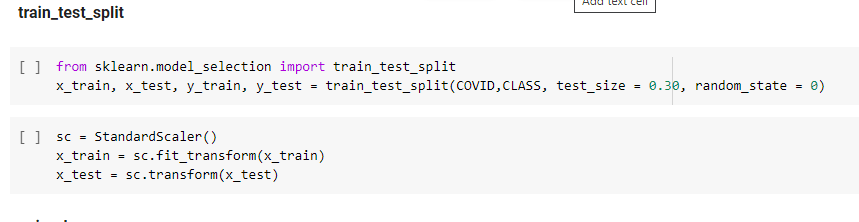

الگوریتم نیو بیز مطابق زیر نوشته و خروجی بدست امده است:

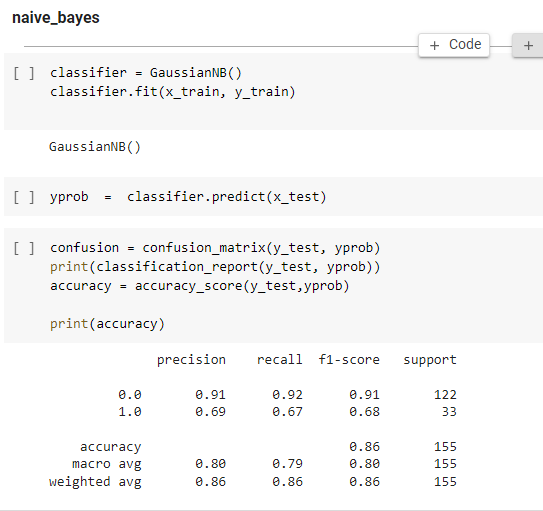

الگوریتم knn :

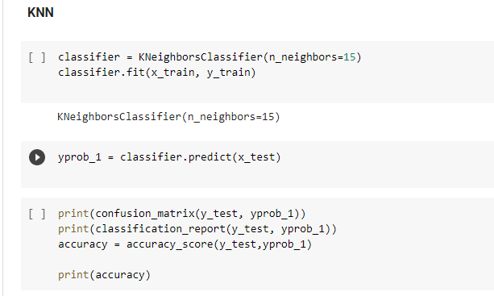

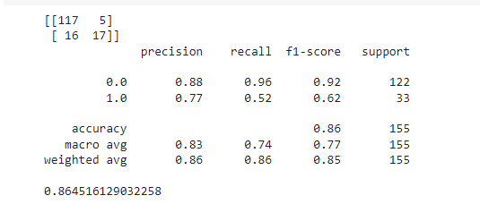

درخت تصمیم:

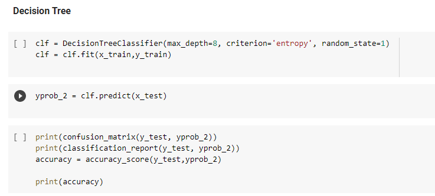

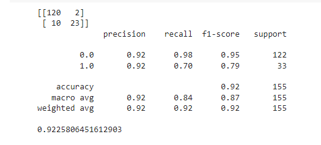

الگوریتم kmeans

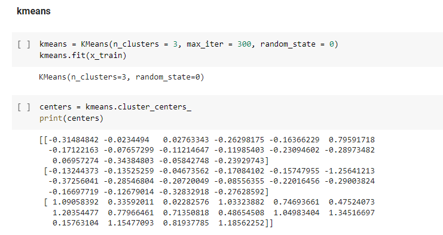

الگوریتم id3:

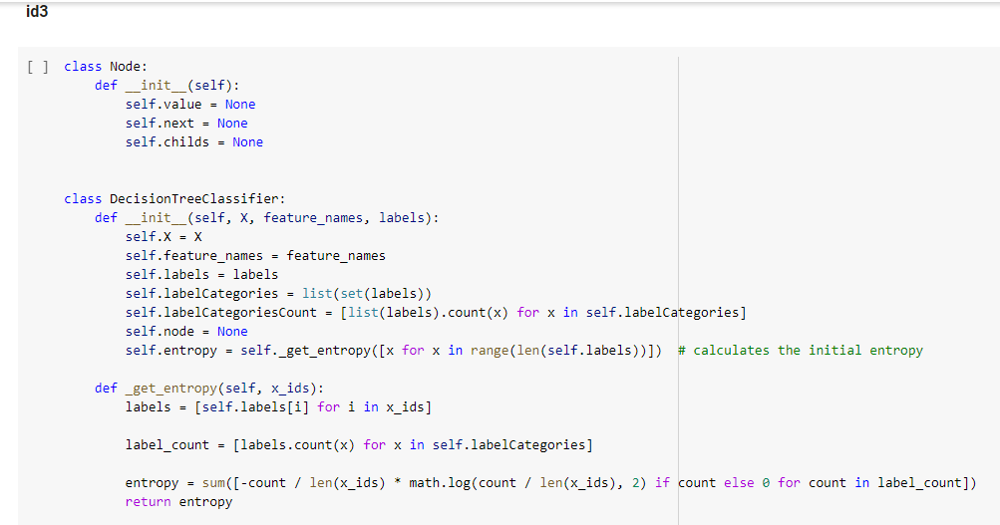

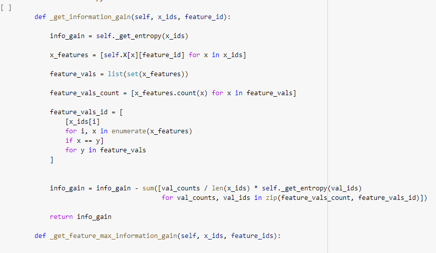

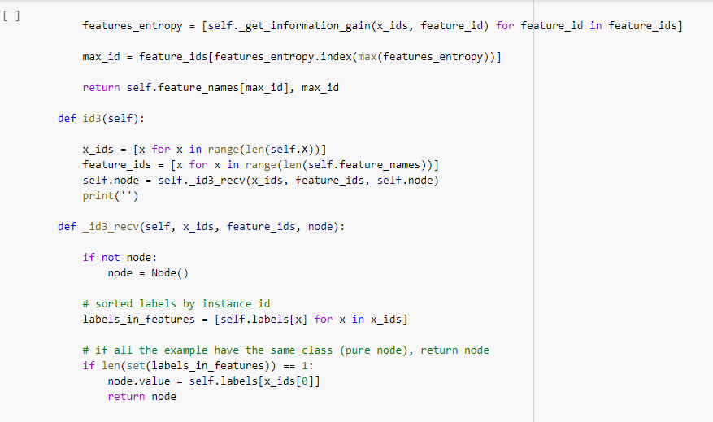

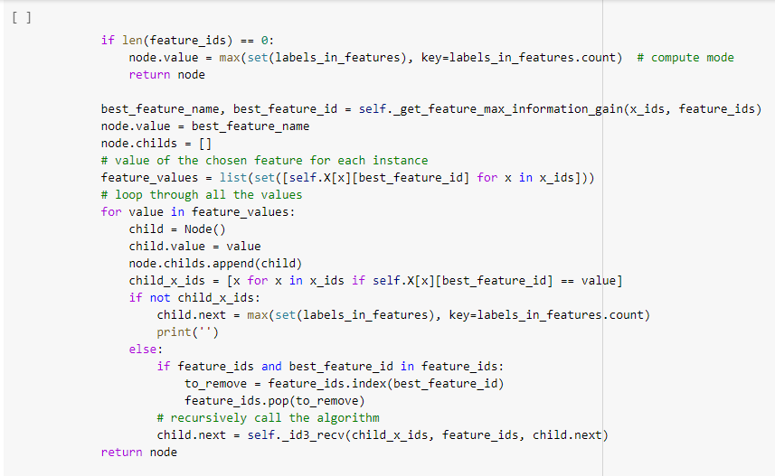

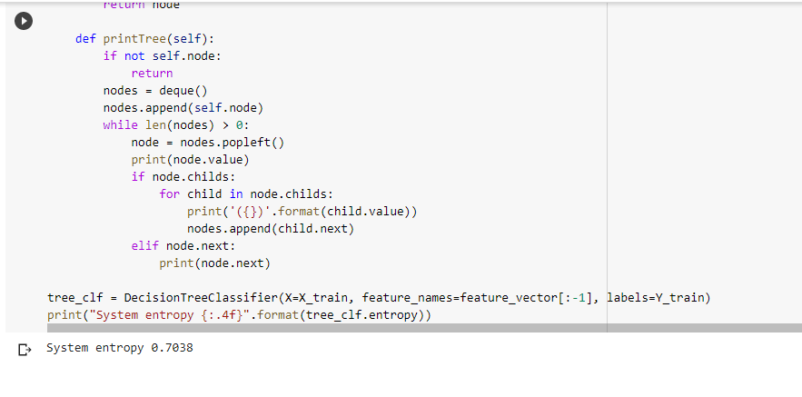

