
<p align="center" >

</p>
<br/>
<h1 align="center"> پروژه پایانی درس یادگیری ماشین </h1>

<br/>
<h3 align="center"> دانشجو : مهدیه یزدی</h3>


<br/>
<h3 align="center">اساتید : جناب آقای دکتریغمایی ، جناب آقای شکری</h3>

<br/>
<h3 align="center"> درس : یادگیری ماشین</h3>
<br/>
<h3 align="center">شماره دانشجویی : 40012920005</h3>


<br/>
<h5 align="center">زمستان 1400</h5>
<br/>
<br/>

<div align="right" >
مقدمه


```
در این پروژه با استفاده از مجموعه داده های علائم بیماران covid که از قبل جمع آوری های آن صورت گرفته بود اقدام به اجرای الگوریتم هایی همچون knn شده است همچنین پاسخ
این سوالات در سایت kaggle و لینک اعلامی نیز قرار داده شده است
```
</div>

در ادامه سوالات پروژه قرار داده شده اند :

<div dir="rtl">
  
با توجه به دیتاست covid که در پوشه ی data موجود است عملیات زیر را روی این دیتاست انجام دهید:
  - نرمالیزه کردن
  - مرتب سازی داده
  - حذف داده های یکسان و تکراری
  - بدست آوردن 5 ویژگی که کمترین اهمیت را دارند
  -  اجرای الگوریتم های find-s و ce و بیز و knn و کلاسترینگ و درخت تصمیم یکبار به صورت تصادفی و یک بار با الگوریتم id3
  - داده های زیر همگی به عنوان true برچسب گذاری خواهند شد و ترکیبات داده ای دیگر به عنوان false تمام ترکیبات داده ای که قابل کشف می باشد را بدست آورید.
  - الگوریتم های اجرا شده را با rappid minner نیست اجرا کنید و نتیجه ی خود را با آن مقایسه کنید
  - دیتاست در سایت kaggle ثبت شده است در صورتی که کد خود را در بخش notebook های kaggle ثبت کنید نمره ی اضافه دریافت خواهید کرد.
  
  
  لینک kaggle
  : 
  <br />
  https://www.kaggle.com/amirshnll/covid-patient-datasets
 
</div>
<h1></h1> 

<h3 dir="rtl">1-import</h3>


<p align="justify" dir="rtl">
در ابتدای کار کتابخانه های مورد نیاز در پایتون import  شده اند  که به جهت تجمیع تمامی کتابخانه های به کار رفته در پروژه در این قسمت قرار گرفته اند . 
</p>

```
import numpy as np

import pandas as pd

import matplotlib.pyplot as plt

import seaborn as sns

from sklearn.linear_model import LinearRegression

from sklearn.model_selection import train_test_split

from sklearn.tree import DecisionTreeClassifier

from sklearn.neighbors import KNeighborsClassifier

from sklearn.naive_bayes import GaussianNB

from sklearn.linear_model import LogisticRegression

from sklearn.cluster import KMeans

from sklearn.ensemble import RandomForestRegressor

from sklearn.inspection import permutation_importance

from sklearn.ensemble import RandomForestClassifier

from sklearn import metrics
```
<p align="justify" dir="rtl">
در ادامه به توضیح مختصری از کتابخانه های وارد شده میپردازیم :
<br/>
1- numpy:<br/>
یک کتابخانه برای زبان برنامه نویسی پایتون (Python) است. با استفاده از این کتابخانه امکان استفاده از آرایه‌ها و ماتریس‌های بزرگ چند بعدی فراهم می‌شود. هم‌چنین می‌توان از تابع‌های ریاضیاتی سطح بالا بر روی این آرایه‌ها استفاده کرد.
<br/><br/>
2-pandas:<br/>
یک کتابخانه «متن‌باز» (Open Source) با گواهینامه BSD است که کارایی بالا، ساختاری با قابلیت استفاده آسان و ابزارهای تحلیل داده برای «زبان برنامه‌نویسی پایتون» (Python Programming Language) را فراهم می‌کند. در واقع، می‌توان گفت پانداس یک کتابخانه قدرتمند برای تحلیل، «پیش‌پردازش» (PreProcessing) و «بصری‌سازی» (Visualization) داده‌ها است. 
<br/><br/>
3-matplotlib:<br/>
Matplotlib از کتابخانه‌­های رسم نمودار در زبان برنامه­‌نویسی پایتون است که به همراه بسیاری از کتابخانه‌­های این زبان که بر مبنای کار با مقادیر عددی مانند NumPy و Pandas توسعه یافته­ اند به کار گرفته می­‌شود.
Matplotlib برای گنجاندن نمودارها در اپلیکیشن‌­ها با استفاده از ابزارهای گرافیکی پایتون مانند Tkinter، wxPyton و … API مبتنی بر شی­ گرایی فراهم می‌­کند. Matplotlib توسط JohnD.Hunter در سال 2003 توسعه داده شد.
<br/><br/>
4-seaborn:<br/>
در واقع کتابخانه مصور سازی داده ها در پایتون هست که بر پایه کتابخانه matplotlib میباشد. در واقع رابطی سطح بالا برای رسم گرافیک های آماری جذاب و اطلاع دهنده، فراهم می آورد. این کتابخانه شامل توابع مختلفی در دسته بندی های زیر میباشد:
<div dir="rtl">
1- رابطه ای<br/>
2-طبقه بندی<br/>
3-توزیع ها<br/>
4-رگراسیون<br/>
5-multiples<br/>
6-style<br/>
7-رنگ<br/>
</div>
<br/>
<div dir="rtl">
5-sklearn:<br/>
همانطور که می‌دانید برای یادگیری ماشین از روش‌های مختلفی شامل یادگیری بانظارت، یادگیری بدون‌نظارت، یادگیری نیمه‌نظارتی و یادگیری تقویتی استفاده می‌شود که کتابخانه Scikit Learn برای پیاده‌سازی  طیفی از الگوریتم‌های بانظارت و بدون‌نظارت در پایتون مناسب است
</div>
</p>
<h3 dir="rtl">2- دیتاست</h3>
<p align="justify" dir="rtl">
در این بخش تمامی فعالیت های انجام شده بر روی دیتاست بررسی خواهند شد 
</p>

<h4 dir="rtl">2-1 بارگذاری دیتاست </h4>

<p align="justify" dir="rtl">
در ابتدا لازم است تا فایل مورد نظر را از منوی سمت چپ اقدام به آپلود نماییم پس از عملیات آپلود و قرار گرفتن فایل در لیست فایل های پروژه لازم است تا با استفاده از کد زیر فایل مورد نظر بارگذاری شود .
<br/>
<br/>
نکته : قبل از قرار دادن فایل آن را تبدیل به فرمت csv کرده و ستونی با نام result ایجاد کرده ایم که تمامی داده های آن yes میباشد
</p>

```
data = pd.read_csv('./covid.csv')
data.info()
```
<p align="justify" dir="rtl">
در کد فوق با کمک کتابخانه pandas و استفاده  از تابع read_csv اقدام به بارگذاری دیتاست مورد نظر شده و در متغیری تحت عنوان  data قرار گرفته است و در خط دوم نیز با کمک تابع info  اطلاعات و جزئیات دیتاست مورد نظر نمایش داده شده است . 
خروجی کد فوق به شکل زیر خواهد بود :
</p>

<p align="center">
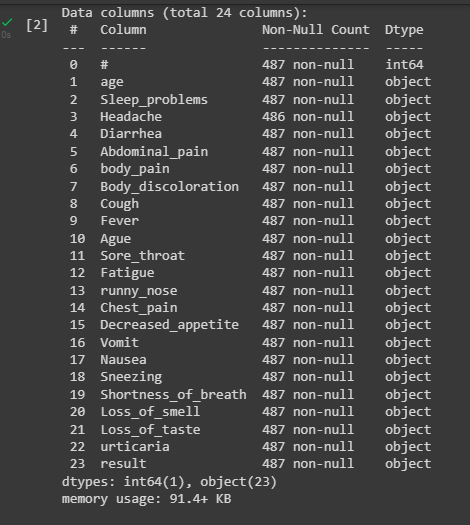
</p>
<p align="justify" dir="rtl">
در خروجی فوق همانطور که مشخص است لیستی از تمامی ویژگی ها مورد نظر در دیتاست قابل روئیت بوده و نوع فیلد ها در مقابل هر یک قرار داده شده است به عنوان مثال نوع فیلد # که شامل اعداد در دیتاست میباشد int64 میباشد که در ستون کناری آن قرار گرفته شده است .
</p>

<h4 dir="rtl">2-2 نمایش اطلاعات دیتاست</h4>

<p align="justify" dir="rtl">
در ادامه به جهت نمایش دیتاست بارگذاری شده با استفاده از دستور زیر اقدام خواهیم کرد : 
</p>

```
data.head(200)
```
<p align="justify" dir="rtl">
در این دستور با کمک تابع head و قرار دادن عدد 200  ، 200 سطر ابتدایی دیتاست نمایش داده شده است که خروجی آن همچون تصویر زیر خواهد بود : 
</p>

<p align="center">
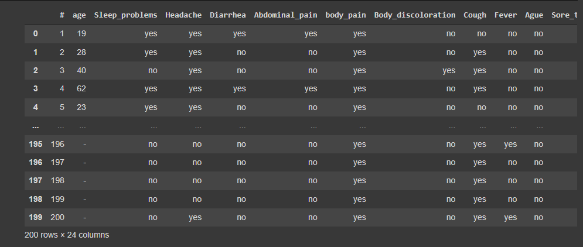
</p>
<h4 dir="rtl">2-3 باینری کردن دیتاست</h4>

<p align="justify" dir="rtl">
در قسمت بعدی پروژه خواسته شده است تا دیتاست مورد نظر نرمال سازی شود به این معنی که بازه اعداد بین  0 تا 1 باشد در نتیجه لازم است تا مقادیر yes موجود در تمام سطر ها تبدیل به 1 و مقادیر no تبدیل به 0 شود در نتیجه با کمک کد زیر مقادیر yes موجود در سطر ها تبدیل به 1 و مقادیر no نیز تبدیل به 0 شده اند.
</p>

```
data.replace(('yes', 'no'), (1, 0), inplace=True)
data.replace(('Yes', 'No'), (1, 0), inplace=True)
  
data.head(50)
```

<p align="justify" dir="rtl">
در نهایت در خط آخر برنامه 50 سطر ابتدایی نمایش داده شده است که خروجی آن به شکل زیر است
</p>
<p align="center">
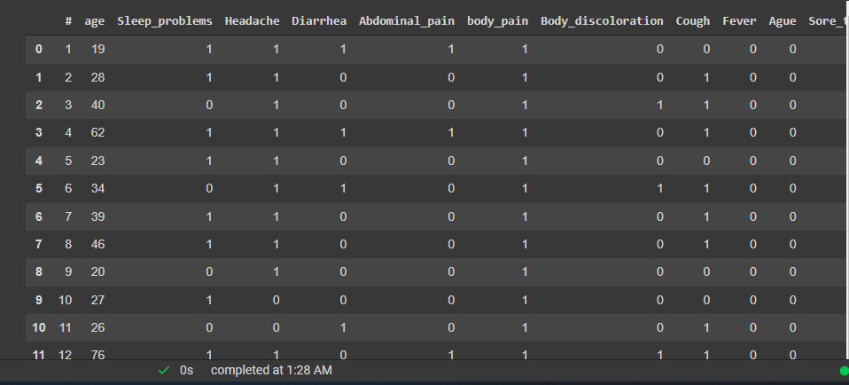
</p>

<h3 dir="rtl">3- نرمال سازی داده ها</h3>

<p align="justify" dir="rtl">
در ادامه برنامه بخش normalize نوشته شده است که به شرح زیرمیباشد :
</p>

```
y = data['result'].values

y = y.reshape(-1,1)

x_data = data.drop(['result','#','age'],axis = 1)

print(x_data)
```
<p align="justify" dir="rtl">
در این بخش با در نظر گرفتن ستون result  که در دیتاست  افزوده شده است ، دیتاست به دو بخش data و result تقسیم شده است.
همچنیین با کمک تابع reshape(-1,1) تمامی مولفه های موجود در دیتاست دریافت شده و به صورت سطری در کنار هم قرار گرقته اند. در ادامه در متغیری تحت عنوان x_data ستون های اضافی که به عنوان داده چندان به کار نمی آیند حذف شده اند از جمله آنها میتوان به  # اشاره نمود که دارای index تمام سطر هاست و همچنین result  که شامل نتیجه میباشد و همه ی نتایج به صورت yes هستند .نتیجه اجرای کد فوق به صورت زیر خواهد بود .
</p>
<p align="center">

</p>
<p align="justify" dir="rtl">
در ادامه قطعه کد مربوط به نرمال سازی داده ها قرار داده شده است که فرمول ریاضی نرمال سازی بر روی داده ها اعمال شده است  و در آخر نیز سطر های دیتاست نمایش داده شده است. 
</p>

```
normalize = (x_data - np.min(x_data)) / (np.max(x_data) - np.min(x_data)).values

normalize.head(20000)
```

<p align="justify" dir="rtl">
با اعمال کد فوق خروجی به شکل زیر را خواهیم داشت که به دلیل باینری بودن اعداد امکان قرار دادن اعداد اعشار بازه ی 0 تا 1 مهیا نبوده  و تنها خروجی به شکل اعداد اعشاری قابل مشاهده میباشند.
</p>
<p align="center">
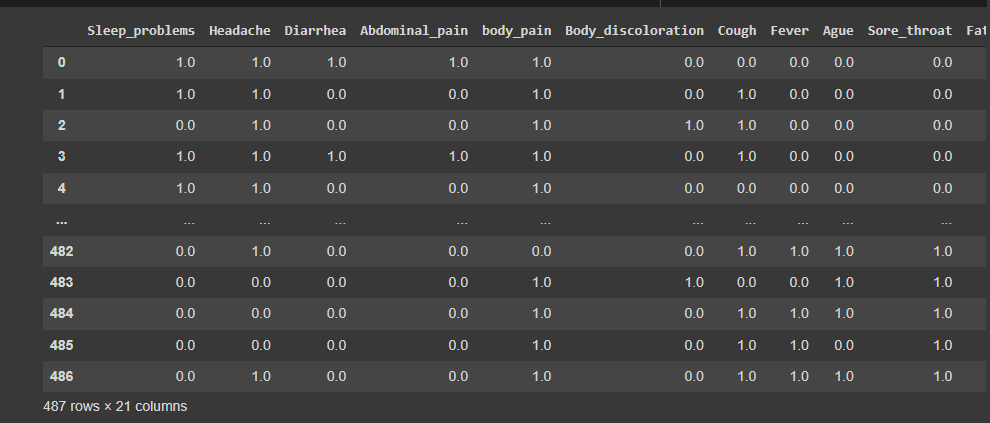
</p>

<h3 dir="rtl">4- مرتب سازی داده ها</h3>

<p align="justify" dir="rtl">
در ادامه قطعه کد مرتب سازی قرار داده شده است که داده ها به ترتیب مقدار sort شده اند . همچنین این تغییرات بر روی داده های نرمال شده اعمال شده است .
</P>

```
sort_data = normalize.apply(lambda x: x.sort_values().values)

print (sort_data)
```
<p align="center">
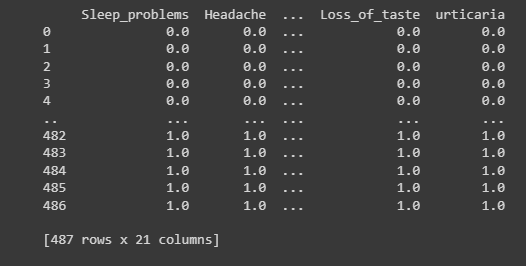
</p>

```
sort_data.isnull().sum()
```
<p align="justify" dir="rtl">
در کد فوق نیز جمع داده هایی که دارای مقدار خالی یا همان null هستند در مقابل هر ستون نمایش داده شده که همانطور که در تصویر زیر مشخص است همه ستون ها مقدار 0 دارند.
</p>
<p align="center">
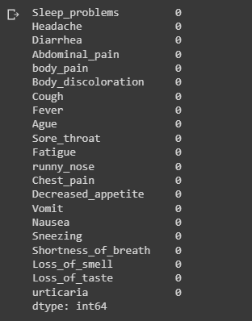
</p>
<h3 dir="rtl">5- حذف داده های یکسان</h3>

<p align="justify" dir="rtl">
 در بخش بعدی مسئله خواسته شده است تا داده های تکراری حذف شوند برای این منظور از تابعی تحت عنوان drop_duplicates استفاده شده است این تابع یه صورت هوشمند مقادیر تکراری موجود در داده های دیتاست را تشخیص داده و در نهایت حذف خواهد کرد.
 همچنین در ادامه با استفاده از دستور پرینت مجدد دیتاست نمایش داده شده است.
</p>

```
drop_duplicate = sort_data.drop_duplicates()

print(drop_duplicate)
```
<p align="center">
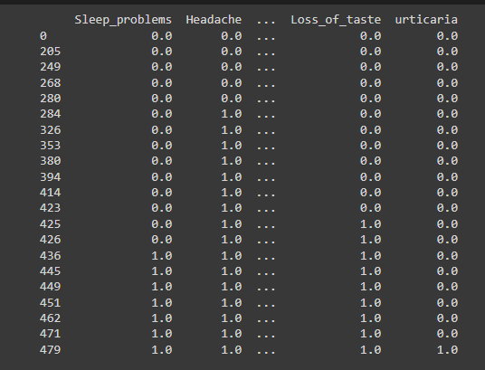
</p>

<h3 dir="rtl">6- یافتن پنج ویژگی کم اهمیت </h3>
<p align="justify" dir="rtl">
در ادامه اقدام به پیدا کردن 5 ویژگی که دارای اهمیت کمتر میباشد شده است 
</p>
<p align="justify" dir="rtl">
 به جهت یافتن ویژگی کم اهمیت از الگوریتم درخت تصمیم کمک گرفته شده است با فراخوانی تابع این الگوریتم و انجام سایر عملیات ها ، مقدار دقت الگوریتم نمایش داده شده است که خروجی آن به شکل زیر است 
 

```
clf=RandomForestClassifier(n_estimators=100)
clf.fit(x_train,y_train)
y_pred=clf.predict(x_test)
print("Accuracy:",metrics.accuracy_score(y_test, y_pred))
```

<p align="center">

</p>
<p align="justify" dir="rtl">
با توجه به اینکه خروجی تمامی سطر ها yes است دقت الگوریتم درخت تصادفی نیز  مقدار 1 را نمایش خواهد داد
</p>


```
for i in x_train : 
  x_train.drop(i, axis=1)
  print("Accuracy", i, ":",metrics.accuracy_score(y_test, y_pred))
  print("========")
```
<p align="justify" dir="rtl">
در برنامه فوق سطر ها تک به تک حذف شده اند و دقت الگوریتم در هر مرحله اندازه گیری شده است و نتیجه همچون تصویر زیر خواهد بود :
<p align="center">
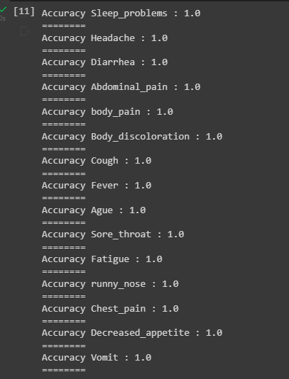
</p>
<p align="justify" dir="rtl">
همانطور که در فوق نیز توضیح داده شد به دلیل 1 بودن نتیجه تمام سطر ها ، 5 ویژگی که کمترین میزان اهمیت را دارند قابل تشخیص نمیباشد.
</p>


<p align="justify" dir="rtl">
در برنامه زیر مقدار مهمترین ویژگی ها نمایش داده شده است که به دلیلی که در فوق به آن اشاره کردیم تمامی ستون هارا نمایش داده است
همچنین در ادامه تصویر خروجی این بخش قرار داده شده است 
</p>

```
rf = RandomForestRegressor(n_estimators=100)
rf.fit(x_train, y_train)
rf.feature_importances_
```
<p align="center">

</p>
<p align="justify" dir="rtl">
در کد قرار داده شده در زیر ویژگی ها بر اساس ترتیب الویت در نمودار قرار داده شده اند و به وسیله ی کتابخانه matplotlib در قالب نمودار نمایش داده شده است 
همچنین با استفاده از تابع xlabel برچسبی برای این نمودار در نظر گرفته شده است 
</p>

```
sorted_idx = rf.feature_importances_.argsort()
plt.barh(x_train.columns[sorted_idx], rf.feature_importances_[sorted_idx])
plt.xlabel("Random Forest Feature Importance")
```

<h3 dir="rtl">7- الگوریتم ها </h3>

<p align="justify" dir="rtl">
در بخش بعدی ما از دیتاست موجود داده های تست و train را تفکیک کرده ایم برای این منظور با کمک کتابخانه ی sklearn از تابع train_test_split آن استفاده شده است .
مقدار test_size نیز بر روی مقدار 0.5 تنظیم شده است به این معنی که نیمی از دیتاست را داده های تست و نیمی دیگر را train در بر بگیرد

</p>

```
x_train, x_test, y_train, y_test = train_test_split(x_data,y,test_size = 0.5,random_state=100)

y_train = y_train.reshape(-1,1)

y_test = y_test.reshape(-1,1)

print("x_train: ",x_train.shape)

print("x_test: ",x_test.shape)

print("y_train: ",y_train.shape)

print("y_test: ",y_test.shape)
```

<h4 align="justify" dir="rtl">7-1 الگوریتم درخت تصمیم</h4>
<p align="justify" dir="rtl">
در ادامه به توضیح الگوریتم درخت تصمیم میپردازیم . به جهت انجام این الگوریتم از تابع DecisionTreeClassifierموجود در کتابخانه ی sklearn کمک گرفته شده است . در نهایت با کمک تابع score میزان دقت الگوریتم اندازه گرفته شده و خروجی این بخش در تصویر زیرین قابل مشاهده است .

</p>

```
dtree = DecisionTreeClassifier()

dtree.fit(x_train, y_train.ravel())

print("Decision Tree Algorithm test accuracy: ", dtree.score(x_test, y_test))
```
<p align="center">

</p>
<h4 align="justify" dir="rtl">7-2 ID3</h4>
<p align="justify" dir="rtl">
در ادامه به توضیح الگوریتم id3 میپردازیم. برای استفاده از این الگوریتم لازم است تا کتابخانه مربوط به آن نصب شود در نتیجه با استفاده از دستور زیر کتابخانه ای به نام chefboost در محیط colab نصب شده و قابل دسترسی است.
</p>

```
pip install chefboost
```
<p align="justify" dir="rtl">
در قطعه کد زیر پس از import  کتابخانه نصب شده امکان استفاده از آن مهیا شده است .
در ادامه در یک دیکشنری مقدار algorithm بر روی id3 تنظیم شده است و در انتها نیز در متغیری با نام model با استفاده از کتابخانه chefboost مقدار داده ها ،config که در خط فوق الگوریتم را از نوع id3 تعریف کرد و نام برچسب هدف را به تابع مورد نظر پاس میدهد. خروجی این بخش در تصویرزیر قابل مشاهده میباشد.
</p>

```
from chefboost import Chefboost as chef

config = {'algorithm': 'ID3'}
model = chef.fit(data, config = config, target_label = 'result')
````
<p align="center">
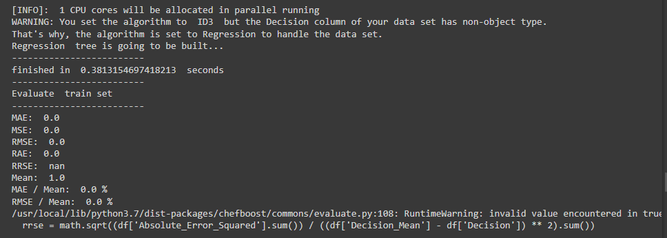
</p>
<p align="justify" dir="rtl">
در برنامه زیر روش دیگر الگوریتم id3 نوشته شده است که با کمک کتابخانه sklearn و در نهایت دقت الگوریتم اندازه گرفته شده است که نتیجه آن به شکل زیر است :
</p>

```
clf = DecisionTreeClassifier(random_state=0,criterion='entropy')
clf.fit(x_train, y_train)

y_pred=clf.predict(x_test)
y_pred
id3 = clf.score(x_test, y_test)
print("ID3 accuracy:", id3)
```

<p align="center">
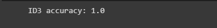
</p>

<h4 align="justify" dir="rtl">7-3 KNN</h4>
<p align="justify" dir="rtl">
در این بخش الگوریتم knn را خواهیم داشت که در ابتدا مقدار K را 5 در نظر گرفته ایم به این معنی که تعداد 5 همسایه مورد بررسی قرار گیرد و نیز در ادامه با فراخوانی تابعی با نام  KNeighborsClassifierکه در قسمت ابتدای فایل آن را import  کردیم تعداد همسایه هایی که باید بررسی کند را به آن داده ایم.در ادامه خروجی این بخش و مقدار دقت در داده های تست و train پرینت شده است که در تصویر زیر قابل مشاهده میباشد.
</p>

```
K = 5
knn = KNeighborsClassifier(n_neighbors=K)
knn.fit(x_train, y_train.ravel())
print("When K = {} neighnors , KNN test accuracy: {}".format(K, knn.score(x_test, y_test)))
print("When K = {} neighnors , KNN train accuracy: {}".format(K, knn.score(x_train, y_train)))
```
<p align="center">
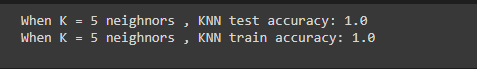
</p>
<p align="justify" dir="rtl">
در ادامه بررسی کرده ایم که بهترین دقت خروجی چه میزان است و در چه تعداد همسایه خواهد بود که با  ساخت دو لیست برای داده های test  و train و قرار دادن مقادیر مربوطه در آنها میزان دقت هر یک در لیست های خود ، قرار گرفته و در نهایت در باکس دوم خواهیم دید که مقادیر به وسیله ی کتابخانه ی matplotlib در قالب نمودار نمایش داده است همچنین خروجی این بخش نیز در ادامه قابل مشاهده است.
</p>

```
ran = np.arange(1,30)
train_list = []
test_list = []
for i,each in enumerate(ran):
    knn = KNeighborsClassifier(n_neighbors=each)
    knn.fit(x_train, y_train.ravel())
    test_list.append(knn.score(x_test, y_test))
    train_list.append(knn.score(x_train, y_train))
 ```
 
 ```
plt.figure(figsize=[15,10])
plt.plot(ran,test_list,label='Test Score')
plt.plot(ran,train_list,label = 'Train Score')
plt.xlabel('Number of Neighbers')
plt.ylabel('feature')
plt.xticks(ran)
plt.legend()
print("Best test score is {} and K = {}".format(np.max(test_list), test_list.index(np.max(test_list))+1))
print("Best train score is {} and K = {}".format(np.max(train_list), train_list.index(np.max(train_list))+1))

 ```
 <p align="center">
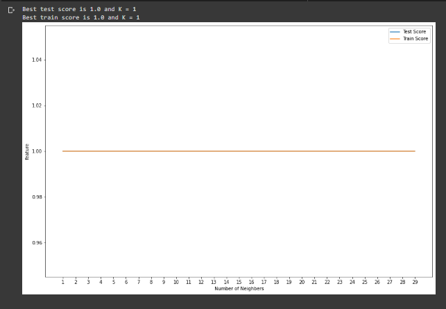
</p>

<p align="justify" dir="rtl">
برای انتخاب ویژگی های مهم راه حل مناسب دیگر رسم نمودار کرولیشن بین ویژگی هاست که از تابع corr  کتابخانه ی seaborn استفاده می کنیم این نمودار ارتباط بین ستون ها را بایکدیگر نشان می دهد و می بینیم کرولیشن هر ویژگی با خودش یک است و بقیه اعدادی بین 1 و-1 هستند. عدد نزدیک به صفر ( چه منفی و چه مثبت) نشان دهنده ی این است که ارزش آن متغیر کم است و هرچه به مثبت یک نزدیک تر باشد یعنی رابطه ی مستقیم بیشتر و هرچه به منفی یک نزدیک تر یعنی رابطه ی عکس بیشتر یه متغیر کم شود، متغیر دیگر زیاد می شود. پس با این نمودار می توان تاثیر ویژگی ها بر یکدیگر را بدست آورد در جدول کرولیشن lose of taste با lose of small هم رابطه است یعنی اگر بیماری یکی از این ها را داشته باشد دومی هم دارد. در ادامه برنامه و تصویر خروجی این الگوریتم قرار داده شده است .
</p>

```
plt.figure(figsize=(20,20))
cor = covid.corr()
sns.heatmap(cor, annot=True, cmap=plt.cm.Reds)
plt.show()
```

<p align="center">
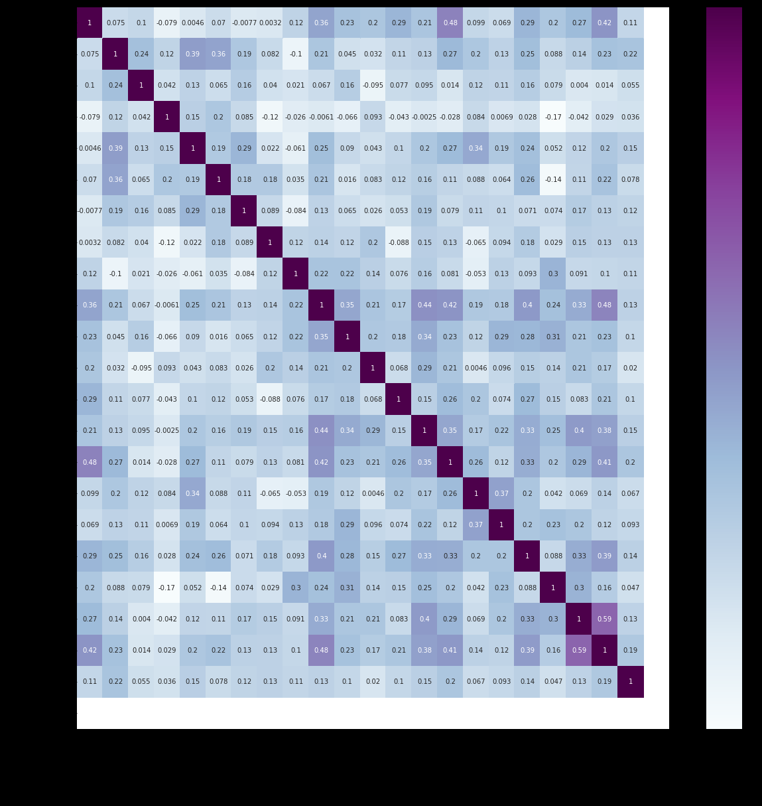
</p>

 
<h4 align="justify" dir="rtl">7-4 Clustering</h4>
<p align="justify" dir="rtl">
در این بخش با استفاده از الگوریتم kmeans اقدام به Clustering کرده ایم این تابع از کتابخانه ی sklearn که در ابتدا import  کرده ایم میباشد و در ادامه با پاس دادن مقدار دیتا در این تابع نتیجه پرینت شده در تصویر زیر قابل مشاهده خواهد بود.
</p>

```
kmeans = KMeans(n_clusters=4)
kmeans.fit(x_train, y_train)
y_kmeans = kmeans.predict(x_data)
print(y_kmeans)
```
<p align="center">

</p>

<p align="justify" dir="rtl">
در ادامه دسته بندی های مورد نظر پرینت  شده و همچنین خروجی در قالب نمودار به نمایش در آمده که نمایشگر خوشه بندی داده هاست در دو تصویر زیر خروجی این دو کد قرار داده شده اند.
</p>

```
print(kmeans.cluster_centers_)
```

<p align="center">
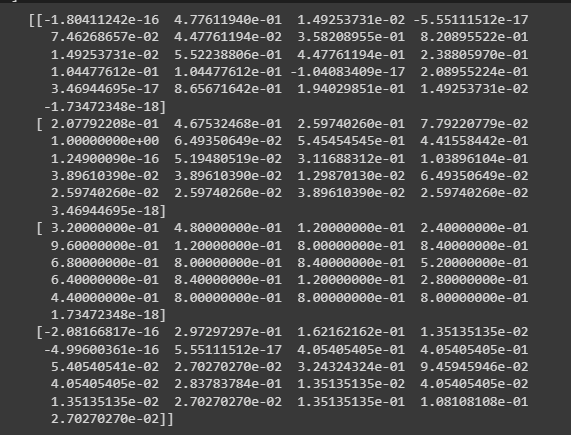
</p>

```
plt.scatter(kmeans.cluster_centers_[:,  0], kmeans.cluster_centers_[:,  1], s=100)
print(kmeans.labels_)
```
<p align="center">
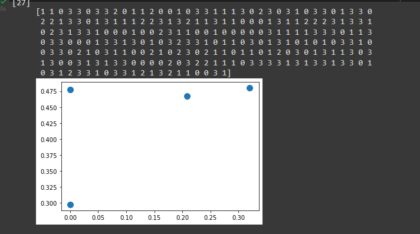
</p>

<h4 align="justify" dir="rtl">7-5 Naive-Bayes</h4>
<p align="justify" dir="rtl">
در این قسمت به منظور انجام الگوریتم nb از تابع GaussianNB از کتابخانه ی sklearn  استفاده شده است که مقادیر train به آن پاس داده شده است و در نهایت مقدار دقت این تابع پرینت شده است. خروجی این بخش نیز در تصویر زیر قرار داده شده است.
</p>

```
nb = GaussianNB()
nb.fit(x_train, y_train.ravel())
print("Naive Bayes test accuracy: ", nb.score(x_test, y_test))
```
<p align="center">

</p>
<h4 align="justify" dir="rtl">7-6 Find-s</h4>
<p align="justify" dir="rtl">
در بخش زیر الگوریتم find-s قرار داده شده برای استفاده از این الگوریتم لازم است تا دیتا های موجود در دیتاست به صورت آرایه باشند در نتیجه با کمک تابع to_numpy خروجی همچون تصویر زیر ایجاد کرده ایم.
</p>

```
concepts = x_train.to_numpy()
print(concepts)
```
<p align="center">
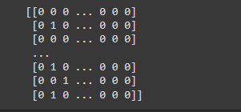
</p>
<p align="justify" dir="rtl">
در ادامه تابعی ایجاد کرده ایم که دو پارامتر ورودی con وtar دارد در ادامه با در  قرار دادن for در پارامتر tar پیمایش کرده ایم و برای نتایج مثبت (1) فرضیه ای specific ساخته ایم و همچنین در ادامه در میان لیست con که همان x_train ماست پیمایش کرده ایم و برای دیتاهایی که 1 هستند و نتایج مثبت یا همان 1 نداشته اند مقدار don't care در نظر گرفته ایم در ادامه مقدار ایجاد شده return شده است و در باکس کد بعدی نیز با فراخوانی تابع و قرار دادن آرگومان های ورودی نتایج پرینت شده در تصویر زیرین قابل مشاهده است.
</p>

```
def  train(con, tar):
for i, val in  enumerate(tar):
if val == 1:
specific_h = con[i].copy()
break
for i, val in  enumerate(con):
if tar[i] == 1:
for x in  range(len(specific_h)):
if val[x] != specific_h[x]:
specific_h[x] = '?'
else:
pass
return specific_h
```
```
print(train(concepts, y_train))
```
<p align="center">
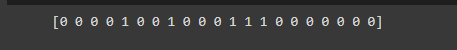
</p>
<h4 align="justify" dir="rtl">7-7 candidate elimination</h4>
<p align="justify" dir="rtl">
برای پیاده سازی الگوریتم  candidate elimination نیز تابعی ایجاد کرده ایم که همچون تابع قبل دو آرگومان ورودی دارد و با دریافت اولین عنصر از لیست ایجاد شده که در مثال قبل با استفاده از تابع to_numpy ایجاد شد ، در ابتدا مقدار اولیه خاص و عمومی پرینت شده استدر ادامه با پیمایش for هر بار برای تمام نتایج مثبت ، بررسی میکند آیا concept مثبت منجر به target مثبت شده است یا خیر و ادامه با بررسی  تمام الگوریتم خروجی همچون شکل زیر خواهیم داشت
</p>
<p align="justify" dir="rtl">
در حقیقت ساختار الگوریتم به شکل زیر است : 
اگر مقدار ویژگی مورد نظر با مقدار خاص ایجاد شده برابر بود کار انجم نده  
در غیر این صورت مقدار ؟ را قرار بده 
</p>
<p>
if attribute_value == hypothesis_value:

Do nothing 
else:
replace attribute value with '?' (Basically generalizing it)
</p>

```
def learn(concepts, target):
specific_h = concepts[0].copy()
print("Initialization of specific_h and general_h")
print("specific_h: ",specific_h)
general_h = [["?" for i in range(len(specific_h))] for i in range(len(specific_h))]
print("general_h: ",general_h)
print("concepts: ",concepts)
for i, h in  enumerate(concepts):
if target[i] == "yes":
for x in  range(len(specific_h)):
#print("h[x]",h[x])
if h[x] != specific_h[x]:
specific_h[x] = '?'
general_h[x][x] = '?'
if target[i] == "no":
for x in  range(len(specific_h)):
if h[x] != specific_h[x]:
general_h[x][x] = specific_h[x]
else:
general_h[x][x] = '?'
print("\nSteps of Candidate Elimination Algorithm: ",i+1)
print("Specific_h: ",i+1)
print(specific_h,"\n")
print("general_h :", i+1)
print(general_h)
indices = [i for i, val in  enumerate(general_h)  if val == ['?',  '?',  '?',  '?',  '?',  '?']]
print("\nIndices",indices)
for i in indices:
general_h.remove(['?',  '?',  '?',  '?',  '?',  '?'])
return specific_h, general_h
s_final,g_final = learn(concepts, y_train)
print("\nFinal Specific_h:", s_final, sep="\n")
print("Final General_h:", g_final, sep="\n")
```
<p align="center">
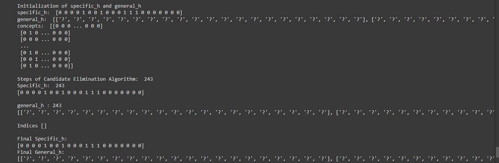
</p>

<h3 align="justify" dir="rtl">8- ایجاد داده های false</h3>
<p align="justify" dir="rtl">
درادامه برنامه ایجاد داده های مصنوعی false به وسیله تابع random مشاهده میشود که خروجی آن نیز قابل مشاهده است
</p>

```
data_False = np.random.randint(2, size=(500,21))
Flase_data = pd.DataFrame(data_False, columns=('Sleep_problems', 'Headache', 'Diarrhea', 'Abdominal_pain',
                                              'body_pain', 'Body_discoloration',
                                              'Cough', 'Fever', 'Ague', 'Sore_throat',
                                              'Fatigue', 'runny_nose', 'Chest_pain',
                                              'Decreased_appetite', 'Vomit', 'Nausea',
                                              'Sneezing', 'Shortness_of_breath',
                                              'Loss_of_smell', 'Loss_of_taste', 'urticaria'))
Flase_data.head(50)

```
<p align="center">
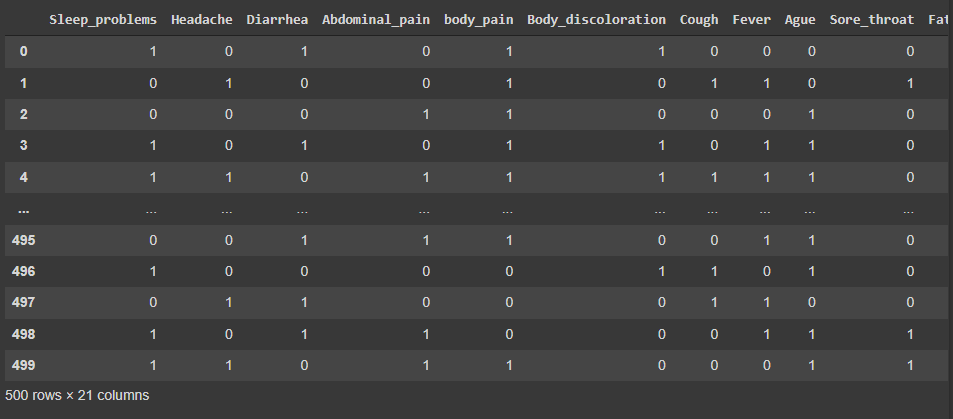
</p>
<h3 align="justify" dir="rtl">9- بررسی الگوریتم ها در برنامه rappid minner</h3>
<p align="justify" dir="rtl">
در ای بخش نیز با کمک نرم فزار rapid minder دیتاست در نرم افزار بارگزاری شد برای این منظور لازم بود تا دیتاست نرمال سازی شده که دارای مقادیر 0 و 1 است در نرم افزار بارگذاری شود در نتیجه با استفده از کد زیر دیتاست را دانلود کرده و در نرم افزار import کردیم : 
</p>

```
my = open('new_covid' + '.csv', 'w')
my.write(data.to_csv())
my.close()
```


<p align="justify" dir="rtl">
در کد فوق  با ایجاد فایلی با نام new_covid.csv مقدار جدید data که به صورت تغییر مقادیر yes به 1 و همچنین تغییر مقادیر no به 0 میباشد را به عنوان دیتا در فایل مربوطه قرار دادیم و در نهایت فایل مربوطه را close کرده ایم خروجی این بخش به شکل زیر است که فایل مربوطه در پنل سمت چپ colab قرار گرفته است : 
</p>
<p align="center">
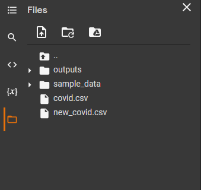
</p>
<p align="justify" dir="rtl">
در ادامه باانتخاب ستون مورد نظر برای عملیات clustering الگوریتم ها بر روی داده ها پیاده سازی شدند و نتایج به دست آمده به شکل تصاویر زیر میباشند :
</p>
<p align="justify" dir="rtl">
در تصویر زیر داده های import شده در نرم افزار قابل مشاهده میباشد:
</p>
<p align="center">

</p>
<p align="justify" dir="rtl">
در این تصویر الگوریتم های مختلف بر روی داده ها اعمال شده ند و نتیجه در قالب نمودار مشخص شده است . مطابق نمودار ، با اعمال الگوریتم درخت تصمیم کمترین دقت و بدترین حالت خروجی را خواهیم داشت ولی در الگوریتم هایی همچون جنگل تصادفی ، دقتی 97 درصدی مشاهده میشود.
</p>
<p align="center">
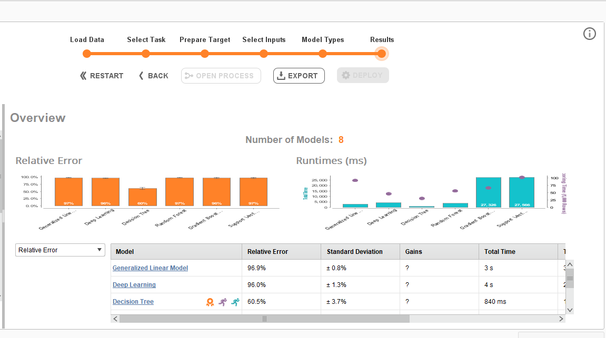
</p>
<p align="justify" dir="rtl">
در تصویر زیر نیز خوشه بندی داده ها در الگوریتم k-means نمایش داده شده است که شامل 2 خوشه میباشد.
</p>
<p align="center">
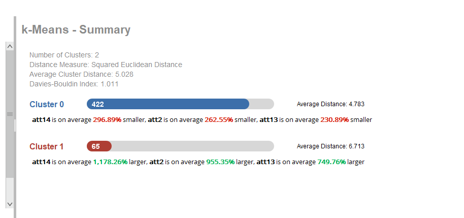
</p>
<p align="justify" dir="rtl">
در این تصویر نیز در چارتی خوشه بندی های ایجاد شده را مشاهده میکنیم و در قسمت تحتانی نمودار ، ویژگی ها قرار گرفته اند 
</p>
<p align="center">
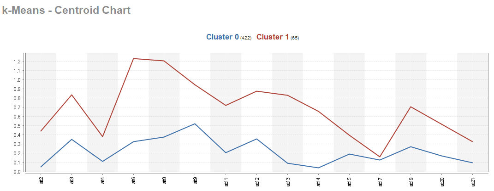
</p>
