

<h5>چکیده </h5>
در سال های اخیر و با توسعه تکنولوژی درحوزه پرداخت معمولا از کارت های اعتباری استفاده میشود که این امر موجب افزایش موارد کلاهبرداری شده است در نتیجه نیاز به توسعه الگوریتم های شناسایی تقلب بوده تا از فعالیت های سودجویانه و کلاهبرداری جلوگیری شود .
در این مقاله ، روش های پژوهشی جلوگیری از کلاهبرداری پیشنهاد شده است که از جمله آنها میتوان به طبقه بندی در یادگیری ماشین و استفاده از الگوریتم هایی همچون رگرسیون لجستیک، جنگل تصادفی و Naive Bayes در Dataset های مورد نظر اشاره نمود. همچنین در این مقاله به بررسی پارامتر های accuracy ، precision ، recall ، f1 score ، confusion matrix و Roc-auc score خواهیم پرداخت .

<h5>کلمات کلیدی</h5> 
شناسایی تقلب، کارت اعتباری ، یادگیری ماشین ، دقت ، امتیاز f1 

<h5>مقدمه</h5> 
هدف اصلی در این مقاله شناسایی تقلب و کلاهبرداری در زمینه کارت های اعتباری میباشد به جهت تحقق بخشیدن به این امر ، لازم به ایجاد طبقه بندی برای عملیات های متقلبانه و غیر متقلبانه خواهد بود .
 هدف اصلی از ایجاد الگوریتم شناسایی تقلب یافتن کلاهبرداری انجام شده در کمترین زمان ممکن و با بالاترین دقت با استفاده از علم یادگیری ماشین و بهره بری از الگوریتم های طبقه بندی میباشد .
با توجه به سرعت رشد تکنولوژی به طور معمول پرداخت وجوه نقد کاهش یافته  و پرداخت های آنلاین افزایش میابند و این امر راه را برای کلاهبرداران هموار میسازد .
در برخی از پرداخت های آنلاین تنها شماره کارت ، تاریخ انقضای کارت و CVV لازم است که این داده ها ممکن است بدون اطلاع ما به سرقت بروند.
درتراکنش هایی که از طریق اینترنت انجام میشود اغلب کلاهبرداران با حملات فیشینگ اقدام به دریافت اطلاعات کرده و ما متوجه لو رفتن این اطلاعات نشده ایم و کلاهبرداران با در دست داشتن اطلاعات کارت اعتباری سواستفاده میکنند.
اطلاعات کارت های اعتباری باید به صورت امن نگهداری شود اما در بعضی مواقع فاش شدن این اطلاعات در دست ما نیست .
بهترین راه برای آگاه شدن از تراکنش های تقلب شده  و تقلب نشده یافتن الگو های هزینه مشتری با استفاده از داده های موجود و علم یادگیری ماشین است .

<h5>انواع تقلب :</h5>
•	آنلاین در مقابل آفلاین
 
•	سرقت کارت 
 
•	حملات فیشینگ به داده ها 
 
•	انجام تقلب در برنامه ها 
 
•	کلاهبرداری مخابراتی

<h5>کار های انجام شده در قبل : </h5>
کلاهبرداری و سرقت کارت های اعتباری یک فعالیت مجرمانه است و یک جرم محسوب میشود.
مطالعات زیادی به جهت شناسایی معاملات کلاهبرداری شده انجام شده است ولی چالش ها و راه های زیادی برای غلبه بر این مشکل وجود دارد که اولا استفاده از بسیاری از تکنیک های داده کاوی برای یافتن تراکنش های کلاهبرداری شده به صورت سنتی قرار دارد که این روش ها مرسوم نبوده و متقلبان به صورت هوشمند میتوانند بدون نقض اقدام به تقلب نمایند. البته یادگیری های ماشین نیز چالش هایی به همراه دارد بنابراین داده هایی که به شدت نامتعادل هستند در dataset ، Kaggle وجود دارد و این امر کمک میکند تا در چالش های به وجود آمده،  بهترین الگوریتم ها را بکارگرفته که البته این الگوریتم ها خود دارای چالش هایی هستند.
الگوریتم های ارائه شده دارای دقتی در حدود 99.9% میباشند در این الگوریتم ها داده های بی معنی و فعالیت های غیر عادی کاربر تشخیص داده شده و از انجام تراکنش های کلاهبرداران جلوگیری میکند با این حال کلاهبرداران بسیار باهوش بوده و به دنبال راهی برای فریب این الگوریتم ها میباشند و در برخی از معاملات ، الگوریتم به دلیل توان بالای کلاهبرداران قادر به شناسایی معاملات انجام شده توسط آنها نبود.

 
 
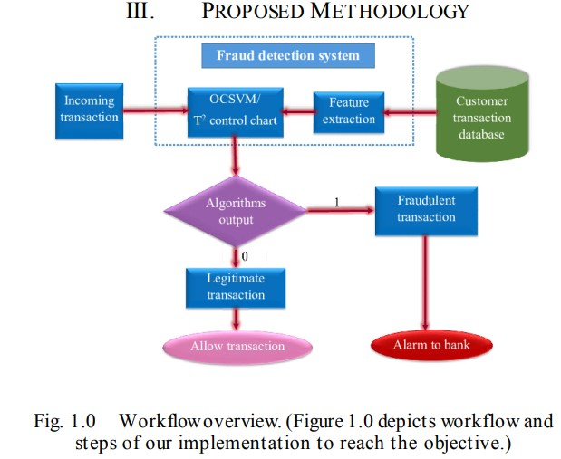

 
این dataset شامل داده های کشور های اروپایی است دارندگان کارت های اعتباری در سپتامبر 2013به مدت دو روز در ویژگی  v1-v28 PCA موجود در dataset  به دلیل مسائل امنیتی و زمان مقادیر 1 را برای تقلب و 0 را برای عدم تقلب در نظر گرفتند.

 
 
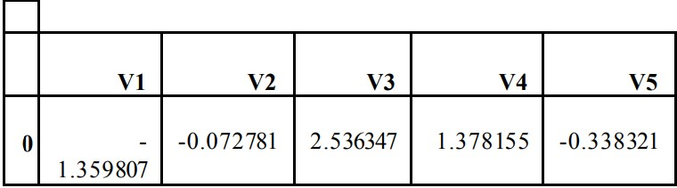
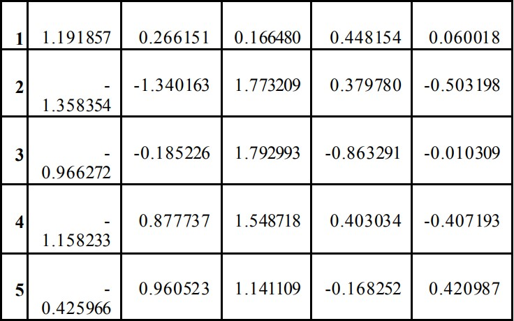

 
در جدول 1 نمونه ای از dataset و ویژگی های v1 – v5 قابل مشاهده هستند.

 
 
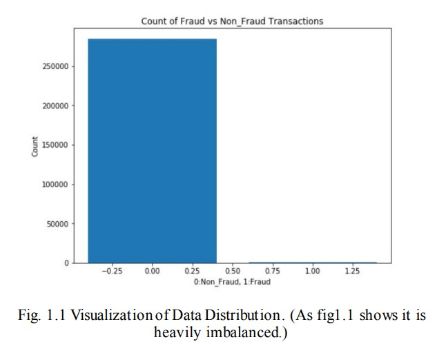
 
پس از انجام Under Sampling، بر روی dataset  تعداد معاملات تقلب شده از 284807 به 890 کاهش یافت. 

 
 
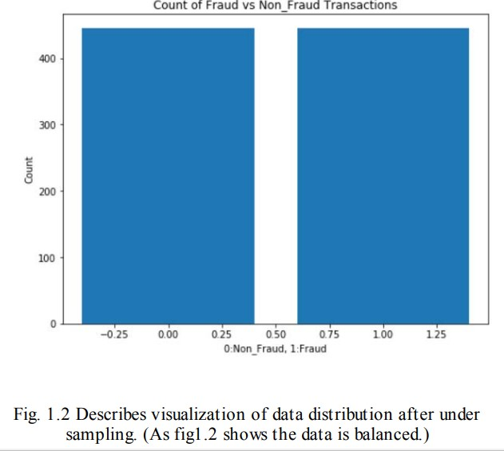
 
با استفاده از تکنیک Outlier در داده کاوی ،  با دقت بالاتری میتوان معاملات تقلب شده را شناسایی نمود زیرا با این ترفند میتوان مقادیر افراطی و بی معنی و گم شده را شناسایی کرد و در نهایت بهترین نتیجه را میتواند به دست آورد.
بنابراین وظیفه این الگوریتم شناسایی و حذف داده های غیر عادی میباشد که برای این منظور نیاز به یک نقشه حرارتی بوده تا همبستگی بین متغیر ها تشخیص داده شود .

 
 
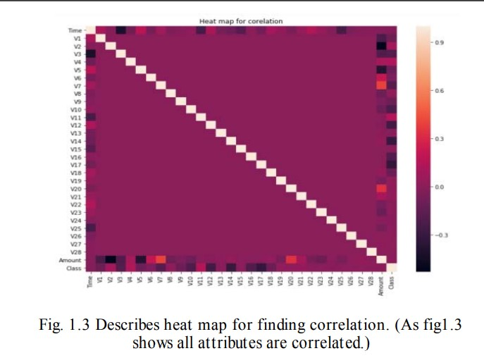
 
در این کلاس، بعضی ستون ها حذف و تعدادی از ستون ها نرمال شده اند . برای حذف ستون های کلاس از dataset ارزیابی درستی انجام شده که این امر سبب افزایش نرخ مقادیر مثبت شده است و موجب میشود   dataset  قالب بندی شود.

 
 
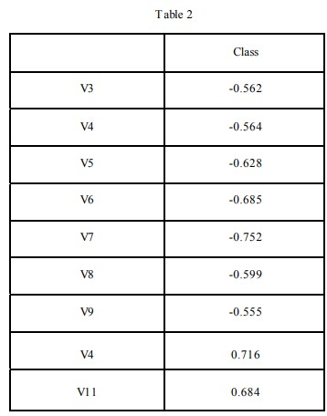
 
جدول فوق شامل ویژگی ها میباشد که ارتباط میان بیشتر الگوریتم ها را مطرح میکند و ممکن است بر روی خروجی تاثیر گذار باشد. این مقادیر میتواند در یک محدوده مقیاس بندی شود که در جایگاه خود نتیجه خوبی خواهد داشت .

 
 
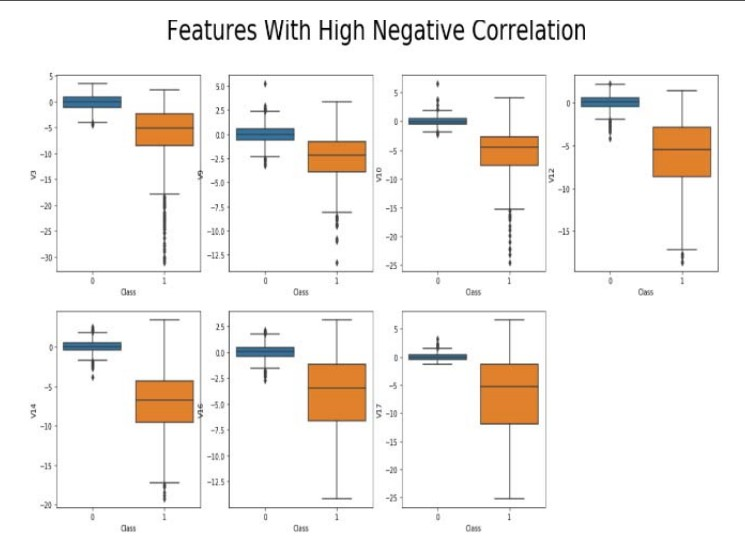
 
 
 
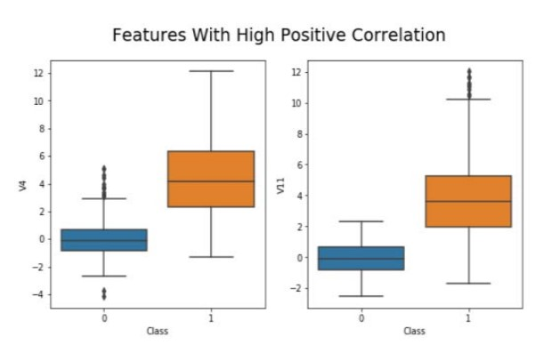
 
بنابر این پس از حذف و تشخیص داده های غیر عادی مجددا تراکنش از مقدار 890 به 620 کاهش یافت. این dataset به این صورت تقسیم بندی شده که 70 در صد آن به آموزش و 30 درصد آن به آزمایش و تست پس از انجام فرآیند پیش پردازش تخصیص داده شده است.
درخت تصمیم : درخت تصمیم ساختاری مشابه درخت دارد و در محلی که برگ وجود دارد تصمیماتی اتخاد میشود که شامل داده ها ، طبقه بندی و پیش بینی میباشد و خروجی به شکل شاخه خواهد بود که مسائل آموزش دیده میباشند.
الگوریتم ID3 برای به دست آوردن اطلاعات شاخه ها جهت انتخاب بهترین شاخه ای که دارای سود بیشتری میباشد استفاده میشود که این مراحل با فرمول های آنتروپی قابل انجام است.
در فرمول زیر الگوریتم ID3 برای محاسبه سود بررسی شده است :

 
 
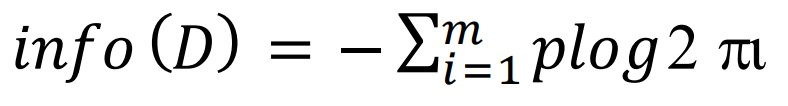
 
جنگل تصادفی : جنگل تصادفی یک الگوریتم طبقه بندی شده است که شامل تعداد زیادی عدد میباشد و درخت تصمیم برای زیر مجموعه های مختلف در dataset میانگین دقت و بهبود را محاسبه نموده و دقت کل را به دست می آورد .
اگر تعداد درخت های تصمیم گیری سبب افزایش دقت شود تعداد جنگل های تصادفی نیز باعث افزایش دقت خواهد شد البته جنگل تصادفی همان درخت تصمیم است ولی نتیجه بهتری را میتوان از آن انتظار داشت . 
رگرسیون لجستیک : از میان تکنیک های طبقه بندی و رگرسیون لجستیک در اکثر موارد از طبقه بندی استفاده میشود اما خروجی آن به صورت دودویی خواهد بود که متعلق به یک کلاس است.
اگر برای به دست آوردن خروجی از پیش بینی استفاده شود، خروجی وابسته به متغیر ها خواهد بود .
این امر سبب میشود ، الگوریتم طبقه بندی دودویی (0 و 1) ساده تری را داشته باشیم .  
در معادله زیر نحوه رگرسیون لجستیک محاسبه شده است : 
 
 
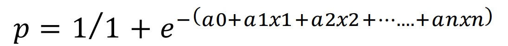
 
در این معادله با جمع مقادیر از a1 x1 تا an xn در نهایت به متغیر p مستقل خواهیم رسید .
Naive Bayes : این الگوریتم همچون الگوریتم بیز میباشد که احتمال یک رویداد و رویداد دیگر را محاسبه میکند
در معادله زیر نحوه عملکرد الگوریتم naive bayes  نمایش داده شده است . 

 
 
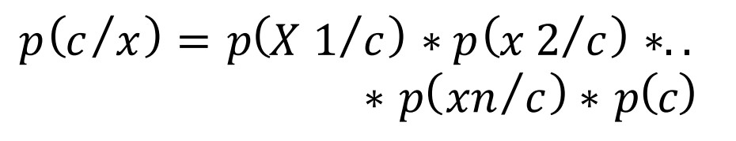
 
Confusion matrix : این الگوریتم اطلاعات صحیح و نادرست را به طور دقیقی طبقه بندی میکند که به این طریق تشخیص خطا ها راحت تر خواهد بود .

 
 
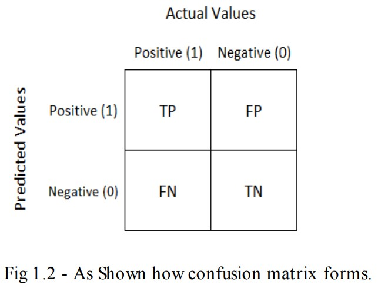
 
Accuracy : میزان خطا در این آزمایش درصد درستی ها میباشد که در جدول فوق نمایش داده شده است و خروجی های پیش بینی شده در آن قرار دارند.
Precision : تعداد خروجی های صحیح طبقه بندی شده  
Recall : به جهت شناسایی موارد مثبت میباشد که به درستی انجام شده یا خیر 
F1 score  : میانگین Precision و Recall را محاسبه میکند.

<h5>آزمایش و نتایج : </h5>
پس ازمحاسبه accuracy، recall و  precisionو امتیاز F1 ، از الگوریتم های ROU-AUC و Confusion Matrix برای یافتن  بهترین خروجی استفاده شده است .
در ادامه نتایج به دست امده از داده ها را مشاهده خواهیم کرد :
نتیجه 0 برای معامله های غیر جعلی و 1 برای معامله های تقلب شده میباشد که در ادامه توضیح میدهیم چرا از داده کاوی در این مسئله استفاده شده است.
در این تکنیک از data set بدون داده های آموزشی (train) استفاده خواهیم کرد .
در داده کاوی،  دقتی در حدود 99.9 درصد در False Positives داشته ایم و همچنین False Negatives برای پیش بینی های نادرست در نظر گرفته شده است که این موضوع به زیان بانک و مشتریان است.

 
 
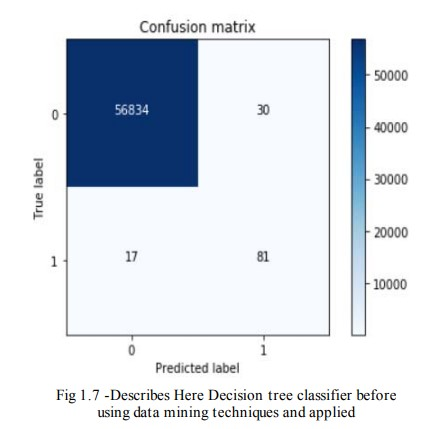
 
با استفاده از تکنیک های داده کاوی و کاربردی كه در شکل بالا نمايش داده شده نتایج نادرست بالایی را مشاهده میکنیم.
بنابراین، چالشی داریم که چرا باید داده ها را پاکسازي كرده و تکنیک‌های داده‌کاوی مانند outlier و مقیاس‌گذاری داده ها را اعمال کنیم تا شاهد نتايج بهتری باشيم.

مطابق شکل زیر الگوریتم به درستی کار میکند اما positive  False و False Negatives مقدار بیشتری میتوانند به مدل پیشنهادی کمک کنند.

 
 
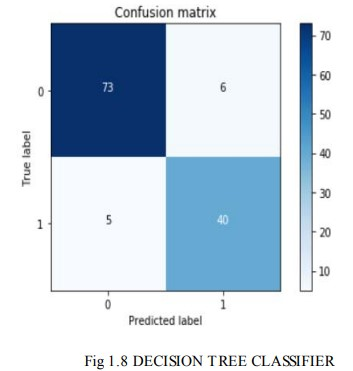
 
مطابق شکل زیر این الگوریتم بهترین عملکرد خود را در  Positives False دارد

 
 
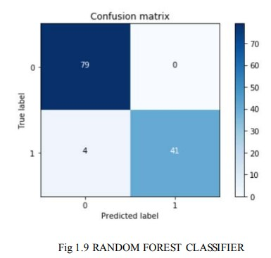
 
مطابق شکل زیر همانگونه که در قبل هم بیان شد الگوریتم عملکرد خوبی دارد اما در  تصویر 1.8 شاهد عملکردی بهتر بودیم. همچنین در برخی موارد شامل  false negatives و positives میباشد  

 
 
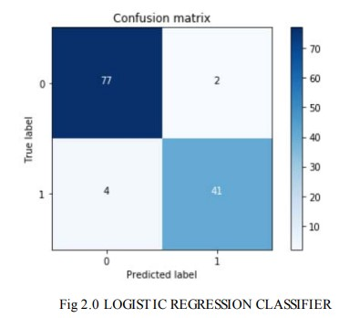
 
بر اساس شکل زیر بهترین حالت خروجی و عملکرد این الگوریتم در false positives میباشد اما با این حال بهتراز تصویر 2.1  نیست 

 
 
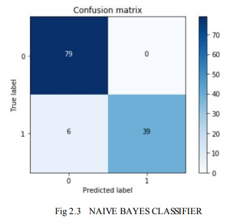
 

تصاویر 2.0 تا2.3  نشان میدهند که چگونه الگوریتم با استفاده از confusion matrix و scores میتواند در تصمیم گیری ها عملکرد بهتری داشته باشند.

 
 
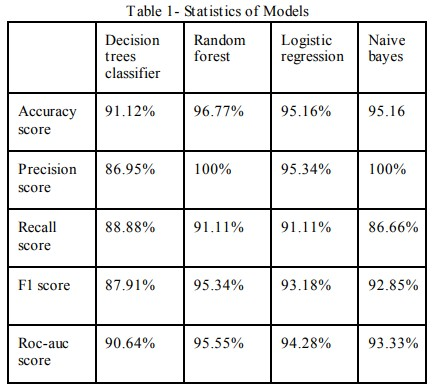
 

<h5>تیجه گیری : </h5>
 در این مقاله درخت تصمیم الگوریتم را مطالعه کرده و در جنگل تصادفی ، رگرسیون لجستیک ، naive bayes classification  و الگوریتم های یادگیری ماشین بررسی کردیم که طبقه بندی در جنگل تصادفی عملکرد بهتری نسبت به سایرین دارد با accuracy 96.7741 % ، precision100%، recall   91.1111% ،f1 score 95.3488% ،  امتیاز ROU-AUC  در حدود 95.5555 و 4 مقدار False Negative در زمانی که ما از داده های غیر تصادفی در محیط نمونه گیری استفاده میکنیم دقتی 99.98% خواهیم داشت که به دلیل عدم تعادل شدید بسیاری از خروجی ها نادرست هستند. بعد از پاکسازی داده ها و اعمال الگوریتم پیشنهادی در جنگل تصادفی بهترین عملکرد ممکن را دریافت کردیم.
البته تفاوت زیادی بین این 4 الگوریتم وجود دارد اما در الگوریتم های شناسایی تقلب ویژگی خاصی به عنوان روت قرار میگیرد که قادر است درختان دیگر را پیش بینی میکند.
تمام الگوریتم های نام برده در فوق دارای عملکردی تقریبا یکسان هستند با این تفاوت که اگر الگوریتم ها با دنیای واقعی تر آموزش ببینند کارایی داده ها افزایش خواهد داشت. 
همانطور که حتی بعد از ایجاد تکنیک های داده کاوی همچنان نتوانستیم به دقت  100% برسیم اما در تلاش هستیم دقت بالاتری را تجربه کنیم و مقدار False Negatives را تا حدامکان کاهش دهیم و با آزمایشات بیشتر، داده های بیشتر و استفاده از الگوریتم های ژنتیک میتوان نتایج بهتری را به دست آورد.

